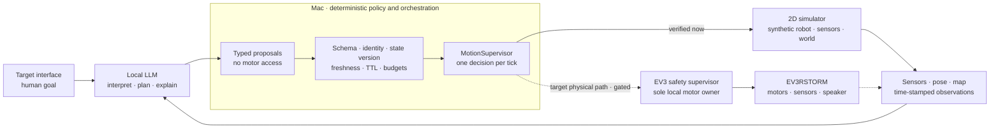

# Robot LLM Lab 🤖


[](https://github.com/Jawbreaker1/robot-llm/actions/workflows/ci.yml)


**Give a local LLM goals—not motor access.**

Robot LLM Lab is an embodied-agent research project. It explores how a local
LLM can become the conversational, planning, and reasoning layer for a LEGO
EV3 robot while deterministic software—not the model—retains exclusive,
bounded, and interruptible control of every physical action.

> **Research question:** Can asynchronous LLM reasoning, dialogue, and
> perception produce useful closed-loop robot behavior while a deterministic
> real-time layer remains the sole authority over motion?

This is **not primarily a general-purpose chatbot**. The chat is the
human-facing workbench for the future robot agent: it lets us test context,
tool selection, evidence, personality, and model behavior before connecting
natural-language goals to physical execution. The physical language-to-motion
path is intentionally still locked.

<p align="center">
  
</p>

<p align="center"><em>Mildly grumpy by design. Personality lives in the language layer; safety does not.</em></p>

## The short answer

| Question | Answer |
|---|---|
| What is this for? | Building and evaluating a local, agentic intelligence for a physical LEGO robot that can understand goals, form plans, observe, act, verify, speak, and replan |
| Is it a chat where I can ask anything? | Gemma can hold a conversation, but general chat is a test harness—not the purpose of the project |
| Can I give the EV3 natural-language instructions today? | Not physically yet. Model-driven goal selection and closed loops run in the 2D simulator; physical EV3 motion remains manual and explicitly acknowledged |
| What does the Lab Console do? | It is an operator and observability workbench for dialogue, agent traces, evidence, experiments, component state, and the simulator-generated spatial map; it has no robot-control routes |
| Why is there a weather demo? | Weather is a deliberately low-risk proof of semantic tool choice, fresh external information, provenance, and citations. The same pattern can later let the robot research something identified by perception; weather itself is not the product |

The intended interaction is a **goal**, not a low-level motor script:

```text
Human: "Explore the room. If something blocks you, investigate it and tell me what you think it is."

local LLM        → interprets the goal, proposes a plan, comments, replans
host policy      → validates typed proposals, versions, freshness, and budgets
MotionSupervisor → chooses exactly one bounded physical decision per tick
robot            → acts briefly, observes again, and reports new evidence
```

Today the motion, observation, arbitration, and verification parts of that
loop are exercised against a synthetic robot and world. Live Gemma has made
bounded exploration and expression decisions in simulator runs, but arbitrary
human-language missions are not yet wired end-to-end. The real EV3RSTORM has
verified motors, sensors, speech, and manual bounded movement; autonomous
physical motion remains gated until the power, transport, calibration,
braking, and fault-injection evidence is strong enough.

## Core architecture



The solid `MotionSupervisor → 2D simulator → observations` control path is
implemented today. Individual Gemma seams are verified for bounded selection
and expression, but the arbitrary human-goal interface and dashed EV3 path
remain target architecture—not end-to-end physical capability claims.

The LLM can propose intent, dialogue, and higher-level actions. It cannot
choose motor ports, raw wheel speeds, safety timeouts, authority, or its own
proposal lifetime. Parallel perception and reasoning are welcome; physical
execution remains serialized and deterministic.

The project deliberately avoids phrase menus, regular-expression intent
matching, and language-specific keyword heuristics. The model classifies
natural language and proposes typed actions; strict host policy either accepts
that proposal as written, rejects it, or asks for clarification. It never
reinterprets the user's sentence into a motor command.

> **Semantic invariant:** the LLM may propose intent and express personality,
> but it never owns a motor.

> **Execution invariant:** parallel perception and reasoning are welcome;
> physical execution is serialized, bounded, interruptible, and deterministic.

## What works today

Status snapshot: **2026-07-29**.

| Area | Verified now | Important boundary |
|---|---|---|
| Physical EV3 baseline | ev3dev boot, USB/SSH, motors A/B/C, bounded manual drive/turn pulses, encoders, touch, relative IR, reflected-light sensing, and Swedish eSpeak TTS | This verifies the assembled EV3RSTORM, not autonomous motion |
| Physical LLM path | One complete motion-free shadow cycle: IR readings → deterministic zone → Gemma comment as audit data → deterministic Swedish TTS | Gemma had no tools or motor access |
| EV3 supervisor | Motion-free `brake`/`stop`/inventory/touch preflight passed on the real robot with zero motor starts | The newer foreground daemon has only been verified against fake sysfs |
| Lab Console | Local Gemma chat, versioned context, read-only weather, evidence, event log, settings, experiment register, and English/Swedish UI + text responses | No motor, SSH, TTS, or stop routes exist in the dashboard |
| RobotAPI loop | Typed, snapshot-bound arm API and a closed `observe → plan → act → verify → replan` loop | Simulator-only and currently driven by a scripted fake planner |
| Navigation | Waypoint following, obstacle avoidance, version-bound multi-waypoint missions, self-directed idle exploration, one MotionSupervisor, and an independent collision oracle | 2D simulator only; Gemma selects opaque host-created opportunities, not arbitrary coordinates or physical commands |
| Spatial map | Continuous bounded occupancy fusion, robot pose, fresh sensor rays, and persistent opaque object hypotheses in a read-only Lab Console map | Simulator metric ranges only; physical EV3 IR remains non-metric, provisional evidence rather than a claim about distance or free space |
| Concurrent interaction | Independent bounded workers plus one live local-Gemma simulator run where model speech overlapped a later navigation tick | Virtual callbacks only; no physical drive, speaker, or arm adapter |
| Physical autonomy | Not enabled | Waiting for reliable EV3 power, physical transport validation, calibration, stop-latency evidence, and fault injection |

<details>
<summary><strong>Why physical autonomy remains locked</strong></summary>

The latest EV3 power check measured **5.889 V**. Physical deployment of the
foreground daemon was intentionally stopped before file transfer to avoid a
brownout and unnecessary SD-card risk. Physical testing remains paused until
reliable battery power is available.

</details>

English and Swedish are verified for the dashboard and model text responses.
English STT, English EV3 speech, multilingual robot personality, camera
vision, and physical language-to-action classification are not yet verified.
The locale contract is generic so more languages can be added without
language detection in the safety layer.

## Fastest robot-focused demo

This runs the implemented autonomous navigation stack in the 2D simulator,
builds its spatial map, and then opens the read-only Lab Console:

```sh
PYTHONPATH=src python3 -m robot_agent.dashboard_cli \
  --simulation-map-demo
```

Choose **Map** in the session URL printed by the server. The episode is
simulator-only and cannot contact or move the EV3.
Its navigation uses deterministic reference behaviors, so this command
validates the control, verification, and mapping stack—not LLM planning.

To evaluate live Gemma making one bounded exploration choice from
host-generated opportunities:

```sh
PYTHONPATH=src python3 -m robot_agent.autonomy_demo \
  --lm-studio --scenario range-change
```

Gemma sees opaque candidate IDs rather than coordinates or motor parameters;
this still is not arbitrary natural-language mission planning.

## The Lab Console


The Mac workbench is the human-facing console for the experiment. It provides
local Gemma dialogue, context, agent traces, evidence, the spatial map,
settings, experiment history, component state, and technical events. It is
currently an **observability and dialogue surface**, not a robot remote:
there are no motor, stop, SSH, or TTS routes.


The experiment register separates measured evidence from capabilities that
are still waiting on a physical gate.

<details>
<summary><strong>Secondary proof: typed read-only tool use</strong></summary>


Weather is intentionally narrow and motion-free. In this run, Gemma selected
the single allowlisted `weather.current` tool, the host fetched Open-Meteo
data, bound it as fresh evidence, and required the answer to cite that
evidence. This validates semantic tool selection and provenance for future
robot perception; it does **not** make weather chat the purpose of the
project.

</details>

<details>
<summary><strong>Declarative component registry</strong></summary>


This is an inventory, not a control surface. The future camera, microphone,
Robot Inventor, and BOOST nodes are offline declarations with no exposed
control path.

</details>

## Architecture in detail

The concurrent simulator runtime now uses independent bounded workers and
latest-snapshot mailboxes for its navigation behaviors. Obstruction-triggered
expression planning, speech playback, and the propeller reaction have separate
bounded queues. Each result is bound to controller, goal, plan, world model,
evidence, locale, and a host-owned lifetime. The MotionSupervisor never waits
for every producer; each tick uses the best fresh proposals already available
and emits at most one short-lived wheel decision.

Speech generation and playback may overlap later navigation ticks. A propeller
wave may not overlap wheel motion: it requests a pause, waits for a verified
stopped-boundary acknowledgement, revalidates the current obstruction, runs
fixed host-owned alternating segments, and releases navigation. Speech-only
reactions never pause the wheels. A slow or failed model/audio callback is
isolated from navigation. Host-tracked object identity gives speech a separate
short-lived semantic context, so briefly losing and reacquiring the same
identified object while turning does not discard a still-relevant model
response. A different object, world, goal, expired lifetime, or a newly
reacquired unknown obstruction still invalidates it. Physical gestures retain
the stricter exact-snapshot check. A per-object cooldown and total planner
budget stop repeated sensor reacquisition from turning into model or speech
spam.

Navigation snapshots can also feed a separate spatial-map worker through a
bounded, non-blocking, drop-oldest relay. Ray projection, occupancy fusion,
object clustering, and dashboard serialization never run on the motion tick.
The map keeps explicit `FREE`, `UNKNOWN`, and `OCCUPIED` evidence, the latest
robot pose and sensor rays, and opaque persistent `UNKNOWN` object hypotheses
that a later vision or language classifier can enrich without rewriting the
geometric safety layer. Relay gaps and mapping failures make the map visibly
degraded; they never stop or authorize motion.

The current metric map is deliberately simulator-only. Its ranges describe
robot-radius-inflated configuration space used by the collision simulator,
not exact physical object surfaces. EV3 `IR-PROX` is stored only as
low-confidence qualitative evidence with no invented millimetres or occupied
endpoint. This is an uncertain local world memory—not SLAM, global
localization, a path planner, or proof that an unseen area is clear.

Above a single waypoint episode, the simulator now accepts a strict,
version-bound mission plan containing up to eight semantic waypoint legs.
Each leg receives a newer goal epoch and shares global time, action, motion,
proposal, and replan budgets. The next leg starts only after the previous
episode has reached its waypoint and verified a terminal STOP. A changed
world model invalidates the remaining plan at that stopped boundary, and a
failed leg never starts later legs. This is the deterministic plan-execution
seam. Gemma does not author arbitrary multi-leg missions yet.

The first self-directed layer now sits above that seam. When idle mode has
been explicitly enabled and no user owns or is waiting for the goal lease, a
typed range producer records exact stopped observations and the host creates
a small feasible menu of local opportunities. Candidate IDs are opaque to the
model; coordinates remain in a private host registry. Gemma may return only
`SELECT`, `HOLD`, or `ABORT`, and `SELECT` must name exactly one offered ID.
The host then revalidates the lease generation, deadline, state version,
world-model version, observation producer/robot/controller/frame identity,
host receive-time/TTL, candidate set, safe stopped snapshot, and cumulative
budgets before creating one short one-leg mission.

Completed cells are remembered only after waypoint success and verified STOP.
Failed or stale attempts are counted separately and a cell is suppressed after
a deterministic retry cap unless an exact new observation makes it relevant
again. Session budgets are backed by a persistent duty-cycle budget across
public scheduler calls; resetting it requires idle to be disabled with no
owner, pending user, fault, motion, or outstanding selector worker. An atomic
authority guard blocks idle enablement and new goal claims during the reset.
An exact same-pose range or simulator-object change is published as typed
evidence without being declared interesting by host heuristics; the model
decides whether the linked opportunity is worth investigating. A user request
first reserves `USER_PENDING`, atomically prevents new idle work, cancels the
active idle lease, and receives a newer goal epoch only after the idle task has
returned a verified STOP. Model selection runs behind a single-flight,
cancelable boundary, so even a selector that never returns cannot hold up user
activation; its late result is discarded and no replacement worker is spawned
while it remains alive. This goal lease is separate from pulse arbitration:
the model can choose a bounded purpose but can never transfer motor ownership
to itself.

Preemption is ordered and bounded, not physically instantaneous. Cancellation
observed before dispatch prevents a pulse. If a user reservation lands inside
the final simulator `apply` seam, at most the one already-dispatched pulse may
finish; its duration is capped by the motion calibration. No later DRIVE is
issued, STOP is verified, and only then can the newer user epoch activate.

If geometry changes after observation but before dispatch, the stale pulse is
rejected, the episode re-observes, and the retry consumes the existing replan
budget. Repeated invalidation ends in a STOP bound to the newest state.
Likewise, release from an exclusive propeller pause forces a new stopped
observation boundary before any later DRIVE.

Touch stop, distance gates, heartbeat, timeout, speed limits, stall checks,
and emergency stop are deterministic. They do not wait for an LLM response.
Only the supervisor may own the motor bus; planning, validation, dialogue,
vision, and audio processes are proposal producers.

The same node and identity model is intended to grow from one EV3 into a
composite LEGO body with EV3, Robot Inventor 51515, BOOST, cameras, and
microphones. Multiple controllers still result in one coordinated,
authoritative physical decision.

See [ARCHITECTURE.md](docs/ARCHITECTURE.md) for the detailed state,
identity, freshness, and multi-controller design.

## Safety boundaries

Verified or enforced today:

- hard speed, duration, speech-length, queue, response-size, and episode
  budgets;
- explicit acknowledgement for every current manual physical motion command;
- motor and audio locks plus encoder postconditions;
- fixed SSH commands and speech text passed through stdin, never interpolated
  into shell code;
- loopback-only LM Studio with deadlines and bounded responses;
- a supervisor core with exclusive motor ownership, heartbeat, touch stop,
  stall/direction checks, latched faults, and verified stop;
- strict JSONL transport identity, sequence, TTL, replay, EOF, signal, and
  backpressure handling, verified against fake hardware;
- snapshot-bound RobotAPI actions with explicit capability allowlists and
  conservative at-most-once semantics;
- an exact read-only research allowlist with provenance, hashes, timestamps,
  TTL, evidence IDs, and citations;
- a loopback-only dashboard with a fresh 256-bit session URL, Host/Origin
  checks, strict route/asset allowlists, CSP, bounded jobs, and no physical
  endpoints;
- simulator-only closed loops for typed arm actions, waypoint navigation, and
  concurrent navigation/expression/speech/propeller coordination, all without
  a physical autonomy adapter;
- simulator-only self-directed exploration with an exclusive goal lease,
  opaque model-selected opportunities, persistent wandering budgets, bounded
  ordered user preemption, stale-world replanning, and verified terminal
  stops;
- a bounded asynchronous spatial-map worker and authenticated read-only map
  endpoint; mapping has no reference to the proposal inbox, motion authority,
  motor bus, or physical adapter.

Still required before autonomous physical motion:

- foreground daemon deployment and motion-free handshake on the real EV3;
- a motion-enabled physical adapter with lock-retaining fail-stop behavior;
- measured stop latency, braking distance, polling jitter, and stall
  thresholds;
- linear and turn calibration plus controlled reflected-light samples;
- fault injection for lost client, link, process, heartbeat, and motor writes;
- explicit time, distance, action, and replan budgets for each physical
  episode.

IR-PROX is a relative reflection/proximity signal from 0 to 100. It is not
centimeters, object identification, or proof that the path is clear. Object
IDs in the concurrent experiment are labels on synthetic simulator obstacles;
physical IR observations are never allowed to claim an identity.

## Try it locally

The host code uses Python's standard library. Python 3.9+ is recommended on
macOS or Linux. The complete quality gate also uses Node.js for executable
tests of the dependency-free dashboard JavaScript; CI currently uses Node 22.

### Start the Lab Console

With LM Studio running on `127.0.0.1:1234` and
`google/gemma-4-26b-a4b` loaded:

```sh
PYTHONPATH=src python3 -m robot_agent.dashboard_cli
```

Open the unique loopback session URL printed by the server:

```text
http://127.0.0.1:8765/session/<session-token>/
```

Restarting the server invalidates the token. The language selector switches
the complete UI and sends a typed `response_locale` with every model turn;
conversation state and form state survive the switch.

### Run the hardware-free tests

```sh
sh ./scripts/quality_check.sh
```

The suite uses simulated sysfs and never activates physical hardware. It
verifies contracts, budgets, process behavior, agent loops, and the
accelerated synchronous simulator—not real stop latency or braking distance.
The same dependency-free quality gate runs on Python 3.9 and 3.13 in GitHub
Actions and also checks JavaScript syntax and the EV3 modules' Python 3.5
grammar.

### Run autonomous navigation in the 2D simulator

```sh
PYTHONPATH=src python3 -m robot_agent.navigation_demo
```

Use `--scenario clear` for a direct waypoint and `--full` for the reproducible
tick trace. Every measurement in `config/navigation_simulation.json` is
labelled `simulation_only`. The command cannot import RobotAPI, SSH transport,
or the EV3 HAL.

### Build and inspect the spatial map

Run the same bounded obstacle-navigation episode while accumulating an
occupancy map:

```sh
PYTHONPATH=src python3 -m robot_agent.spatial_mapping_demo
```

To inspect that completed simulator map in the Lab Console:

```sh
PYTHONPATH=src python3 -m robot_agent.dashboard_cli \
  --simulation-map-demo
```

Open the session URL and choose **Map**. The view is read-only and shows
uncertain/free/occupied cells, the final robot pose, fresh sensor rays,
source and age metadata, and opaque object hypotheses. The flag runs a real
simulator episode before the dashboard starts; without it the map honestly
reports that no provider is connected. Neither command contacts EV3
hardware.

### Run self-directed idle exploration

Run the deterministic test oracle for three bounded, self-created waypoint
tasks:

```sh
PYTHONPATH=src python3 -m robot_agent.autonomy_demo
```

Let the loaded local Gemma model choose among the same opaque, host-owned
opportunities:

```sh
PYTHONPATH=src python3 -m robot_agent.autonomy_demo --lm-studio
```

The dynamic scenario completes one task, moves the synthetic box while the
robot is stopped, and asks the model to choose again from candidates linked to
the exact range transition:

```sh
PYTHONPATH=src python3 -m robot_agent.autonomy_demo \
  --lm-studio --scenario range-change
```

All three commands are simulator-only. Idle autonomy defaults off in the goal
coordinator; the demo enables it explicitly. Every task receives a new lease
and goal epoch, each task ends at a verified stopped boundary, and repeated
scheduler calls share a persistent duty-cycle budget until an explicit safe
re-arm.

### Run concurrent navigation and object interaction

```sh
PYTHONPATH=src python3 -m robot_agent.concurrent_demo
```

The default planner and simulated world are deterministic and offline; thread
timestamps and event interleaving are intentionally not byte-reproducible. The
run exercises independent navigation, expression, speech, and arm workers with
virtual callbacks and prints bounded JSON evidence, including whether speech
actually interleaved with navigation ticks and whether the propeller pause/ack
gate ran.

To use the loaded local model for the typed expression decision:

```sh
PYTHONPATH=src python3 -m robot_agent.concurrent_demo \
  --lm-studio --locale en-US --tick-ms 50
```

This remains a 2D simulation. Its speech and propeller callbacks record what
would happen; they do not play audio or contact EV3 hardware. A live LM Studio
run is therefore evidence for asynchronous model orchestration, not physical
TTS or motion.

### Run the read-only weather agent

```sh
PYTHONPATH=src python3 -m robot_agent.research_cli --pretty \
  'Do I need an umbrella in Stockholm right now?'
```

Gemma chooses semantically from a strict schema; the host performs no regex,
substring, or keyword routing. The current registry contains only
`weather.current`, backed by Open-Meteo's
[geocoding](https://open-meteo.com/en/docs/geocoding-api) and
[forecast](https://open-meteo.com/en/docs) APIs. Responses include evidence
IDs, timestamps, TTL, source URLs, byte counts, and SHA-256 hashes.

<details>
<summary><strong>Physical EV3 operator path</strong></summary>

Do not deploy or test on the EV3 until it has reliable power. Back up current
files, verify the destination and hashes, keep a physical abort method ready,
and compare the assembled wiring with
[`config/ev3rstorm.json`](config/ev3rstorm.json). The committed map is
specific to this EV3RSTORM.

Deploy and inventory:

```sh
ssh 'robot@<EV3-host>' 'mkdir -p /home/robot/robot-llm'
scp -r ev3 config 'robot@<EV3-host>:/home/robot/robot-llm/'
ssh 'robot@<EV3-host>' \
  'cd /home/robot/robot-llm && python3 ev3/robot_cli.py inventory'
```

Read the IR sensor or test the already verified **Swedish** TTS path without
motion:

```sh
python3 ev3/robot_cli.py read-sensor --role infrared
printf '%s\n' 'Jag ser något framför mig.' |
  python3 ev3/robot_cli.py speak-stdin
```

Run the motion-free local probes:

```sh
python3 ev3/robot_cli.py stop
python3 ev3/ir_gate_probe.py
python3 ev3/supervisor_cli.py preflight
```

`robot_cli.py stop` exits successfully only when every configured motor is
inactive, fault-free, encoder-stable, and matched to the expected topology.
An unreadable or invalid config does not prevent a best-effort emergency stop,
but that configless attempt is reported on stderr with exit code 1 and can
never claim `stop_confirmed: true`.

Run one motion-free Gemma shadow cycle from the Mac:

```sh
PYTHONPATH=src python3 -m robot_agent.shadow_cli \
  --ssh-target 'robot@<EV3-host>'
```

The foreground daemon preflight is the next physical gate. Its public entry
point cannot enable motion, and the host sends only
`describe → status → claim → heartbeat → status → arm → status → release → status → shutdown`:

```sh
PYTHONPATH=src python3 -m robot_agent.supervisor_preflight_cli \
  --ssh-target 'robot@<EV3-host>'
```

Only after the experiment protocol's power, wiring, clearance, exclusivity,
and abort checks may an operator run a bounded manual pulse:

```sh
python3 ev3/robot_cli.py drive-test \
  --left-speed-dps 100 \
  --right-speed-dps 100 \
  --duration-ms 300 \
  --acknowledge-physical-motion
```

This is a manual hardware test, not autonomous navigation. Read the full
[experiment plan](docs/EXPERIMENT_PLAN.md) before physical work.

</details>

## Verified results

| Measurement | Result |
|---|---:|
| Hardware-free test suite | `700 / 700` passing |
| Physical supervisor preflight | `completed`, `0` motor-start commands |
| Straight physical B/C pulse | `+175° / +175°` |
| Physical B/C turn pulse | `+172° / −170°` |
| Stored dynamic IR replicate | `277` samples |
| IR measurement sampling | mean `50 ms`, range `47–53 ms` |
| IR gate blocked | `100 ms` after first raw value `≤35` |
| IR gate released | `100 ms` after first filtered value `≥40` |
| Gemma proposal in one physical shadow run | `417 ms` |
| Live concurrent Gemma simulator run | `1` accepted expression; speech/navigation interleaving observed; `98` actions; verified stop |
| Live idle Gemma range-change run | `2 / 2` self-selected tasks; same box `207 → 357 mm`; `22` actions; `0` collisions; verified stop |
| Spatial-map simulator run | `100` fused snapshots; `193` retained cells; `9` opaque hypotheses; `98` actions; `0` collisions; verified stop |

The IR figures verify filtering and hysteresis in stationary tests. They are
not motor stop time, braking distance, a real-time guarantee, or a benchmark.
Protocols, limitations, and raw data are in the
[experiment plan](docs/EXPERIMENT_PLAN.md) and
[EXP-F1-IR-DYN-002.json](docs/data/EXP-F1-IR-DYN-002.json).

## Roadmap

- [x] Physical EV3 baseline: ev3dev, USB/SSH, manual motors, sensors, encoders,
  and Swedish TTS
- [x] Motion-free physical Gemma shadow cycle and supervisor preflight
- [x] Foreground transport verified against fake sysfs and real subprocesses
- [x] English/Swedish Lab Console, typed response locale, local chat, and
  read-only cited weather
- [x] Typed RobotAPI and closed arm loop in simulation
- [x] Simulator-first waypoint navigation with parallelizable proposals and
  serialized supervision
- [x] Strict multi-waypoint mission execution with shared budgets, verified
  inter-leg stops, and world-version invalidation
- [x] Concurrent simulator runtime: asynchronous navigation/expression/speech,
  optional propeller reaction, and serialized wheel ownership
- [x] Self-directed simulator idle loop: typed change observations, opaque
  Gemma-selected waypoint opportunities, cancelable single-flight selection,
  goal leases, bounded user preemption, retry memory, and persistent wandering
  budgets
- [x] Asynchronous simulator spatial map with bounded occupancy evidence,
  persistent unknown-object hypotheses, and a read-only live GUI view
- [ ] Reliable EV3 power and physical motion-free foreground handshake
- [ ] Physical RobotAPI adapter, semantic tools, calibration, and safety
  evidence
- [ ] Gemma-driven physical `ACT`/`ABORT` loop behind a separate motion gate
- [ ] Map-informed frontier planning and semantic classification of persistent
  hypotheses, with confidence and evidence lineage
- [ ] Push-to-talk STT through the Mac microphone
- [ ] Wi-Fi, camera, microphones, vision, and sound-source localization
- [ ] Multi-controller orchestration across EV3, Robot Inventor, and BOOST

The dream demo:

`dog bark → locate sound → look for the source → confirm dog → turn toward it → “woof right back at you”`

## Repository layout

```text
config/                 port map, safety limits, and simulator configuration
docs/                   architecture, experiment protocols, evidence, and UI captures
ev3/                    Python 3.5 HAL, supervisor, and manual EV3 tools
src/robot_agent/        host policy, agent loops, navigation, research, and dashboard
tests/                  hardware-free test suite
```

Robot LLM Lab deliberately stays small and avoids a large robotics framework.
Abstractions must earn their place through real experiments.

LEGO, MINDSTORMS, EV3, Robot Inventor, and BOOST are trademarks of the LEGO
Group. This independent experimental project is not affiliated with or
endorsed by the LEGO Group.
