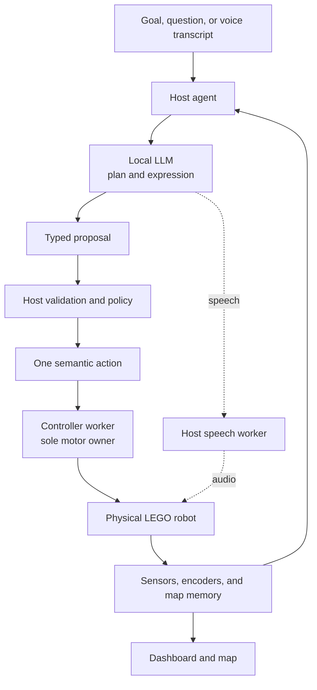

# Robot LLM Lab 🤖

[](https://github.com/Jawbreaker1/robot-llm/actions/workflows/ci.yml)


**A real LEGO robot controlled by a local agentic AI that can plan, observe,
speak, and adapt as it goes.**

Robot LLM Lab connects a local AI agent to physical LEGO robots. EV3RSTORM
currently carries the complete navigation loop: give it a goal and the agent
plans, acts, reads sensors and motor feedback, and adapts when reality
disagrees. Robot Inventor 51515 now runs the same model-directed
act → observe → replan loop over Pybricks and persistent BLE telemetry, with
robot-specific bounded actions and gyro-backed distance scans.

The language model chooses semantic intent and expression. The host application
validates and dispatches typed actions, while the active controller worker
remains the sole owner of its motor ports.

<p align="center">
  
</p>

<p align="center"><em>Mildly grumpy by design. Personality shapes the language, not motor authority.</em></p>

## What makes it agentic

Many LLM–robot demos are effectively one-shot remote controls:

```text
prompt → command → execution
```

Robot LLM Lab keeps the goal alive and closes the loop:

```text
goal → plan → action → observe → verify → adapt
```

This means:

- a goal can survive across several actions and observations;
- verified sensor and encoder results inform the next decision;
- the agent can investigate, revise its plan, or stop when reality contradicts
  its assumptions; and
- speech, mapping, and UI updates can progress alongside navigation while
  physical actions remain serialized.

Natural-language intent is handled by the model through strict schemas. The
host does not translate instructions with regular expressions, keyword lists,
or language-specific command menus. The model never receives raw motor access.

## What works today

| Status | Capabilities |
|---|---|
| Working on physical EV3 | ev3dev, Wi-Fi/SSH control, bounded movement and turning, stop, IR, touch, motor encoders, host-generated robot speech, and the goal → plan → act → observe → replan loop |
| Working on physical Robot Inventor | Pybricks firmware on BLAST-01, local BLE deployment, persistent telemetry, bounded actions, interruptible stop, and a model-directed act → observe → replan loop with two-sided distance scans |
| Working in the application | English/Swedish web dashboard, direct robot conversation and status questions, local push-to-talk STT, technical events, current plan, active route and waypoint, simulator mapping, per-run physical navigation memory, multi-controller telemetry and connection controls, and agent-directed BLAST episodes |
| Experimental | Operator-confirmed physical obstacle passage, active IR scanning, qualitative hazard mapping, model-authorized typed detour routes, body-aware path checks, and recovery from imperfect motor movement |
| Planned | Repeatable autonomous obstacle navigation, richer Robot Inventor goals, continuous hands-free voice interaction, cameras, vision, sound localization, BOOST, and multi-robot coordination |

EV3 obstacle navigation has succeeded in an operator-confirmed physical trial;
repeatability and broader acceptance runs remain experimental.

The current EV3 map is intentionally qualitative. IR reflection can support
obstacle hypotheses, but it is not vision, object recognition, or precise
metric SLAM. The forward-facing color/light sensor is installed but is not yet
used by the production navigation loop.

BLAST-01 has its own registered robot identity and can be selected as the
dashboard's physical agent profile. Gemma chooses one typed action at a time;
the host executes it through the existing bounded BLE controller, feeds the
fresh observation back to the model, and repeats until completion or abort.
The first slice supports drive, turn, and gyro-measured two-sided scan
decisions. Multi-step obstacle navigation is experimental; manipulation goals
remain future work for this profile.

## Architecture



The host owns goals, state, navigation memory, model calls, and validation.
Each controller worker exposes a small set of fixed robot operations and
processes one request at a time. It contains no planner, personality, or
independent goal. EV3 and Robot Inventor are both application-integrated for
autonomous execution. Their profiles translate shared semantic intent into
robot-specific bounded operations; EV3 currently has the richer map and route
executive, while BLAST replans after each movement or scan. Once the model has
authorized a target and detour side, a deterministic route executive may
serialize several freshly checked pulses before asking the model again. New
geometry, ambiguous progress, a veto, or a failed movement returns control to
the agent immediately.

Speech, map publication, and UI delivery already run alongside the physical
loop. Future vision, audio, validation, and planning workers will publish
time-stamped observations or proposals, but they will not control motors
directly. Physical execution remains serialized through the worker that owns
the relevant controller.

More detail is available in [the architecture document](docs/ARCHITECTURE.md).

## Dashboard


The local web application has two conversation targets:

- **Robot** can answer, report what its current sensors and plan say, or turn a
  text or speech instruction into a physical goal.
- **Workbench** provides ordinary dialogue, configuration, evidence, and
  development tools.

The dashboard shows the current live state rather than offering old physical
runs to resume. It exposes the current goal, plan, action, speech state,
active detour route and waypoint progress, technical events, and a read-only
map. Navigation memory is retained during an EV3 episode and reset before the
next physical run. The **Bodies** view keeps each controller separate: BLAST
has Connect, Disconnect, and Retry controls, while EV3 has a motion-free
readiness check because its SSH worker is opened and closed per task.

The same Map view can display a completed simulator run or qualitative physical
odometry and obstacle hypotheses:


See [the dashboard guide](docs/DASHBOARD.md) for STT, settings, persistence,
and UI contracts.

## Quick start without a robot

```sh
git clone https://github.com/Jawbreaker1/robot-llm.git
cd robot-llm
PYTHONPATH=src python3 -m robot_agent.dashboard_cli \
  --simulation-map-demo
```

Open the private live URL printed by the server and choose **Map**. This uses a
deterministic simulator and requires no EV3 or loaded LLM. It demonstrates the
application and mapping pipeline, not physical calibration.

To run the Workbench with a model exposed by LM Studio:

```sh
ROBOT_LLM_STT_URL='' scripts/start_lab_console.sh \
  --model 'EXACT-MODEL-ID-FROM-LM-STUDIO'
```

The empty STT URL starts without speech recognition. Follow the
[dashboard guide](docs/DASHBOARD.md) to add the local whisper.cpp service.

## Start the robot console

The normal two-controller lab starts with one command:

```sh
scripts/start_robot_console.sh
```

This assumes the default local speech-recognition service is running. To start
without voice input, use `ROBOT_LLM_STT_URL='' scripts/start_robot_console.sh`.

This configures EV3RSTORM and BLAST without contacting either robot. Power them
on afterwards, then use **Bodies → Check connection** for EV3 and
**Bodies → Connect** for BLAST. The defaults are `robot@ev3dev.local` and
`BLAST-01`; different names can be supplied without editing the scripts:

```sh
ROBOT_LLM_EV3_TARGET='robot@192.168.1.50' \
ROBOT_LLM_BLAST_HUB_NAME='MY-BLAST' \
  scripts/start_robot_console.sh
```

The combined profile currently uses EV3 as the active goal executor while
BLAST, once connected, remains available for telemetry and bounded controller
actions. Use
`scripts/start_ev3rstorm_console.sh` or `scripts/start_blast_console.sh` when
only one robot should be configured. All launchers reuse the same application
entry point and prefer the repository's `.venv` when it exists.

### Show both live paths in one fixed-start map

Run one dashboard process per active robot; each process keeps sole ownership
of its robot. The dashboard you watch can read the other process's local v1
map over authenticated loopback and project both pose trails into the existing
shared v2 map. For example, start the EV3 peer first:

```sh
ROBOT_LLM_STT_URL='' scripts/start_ev3rstorm_console.sh --port 8766
```

Then start BLAST on the normal port. Replace the illustrative `600, 0, 0`
with the measured EV3 start origin `(x mm, y mm, yaw millidegrees)` in BLAST's
start frame (`+X` forward, `+Y` left, positive yaw left/counter-clockwise):

```sh
ROBOT_LLM_STT_URL='' scripts/start_blast_console.sh \
  --port 8765 \
  --shared-peer-port 8766 \
  --shared-peer-access-key-file ~/.robot-llm/dashboard-access-key \
  --shared-peer-x-mm 600 \
  --shared-peer-y-mm 0 \
  --shared-peer-yaw-mdeg 0
```

The first complete local-map generation from each process is bound once.
Starting a new episode changes that robot's local frame and deliberately makes
the shared map unavailable instead of silently teleporting it; place both
robots back on the fixed marks and restart the viewing process to bind again.
This checkpoint shares pose/path visualization only. It does not yet fuse
obstacle hypotheses or authorize simultaneous navigation.

## Running with a physical EV3

The physical path requires an EV3 running ev3dev, a network connection to the
brick, Python 3.9+ on the host, the deployed EV3 worker, and a model served by
LM Studio.

Before allowing movement, verify the robot configuration and complete the
motion-free deployment checks in:

- [EV3 Wi-Fi setup](docs/EV3_WIFI.md)
- [EV3 runtime deployment](docs/EV3_RUNTIME_DEPLOYMENT.md)

Then start the explicit EV3 profile. Its default target is
`robot@ev3dev.local`:

```sh
ROBOT_LLM_STT_URL='' scripts/start_ev3rstorm_console.sh \
  --model 'EXACT-MODEL-ID-FROM-LM-STUDIO'
```

Set `ROBOT_LLM_EV3_TARGET` when the brick uses another hostname or address.

Omit the STT override when the local speech-recognition service is configured.
The dashboard may be started before the EV3 is powered on. After the brick has
booted, choose **Bodies → Check connection** to verify SSH, the deployed worker,
stationary sensing, stop, and clean shutdown without issuing a motor command.
The check records when readiness was last verified; it does not claim or keep a
persistent connection. Robot movement begins only after a goal is submitted
and explicitly started in the dashboard.

## Robot Inventor 51515 bring-up

BLAST-01 runs Pybricks and accepts programs directly from the local repository
over Bluetooth. Live diagnostics identify four angular motors, a color sensor,
an ultrasonic sensor, the built-in six-axis IMU and battery telemetry. Display,
speaker and bounded motor actuation are physically verified. A persistent BLE
session exposes observations, stop, drive, turn, claw and body pulses. The
dashboard can keep that session open, show battery, distance, color, IMU and
motor telemetry, run those fixed actions manually, or bind the same connection
to a model-directed robot episode. Stop can interrupt an in-flight pulse and is
verified against a fresh inactive observation. The **Bodies** view exposes the
same BLE lifecycle as Connect, Disconnect, and Retry controls.

```sh
python3 -m venv .venv
.venv/bin/python -m pip install -r requirements-pybricks.txt
./scripts/run_blast_smoke.sh
.venv/bin/python -m pybricksdev run ble --name BLAST-01 \
  hub_programs/blast_01/inventory.py
```

To run BLAST as the dashboard's active physical agent:

```sh
ROBOT_LLM_PYTHON=.venv/bin/python ROBOT_LLM_STT_URL='' \
  scripts/start_blast_console.sh \
  --model 'EXACT-MODEL-ID-FROM-LM-STUDIO'
```

This optional toolchain requires Python 3.10 or newer. Disconnect Pybricks Code
from the hub before running the local command because only one BLE client can
own the connection.

## Tests

```sh
sh ./scripts/quality_check.sh
```

The hardware-free suite covers contracts, agent loops, process transports,
mapping, dashboard behavior, simulated EV3 sysfs, and failure cleanup. It does
not replace physical calibration or live stop tests.

## Roadmap

- Make physical obstacle navigation repeatable and complete its live
  calibration and acceptance runs.
- Add color sensing, continuous voice interaction, wireless cameras,
  microphones, vision, and sound-source reasoning.
- Extend Robot Inventor navigation with shared route and map support, then add
  BOOST and coordinate several LEGO controllers.
- Expand the asynchronous architecture with parallel perception, validation,
  and forward planning while preserving serialized motor ownership.

Long-term vision: hear a dog bark, locate the sound, look for the source,
recognize the dog, turn toward it, and answer, “woof right back at you.”

## Documentation

| Document | Contents |
|---|---|
| [Architecture](docs/ARCHITECTURE.md) | Agent runtime, authority, parallelism, memory, and multi-controller design |
| [Navigation simplification plan](docs/NAVIGATION_SIMPLIFICATION_PLAN.md) | Fixed three-stage plan for aligning BLAST and EV3 without a new framework |
| [Dashboard](docs/DASHBOARD.md) | Live UI, STT, map, settings, and persistence |
| [EV3 Wi-Fi](docs/EV3_WIFI.md) | Network onboarding and recovery |
| [EV3 runtime deployment](docs/EV3_RUNTIME_DEPLOYMENT.md) | Worker deployment, preflight, transport, speech, and physical checks |
| [Experiment plan](docs/EXPERIMENT_PLAN.md) | Test protocols, observations, limitations, and evidence |
| [Navigation benchmark](docs/LM_STUDIO_NAVIGATION_BENCHMARK.md) | Structured-planner benchmark method and results |
| [`docs/data`](docs/data) | Machine-readable experiment artifacts |

## Repository layout

```text
config/                 robot topology and fixed action profiles
docs/                   architecture, setup, experiments, evidence, and images
ev3/                    EV3 HAL, bounded workers, and diagnostic tools
hub_programs/           controller-side programs for non-EV3 LEGO hubs
src/robot_agent/        host agent, navigation, mapping, speech, and dashboard
tests/                  hardware-free scenarios, contracts, and failure tests
```

Robot LLM Lab deliberately avoids a large robotics framework. New abstractions
are introduced when experiments show that they are needed.

No open-source license has been selected yet.

LEGO, MINDSTORMS, EV3, Robot Inventor, and BOOST are trademarks of the LEGO
Group. This independent experimental project is not affiliated with or
endorsed by the LEGO Group.
