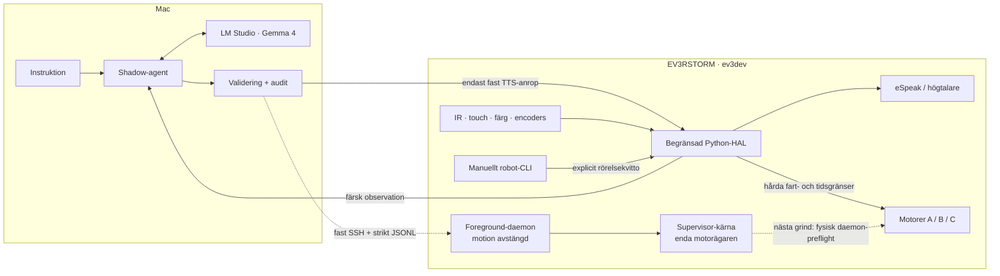

# Robot LLM Lab 🤖


**En lokal språkmodell får en riktig LEGO-kropp – men inte nycklarna till
motorerna.**

Robot LLM Lab är ett kontrollerat experiment med en fysisk LEGO MINDSTORMS
EV3RSTORM, ev3dev och en lokal Gemma-modell via LM Studio. Målet är att
utforska perception, språk, kontext, planering och slutna agentiska loopar
utan att göra modellens latens eller fantasi till en säkerhetsfunktion.

> **Designinvariant:** LLM:n får uttrycka avsikt och personlighet.
> Deterministisk kod avgör om, hur och hur länge kroppen får agera.

> **Semantisk invariant:** Naturligt språk klassificeras och planeras av
> språkmodellen – aldrig av regexp, substringmatchning, nyckelordslistor eller
> hårdkodade frasmenyer. Modellens resultat är ett typat beslutsförslag,
> aldrig ett motoranrop.

Den deterministiska host-policyn validerar endast förslagets schema,
verktygs-ID, argument, kontextreferenser, färska robotstatus och budget. Den
försöker inte tolka originalmeningen på nytt. Ogiltiga eller tvetydiga
förslag ger `reject` eller `clarify`, aldrig en keyword-baserad gissning.

**Status:** Den fysiska PoC-baslinjen är verifierad. Motorer, sensorer och
svenskt tal fungerar; Gemma kör en rörelsefri shadow-loop. En språkblind
EV3-supervisor finns nu som hårdvarufritt verifierad kärna och dess
rörelsefria stop-/inventeringspreflight har passerat på den riktiga EV3:an.
En nodmärkt foreground-transport och en Mac-klient har dessutom verifierats
mot falsk hårdvara genom riktiga OS-processer, pipes, EOF och signaler.
Transportens publika entrypoint kan inte aktivera motion. Autonom
motorstyrning är fortfarande inte aktiverad.

## Vad fungerar på riktigt?

| Lager | Verifierat på den fysiska roboten |
|---|---|
| Linux och transport | ev3dev från microSDHC, USB CDC och icke-interaktiv SSH från Mac |
| Kropp | motor A som propellerarm, B/C som vänster/höger drivning, tidsbegränsade pulser och encoderverifiering |
| Perception | touch, färg, motorpositioner och relativ IR-närhet |
| Röst | lokal svensk eSpeak-TTS via en längdbegränsad stdin-väg med ljudlås och timeout |
| Lokal LLM | Gemma 4 via LM Studio, utan verktyg och utan motoråtkomst, i en komplett fysisk shadow-cykel |
| IR-evidens | två motorstilla approach/retreat-cykler vid 20 Hz med full auditdata |
| Supervisor-preflight | fysisk `brake` + `stop`, stabil touch, komplett terminal audit och frigjort motorlås; inga motorstarter |
| Foreground-transport | strikt JSONL över stdio, controller-identitet, lokal kö-TTL, replaygrind och fail-closed EOF/signal/backpressure mot falsk sysfs |

Det här är alltså inte en simulering med en robotbild bredvid. Kod har kört
mot riktig sysfs-hårdvara, riktiga encoders, en riktig IR-sensor och den
överraskande begripliga lilla EV3-högtalaren.

## Tre separata ansvar

Semantik, auktorisation och fysisk exekvering är avsiktligt separerade:



Gemmas kandidat är i dag auditdata. Den kan inte välja robotverktyg, tala
direkt eller röra en motor. Det manuella rörelsespåret kräver ett uttryckligt
kvitto och går genom separat, begränsad kod.

I målarkitekturen producerar LLM:n ett typat `DecisionProposal`.
Host-policyn får auktorisera exakt en begränsad handling, och den språkblinda
EV3-supervisorn avgör lokalt om handlingen fortfarande kan köras. Supervisorn
får alltid neka eller stoppa, men aldrig byta mål eller hitta på en ny
handling.

## Några siffror från verkligheten

| Mätning | Observerat resultat |
|---|---:|
| Hårdvarufria tester | `193 / 193` passerar |
| Fysisk supervisor-preflight | `completed`, `0` motorstartkommandon |
| Rak fysisk drivpuls, B/C | `+175° / +175°` encoderrotation |
| Fysisk svängpuls, B/C | `+172° / −170°` encoderrotation |
| Sparat dynamiskt IR-replikat | `277` prover |
| IR-samplingsperiod inom mätfaserna | medel `50 ms`, spann `47–53 ms` |
| IR-grind till hinder | `100 ms` efter första råa värdet `≤35` |
| IR-grind frigiven | `100 ms` efter första filtrerade värdet `≥40` |
| Gemma-kandidat i en fysisk shadow-körning | `417 ms` |

IR-tiderna verifierar filter- och hystereslogiken i just dessa motorstilla
tester. De är **inte** motorstopptid, bromssträcka, realtidsgaranti eller bevis
på fri väg. Gemma-tiden är en enskild observerad körning, inte ett benchmark.

Fulla protokoll, begränsningar och rådata finns i
[experimentplanen](docs/EXPERIMENT_PLAN.md) och
[EXP-F1-IR-DYN-002.json](docs/data/EXP-F1-IR-DYN-002.json).

## Grinig, inte farlig

Robotens framtida personlighet får gärna vara en gammal, lätt svärande gubbe:

> “Vad fan är det där framför mig?”

Humorn hör hemma i språkplanet. Säkerhetslagret får aldrig ha humör. I
nuvarande shadow-läge loggas Gemmas kommentar, medan endast en
deterministiskt vald fras kan nå högtalaren.

## Snabbstart

### Förutsättningar

- Mac eller Linux med Python `3.9+` för host-agenten.
- LEGO MINDSTORMS EV3 med ev3dev-stretch och Python `3.5`.
- USB eller annan fungerande SSH-transport till EV3.
- `espeak` och `aplay` på EV3 för tal.
- LM Studio på `127.0.0.1:1234` med
  `google/gemma-4-26b-a4b` laddad för den valfria shadow-cykeln.

Host-koden och testerna använder bara Pythons standardbibliotek.

### 1. Kör den helt hårdvarufria testsviten på Mac

Från repots rot:

```sh
PYTHONDONTWRITEBYTECODE=1 \
  PYTHONPATH=src python3 -m unittest discover -s tests -q
```

Testerna använder simulerad sysfs och aktiverar aldrig fysisk hårdvara.

### 2. Lägg den minimala EV3-koden på roboten

Byt `<EV3-host>` mot exempelvis `ev3dev.local` eller robotens USB-adress:

```sh
ssh 'robot@<EV3-host>' 'mkdir -p /home/robot/robot-llm'
scp -r ev3 config 'robot@<EV3-host>:/home/robot/robot-llm/'
```

Inventera sedan portarna från EV3:

```sh
ssh 'robot@<EV3-host>' \
  'cd /home/robot/robot-llm && python3 ev3/robot_cli.py inventory'
```

Den incheckade portkartan är specifik för den färdigbyggda EV3RSTORM som
används i experimentet. Jämför alltid fysisk inkoppling med
[`config/ev3rstorm.json`](config/ev3rstorm.json).

### 3. Läs en sensor eller prova TTS utan rörelse

På EV3:

```sh
python3 ev3/robot_cli.py read-sensor --role infrared
```

Agenttext skickas som data över stdin, aldrig interpolerad i shellkod:

```sh
printf '%s\n' 'Jag märker något framför mig.' |
  python3 ev3/robot_cli.py speak-stdin
```

`IR-PROX` är ett relativt reflektions-/närhetsvärde mellan 0 och 100. Det är
inte centimeter, objektidentifiering eller ett löfte om fri väg.

### 4. Kör den motorfria IR-proben på EV3

Stoppa först motorerna och säkerställ att ingen annan process styr dem:

```sh
python3 ev3/robot_cli.py stop
python3 ev3/ir_gate_probe.py
```

Proben guidar människan med deterministiskt tal, samplar lokalt och skriver
rå/filtrerad audit-JSON. Själva proben gör inga motoranrop; den är inte ett
lås mot andra motorprocesser.

### 5. Kör supervisorns rörelsefria preflight på EV3

Preflight tar motorlåset, skriver `stop` till alla upptäckta motorer,
verifierar motorinventering och stoppläge samt läser touchsensorn. Den har
ingen kodstig som startar motorerna:

```sh
python3 ev3/supervisor_cli.py preflight
```

Resultat och tillståndsövergångar skrivs även som JSONL till
`/tmp/robot-llm-supervisor-audit.jsonl`.

Detta är endast en stop-/inventeringsgrind. Preflight varken armerar eller
startar motorer och är inte ett godkännande för autonom körning.
Om resultatet blir `failed` eller processen avbryts ska roboten betraktas som
osäker tills motorstatus har kontrollerats på plats; stäng av strömmen om ett
motorläge inte kan verifieras.

### 6. Kör en rörelsefri Gemma-shadow från Mac

LM Studio ska endast exponeras på loopback. SSH måste fungera med nyckel och
utan lösenordsprompt:

```sh
PYTHONPATH=src python3 -m robot_agent.shadow_cli \
  --ssh-target 'robot@<EV3-host>'
```

Flödet är:

`tre IR-läsningar → deterministisk zon → Gemma-kandidat → audit → deterministisk EV3-TTS`

Begäran till LM Studio använder native `POST /api/v1/chat`,
`reasoning: "off"`, `store: false`, `stream: false`, inga integrationer och
en tresekunders deadline. Modellfel leder till deterministisk fallback och
skapar ingen motoråtkomst.

### 7. Kör foreground-daemonens rörelsefria preflight

Kopiera först aktuell `ev3/` och `config/` till roboten. Den publika
daemon-entrypointen saknar en flagga för att aktivera motorstart. Mac-klienten
begär endast:

`describe → status → claim → heartbeat → status → arm → status → release → status → shutdown`

```sh
PYTHONPATH=src python3 -m robot_agent.supervisor_preflight_cli \
  --ssh-target 'robot@<EV3-host>'
```

`describe` måste rapportera `motion_enabled=false`, differentialdrift som
avstängd och rörelsebudget `0` innan sessionen får fortsätta. Detta prov
armerar supervisorns state machine men skickar aldrig `drive_timed`.
Framgång kräver dessutom ren remote processexit; fysisk audit och
motor-write-log kontrolleras separat i experimentprotokollet.

<details>
<summary><strong>Manuellt fysiskt drivprov – läs säkerhetsnotisen först</strong></summary>

Placera roboten med fri yta, håll abortmetoden redo och kör endast från EV3.
Kommandot nedan är en kort manuell puls, inte autonom navigation:

```sh
python3 ev3/robot_cli.py drive-test \
  --left-speed-dps 100 \
  --right-speed-dps 100 \
  --duration-ms 300 \
  --acknowledge-physical-motion
```

Rörelsen avvisas om argumenten bryter mot konfigurerade gränser. Efter
pulsen kontrolleras encoderrotationens storlek och riktning.

</details>

## Säkerhetsmodell

### Verifierat nu

- hårda fart-, tids- och textgränser,
- tidsbegränsade motorpulser och explicit fysisk bekräftelse,
- motor- och ljudlås,
- encoderpostcondition efter manuella rörelser,
- fast SSH-kommandoyta och taltext endast via stdin,
- LM Studio på loopback med deadline och begränsad svarsbody,
- modellkandidat endast som shadow/audit,
- IR-grind med medianfilter och hysteres, ännu inte kopplad till motorerna,
- hårdvarufritt verifierad supervisor-kärna med livslångt motorlås,
  serverutfärdad session, stigande sekvens-ID, heartbeat, touchstopp,
  stall-/riktningskontroll, absolut poll-deadline, latched fault och
  verifierat stopp,
- fail-closed motorstatus: okända ev3dev-tokens nekas och `holding` räknas
  som aktivt tills `brake` + `stop` har verifierats,
- begränsad auditbuffer i minnet under säkerhetskritisk exekvering; den
  rörelsefria preflight-processen skriver JSONL först efter shutdown.
- strikt, nodmärkt foreground-protokoll med exakt schema, unika request-ID:n,
  lokal `queue_ttl_ms`, processinstans-ID och annonserade capabilities,
- separat reader/writer-I/O, prioriterat korrekt adresserat stopp och
  safety-poll på den enda supervisortråden,
- rörelsefri host-preflight och riktiga subprocessprov för EOF, `SIGTERM`,
  trasig frame och blockerad stdout; samtliga verifierar noll `run-timed`.

### Krävs före autonom rörelse

- transport-/processintegration för supervisorn på fysisk EV3,
- fysisk felinjektion för tappad klient, länk, process och motorskrivning,
- uppmätt faktisk stopplatens och bromssträcka,
- kalibrering av pollingjitter och stallgränser vid låg hastighet,
- episodbudget för tid, sträcka, agentvarv och omplaneringar,
- lock-retaining fail-stop/retry om ett framtida motion-enabled processläge
  inte kan verifiera shutdown; den publika daemonen är därför fortsatt
  strikt rörelsefri.

## Roadmap

- [x] ev3dev, USB/SSH och fysisk inventering
- [x] begränsad EV3-HAL, motorer, sensorer och svensk TTS
- [x] rak körning och svängning med encoderpostcondition
- [x] statisk IR-kalibrering och motorfri dynamisk evidensgrind
- [x] rörelsefri Gemma-shadow med deterministisk TTS-fallback
- [x] hårdvarufri supervisor-kärna med heartbeat, touch och stallstopp
- [x] fysisk rörelsefri supervisor-preflight med verifierad shutdown
- [x] rörelsefri foreground-daemon och hosttransport mot falsk hårdvara
- [ ] fysisk rörelsefri daemon-preflight över USB-SSH
- [ ] motion-enabled process med lock-retaining fail-stop och uppmätta stoppgrindar
- [ ] transportoberoende robot-API och manuella verktygstester
- [ ] LLM-baserad semantisk klassificering med typat beslutskontrakt och
  strukturerad kontext – utan regexp/keyword-fallback
- [ ] sluten loop: `mål → observera → planera → agera → verifiera → omplanera`
- [ ] push-to-talk STT via Macens mikrofon
- [ ] parallell perception, planering och validering
- [ ] trådlös kamera/mikrofon, ljudriktning och aktiv visuell perception
- [ ] adaptrar för Robot Inventor 51515 och BOOST Droid Commander

Den långsiktiga nod-, state- och multi-controller-arkitekturen beskrivs i
[`docs/ARCHITECTURE.md`](docs/ARCHITECTURE.md).

Drömdemon längre fram:

`hundskall → ljudriktning → visuell sökning → hund bekräftad → “voff på dig med”`

## Repostruktur

```text
config/                 observerad portkarta och säkerhetsgränser
docs/                   experimentplan, grindar och fysisk evidens
ev3/                    Python 3.5-HAL, supervisor och manuella EV3-verktyg
src/robot_agent/        host-policy, LM Studio-klient och shadow-loop
tests/                  hårdvarufria tester
```

Projektet är medvetet litet och bygger inte på ett stort robotikramverk.
Abstraktionerna får förtjänas av verkliga problem, ett kontrollerat experiment
i taget.
