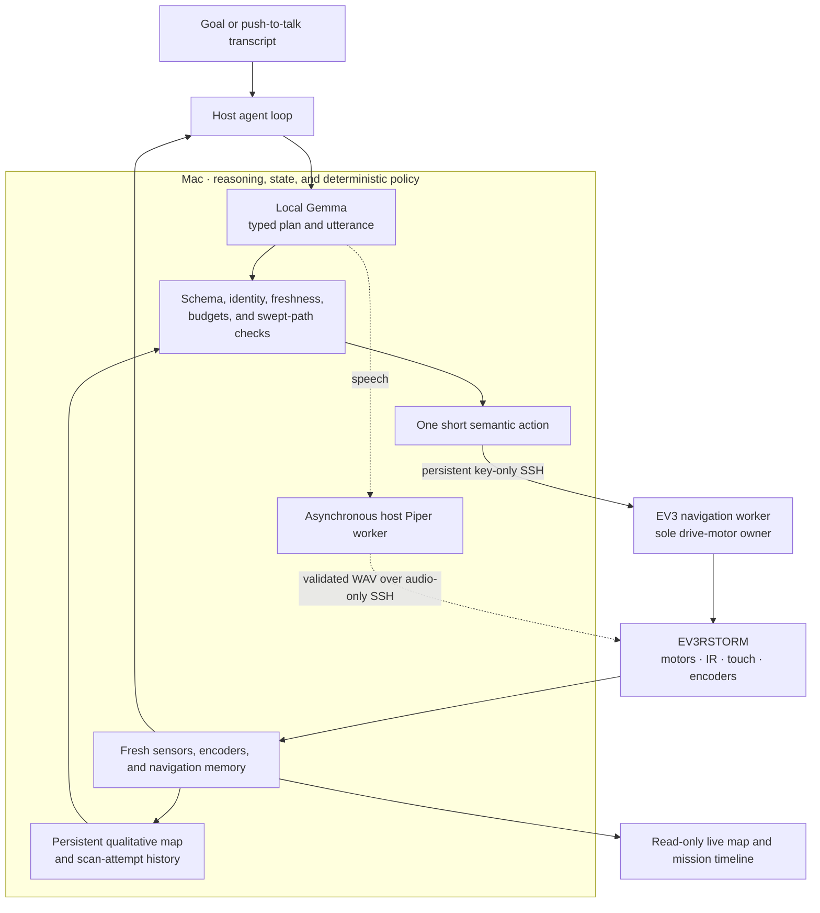

# Robot LLM Lab 🤖

[](https://github.com/Jawbreaker1/robot-llm/actions/workflows/ci.yml)


**A real LEGO robot controlled by a local agentic AI that can plan, observe,
speak, and adapt as it goes.**

Robot LLM Lab connects a local Gemma model to a physical LEGO EV3RSTORM. Give
the robot a goal and it produces a short plan, tries one action, reads the
sensors and motor encoders, checks what actually happened, and changes course
when reality disagrees. The model decides what to try; deterministic host and
EV3 code are the only components allowed to command motors.

This is a personal research project and a controlled experiment, not a
finished robotics product. The current EV3 path has moved, sensed, spoken,
scanned, and replanned on real hardware over Wi-Fi. Its first clean autonomous
route around the test obstacle is still the next acceptance run.

<p align="center">
  
</p>

<p align="center"><em>Mildly grumpy by design. Personality shapes the language; it never bypasses physical control.</em></p>

## At a glance

| Part | What runs today |
|---|---|
| Brain | Local Gemma through LM Studio's OpenAI-compatible API. An LM Link route to another machine on the same local setup also works when configured in LM Studio. |
| Host | A dependency-light Python application on the Mac owns goals, model calls, validation, navigation memory, speech, STT, and the web UI. |
| Body | An assembled EV3RSTORM running ev3dev, reached over key-only Wi-Fi/SSH. Mini-USB remains the recovery path. |
| Physical control | The EV3 navigation worker owns the drive motors, accepts one typed request at a time, and exposes only fixed semantic operations. |
| Perception | IR proximity, the red touch button, drive encoders, motor state, and a forward-facing color/light sensor. The production navigation loop currently consumes IR, touch, and encoders; color is not fused yet. |
| Interaction | English/Swedish text UI, local push-to-talk with whisper.cpp, and host-generated Swedish WAV speech streamed to the EV3 speaker. |
| State | One current live console, process-local technical history, and a separate host-persisted navigation memory for pose, hazards, and scan evidence. |
| Validation | The hardware-free quality gate currently passes 1,341 tests. Physical calibration and the complete obstacle run remain open. |

Weather lookup and ordinary conversation exist as supporting agent tests. They
are not the purpose of the project: the project is the closed loop between a
goal, a reasoning model, changing world state, and a physical robot.

## Why this differs from common LLM-controlled robots

Many LLM–robot demos are effectively one-shot remote controls:

```text
prompt → model chooses command → robot executes command
```

Robot LLM Lab keeps the goal alive and closes the loop:

```text
goal → plan → action → observe → verify → continue, investigate, replan, or stop
```

That difference has practical consequences:

- the goal survives across multiple model calls, sensor readings, and actions;
- the planner sees verified encoder outcomes, not merely the command that was
  sent;
- obstacle hypotheses remain relevant after the robot turns away from them;
- repeated attempts are compared against the physical evidence that justified
  them, so a new timestamp or a little IR jitter does not count as progress;
- speech, mapping, UI updates, and future perception workers can progress
  without owning the wheel controller; and
- one deterministic execution path serializes every physical action.

Natural-language intent is classified by the model through strict schemas.
The host does not translate Swedish or English robot instructions with regular
expressions, keyword lists, or language-specific command menus. It validates
the model's typed proposal against current state; it does not secretly turn the
user's sentence into wheel speed or duration.

> The LLM chooses intent, plan, and expression. It never owns a motor.

## Try the interface in 30 seconds

This needs no EV3, LM Studio model, or speech service:

```sh
git clone https://github.com/Jawbreaker1/robot-llm.git
cd robot-llm
PYTHONPATH=src python3 -m robot_agent.dashboard_cli \
  --simulation-map-demo
```

Open the printed private `/live/<access-key>/` URL and choose **Map**. The run
uses deterministic simulator behavior, so it demonstrates orchestration,
mapping, and the UI—not physical calibration or live model planning.

## Architecture



The physical execution loop is currently serialized: Gemma plans, the host
admits one action, the EV3 executes it, and the result is observed before the
next action is accepted. Speech, map publication, and UI/event delivery already
run beside that loop. The planned multi-producer arbiter—independent vision,
sound, validation, and forward-planning workers publishing simultaneous
proposals—is an architectural direction, not a claim about today's EV3
runtime.

## Current physical status

Status snapshot: **2026-08-01**.

| Capability | Current boundary |
|---|---|
| EV3 foundation and worker | ev3dev, USB recovery, AR9271 Wi-Fi, key-only SSH, motors A/B/C, encoders, IR, touch, reflected light, speaker, and bounded movement have been exercised on the assembled robot. The foreground worker has returned observations, turns, drive pulses, scan slices, encoder results, and stop proofs. Moving disconnect and emergency-stop acceptance still need a recorded run. |
| Physical agent loop | A Robot goal has reached local Gemma, produced a typed plan and speech, moved the EV3, observed an obstacle, scanned, turned, and replanned. It has not yet completed a clean route around the box. |
| Mission scope | The production acceptance mission currently measures roughly `420 mm` of forward progress along a frozen starting direction while allowing obstacle investigation and detours. General room exploration, arbitrary waypoints, and self-created physical missions currently exist only in simulation. |
| Motion recovery | Actual left/right encoder movement is retained when a side starts late or under-runs. Recovery is limited to a fixed single-wheel catch-up or bounded paired same-direction retry. Repeatability still needs measurement, and encoders cannot detect wheel slip. |
| Obstacle reasoning | Bilateral coarse-to-fine IR scanning, cumulative pose-stamped scan evidence, persistent hazard hypotheses, and an asymmetric swept body envelope are implemented. The dimensions and scan conversion remain provisional until the next physical box run. |
| Speech and voice input | Swedish `nst-deep` speech has been heard from the robot during a physical agent run. Local whisper.cpp push-to-talk can submit a transcript directly as a Robot goal. Repeated move-and-speak acceptance, an English voice, and hands-free listening remain open. |
| Expression and future bodies | The grumpy persona currently changes navigation utterances. The propeller works separately and in simulation, but is not an autonomous physical action yet. Robot Inventor 51515, BOOST, cameras, and microphones have contracts or registry entries only; EV3 is the sole production body. |

### What the latest box run taught us

The robot approached the box, gathered live IR and encoder evidence, spoke,
turned, and replanned. Its protruding right arm then touched the box and altered
the turn. That exposed a real modeling error: treating the robot as a point or
a symmetric circle was not enough.

The checked-in EV3 profile now uses a conservative asymmetric body envelope
and checks the swept body before planning and again before dispatch. Scan
attempts accumulate by verified pose and evidence shape instead of replacing
one another. The planner also receives a compact action/result history so it
can tell the difference between blindly retrying and acting after a real change
in pose, sensor state, hazard geometry, or scan coverage.

Those changes pass simulated and fake-hardware tests. They have not yet passed
the physical rerun, so the README does not label autonomous obstacle navigation
as complete.

The color/light sensor is now mounted on the right arm, facing forward,
roughly 10–15 cm below and about 10 cm to the right of the IR sensor. Its live
contrast response has been explored, but the production navigation worker does
not read it yet. It therefore does not currently extend box boundaries, classify
objects, or add map evidence.

The red touch sensor is a button, not a body-wide collision bumper. Side and
arm contact remain operator-observed unless another sensor detects the object.

## Live dashboard


The local web app has two conversation targets:

- **Robot** turns the submitted text or STT transcript into one goal-directed
  physical mission. It exposes model choice, mission budget, speech, start,
  stop, emergency stop, the current plan, recent observations, and technical
  events.
- **Workbench** is ordinary dialogue plus read-only research tools, evidence,
  configuration, and development traces.

There is only one operational console: the current process and the robot's
current state. The private URL has the form:

```text
http://127.0.0.1:8765/live/<access-key>/
```

The random key controls access to the current console; it is not a resumable
run ID. The normal launcher keeps it in the owner-only file
`~/.robot-llm/dashboard-access-key`, so the live bookmark survives restarts.
Old physical runs are evidence, never states to resume. A new Workbench
conversation resets dialogue context only.

The EV3 world model is separate and persists by default at
`~/.robot-llm/navigation/ev3rstorm-01-memory.json`. Use
`--robot-memory-path` to select another file or `--robot-reset-memory` after
manually moving the robot between runs. Changed encoder anchors are detected,
but lifting or rotating the robot without turning its wheels is not; that reset
is the operator's responsibility. Hot UI history remains process-local, and
there is no GUI persistence toggle yet. See the
[dashboard documentation](docs/DASHBOARD.md) for route compatibility and
retention details.

### Map view


The screenshot above is intentionally a **simulator** map; its provenance is
shown in the UI. The same read-only surface displays physical local odometry,
qualitative IR rays, retained hazard hypotheses, body envelope, goal, current
action, plan, speech state, and ordered mission history when a live EV3 run has
published them. It never sends motor commands.

EV3 `IR-PROX` is a relative reflection value from 0 to 100. It is not distance
in centimeters and cannot identify an object. Physical map rays therefore show
the observed bearing and blocked/clear classification without inventing range,
free floor cells, or a measured box surface.

## How one physical decision is made

For each step of the current EV3 mission:

1. the host takes a fresh observation and a snapshot of persistent navigation
   memory;
2. it projects the relevant pose, hazard, scan, and attempt facts into Gemma's
   context window;
3. Gemma returns a strict structured plan and optional utterance;
4. the host rejects stale, malformed, exhausted, or geometrically impossible
   proposals;
5. one accepted semantic action is sent to the EV3 worker;
6. the worker executes a fixed profile, stops, and returns sensors plus encoder
   results; and
7. the host updates pose, hazards, scan history, and attempt results before the
   next planner call.

The model sees semantic choices such as `OBSERVE`, `ADVANCE`, `REVERSE`,
`TURN_LEFT_90`, `TURN_RIGHT_90`, `SCAN_FRONT_ARC`, and `FINISH`. It never
chooses motor ports, raw power, speed, or arbitrary duration.

Authoritative map memory stays on the host and is bounded independently from
the model prompt. The planner receives a deterministic projection that keeps
current targets, exact totals, latest outcomes, and explicit omission counts
within the configured 32k context window. Detailed retention rules, migration
formats, and stress results live in [the architecture document](docs/ARCHITECTURE.md),
not in this front page.

No motor is active while Gemma is planning. EV3-local touch and operation
limits act without a model response, and emergency stop independently aborts
the physical transport. A normal stop discards any late planner result, though
the synchronous HTTP call may return or time out before its thread finishes.

## Parallel today and later

Host speech, EV3 audio playback, map publication, UI delivery, and stop
requests can overlap the physical loop, but none can bypass the one-request
EV3 worker. Speech teardown cannot block motor cleanup.

The longer-term architecture extends the same rule to multiple producers and
bodies: dialogue, vision, sound localization, result validation, and planning
ahead may all publish timestamped observations or proposals, while one arbiter
per physical controller produces the serialized action. A later composite body
may coordinate EV3, Robot Inventor 51515, BOOST, cameras, and microphones, but
those integrations are not implemented yet.

## Full local and physical setup

The host uses Python's standard library. Python 3.9+ is supported on macOS and
Linux; the current physical setup is validated on macOS. Node.js 22 is needed
only for the complete JavaScript-inclusive quality gate.

### 1. Run the local Gemma console

Start LM Studio's local server and load the exact model you intend to use. The
code default is `google/gemma-4-26b-a4b-qat`, but passing the exact served ID is
clearer and prevents accidentally targeting a different local model:

```sh
ROBOT_LLM_STT_URL='' scripts/start_lab_console.sh \
  --model 'EXACT-MODEL-ID-FROM-LM-STUDIO'
```

Setting `ROBOT_LLM_STT_URL=''` deliberately starts without speech recognition.
The launcher otherwise expects an already running whisper.cpp server and fails
visibly if it cannot probe one.

LM Studio may serve the model on this machine or expose another local machine
through LM Link, as long as the OpenAI-compatible API remains available at the
configured loopback URL.

<details>
<summary><strong>Add local push-to-talk with whisper.cpp</strong></summary>

On macOS, Terminal 1:

```sh
brew install whisper-cpp
sh scripts/download_whisper_model.sh large-v3-turbo-q5_0
whisper-server \
  --model models/ggml-large-v3-turbo-q5_0.bin \
  --host 127.0.0.1 \
  --port 8178 \
  --threads 8 \
  --language auto \
  --no-timestamps \
  --suppress-nst \
  --request-path /v1 \
  --inference-path /audio/transcriptions
```

Keep that foreground service running. In Terminal 2:

```sh
scripts/start_lab_console.sh \
  --model 'EXACT-MODEL-ID-FROM-LM-STUDIO'
```

Linux users can build or install whisper.cpp separately and run the same
server interface. The browser captures bounded 16 kHz mono audio through
`getUserMedia` and `AudioWorklet`; it does not use Safari, Chrome, or another
vendor's transcription service. Microphone selection, level, threshold,
sensitivity, silence stop, language hint, and transcript submission are
configured in the UI.

</details>

### 2. Start the physical EV3 runtime

Keep mini-USB available for recovery, verify the wiring against
[`config/ev3rstorm.json`](config/ev3rstorm.json), then follow the
[Wi-Fi runbook](docs/EV3_WIFI.md) and
[runtime deployment guide](docs/EV3_RUNTIME_DEPLOYMENT.md). They cover copying
the current checkout, manifest comparison, and the motion-free
`start → describe → observe → stop → shutdown → close` worker preflight.

Start the explicit physical profile with the exact currently served model:

```sh
scripts/start_ev3rstorm_console.sh \
  --robot-target 'robot@<EV3-host>' \
  --model 'EXACT-MODEL-ID-FROM-LM-STUDIO'
```

If whisper.cpp is not running, prefix the command with
`ROBOT_LLM_STT_URL=''`. If the robot has been manually relocated since its last
run, also pass `--robot-reset-memory`.

To hear the current production Swedish robot voice, a loopback
OpenAI-compatible Piper service must expose
`http://127.0.0.1:8179/v1/audio/speech` with model `piper-sv` and voice
`nst-deep`. The host requests bounded WAV, validates it, and streams it through
a separate audio-only SSH worker. The older `robot_cli.py speak-stdin` command
is only an onboard eSpeak/speaker diagnostic; it is not the production speech
path. See the [runtime deployment guide](docs/EV3_RUNTIME_DEPLOYMENT.md).

Manual `drive-test` remains a calibration tool, not the autonomous path.

### 3. Run the quality gate

```sh
sh ./scripts/quality_check.sh
```

The suite uses fake subprocesses, simulated sysfs, deterministic clocks, and
the accelerated simulator. It never activates physical hardware and cannot
prove real braking distance, stop latency, room geometry, or speaker output.

<details>
<summary><strong>Additional simulator and research commands</strong></summary>

```sh
# Waypoint navigation
PYTHONPATH=src python3 -m robot_agent.navigation_demo

# Spatial mapping
PYTHONPATH=src python3 -m robot_agent.spatial_mapping_demo

# Self-directed idle exploration
PYTHONPATH=src python3 -m robot_agent.autonomy_demo

# Concurrent navigation, dialogue, virtual speech, and propeller behavior
PYTHONPATH=src python3 -m robot_agent.concurrent_demo
```

The defaults are offline and deterministic. `--lm-studio` is explicit for the
autonomy and concurrent demos.

The read-only research seam requires LM Studio plus outbound internet:

```sh
PYTHONPATH=src python3 -m robot_agent.research_cli \
  --model 'EXACT-MODEL-ID-FROM-LM-STUDIO' \
  --pretty \
  'Do I need an umbrella in Stockholm right now?'
```

The model selects the typed `weather.current` tool semantically. The host does
not use keywords or regex routing, and the result carries source and freshness
metadata.

</details>

## Next milestones

- [ ] Rerun and capture the box experiment with the asymmetric footprint,
  cumulative scan evidence, persistent map, and action/result memory
- [ ] Complete a clean physical goal → plan → act → observe → replan → finish
  run around the obstacle
- [ ] Measure body extents, straight/reverse profiles, 90-degree turns, scan
  conversion, restoration tolerance, and intermittent drive-side recovery
- [ ] Fuse the forward color/light sensor into perception only after live data
  shows what information it adds
- [ ] Repeat Swedish speech during completed motion and configure a separately
  tested English host voice
- [ ] Add autonomous physical propeller-arm expression without expanding wheel
  authority
- [ ] Add continuous hands-free STT with turn-taking and echo handling
- [ ] Build a Robot Inventor 51515 body and run EV3 plus 51515 concurrently
- [ ] Add robot-mounted wireless cameras and microphones
- [ ] Add vision, object research, sound classification, and source localization
- [ ] Generalize the arbiter to multiple asynchronous perception/reasoning
  producers and several physical controllers

The dream demo:

```text
dog bark → locate sound → look for the source → confirm dog
         → turn toward it → “woof right back at you”
```

## Documentation and evidence

| Document | Purpose |
|---|---|
| [Architecture](docs/ARCHITECTURE.md) | Authority model, parallelization, navigation memory, planner projection, and multi-controller direction |
| [Dashboard](docs/DASHBOARD.md) | Live-console semantics, STT, map, retention, and UI contracts |
| [EV3 Wi-Fi](docs/EV3_WIFI.md) | AR9271/ConnMan onboarding, key-only SSH, recovery, and network checks |
| [EV3 runtime deployment](docs/EV3_RUNTIME_DEPLOYMENT.md) | Worker deployment, preflight, transport, speech path, and physical acceptance boundaries |
| [Experiment plan](docs/EXPERIMENT_PLAN.md) | Protocols, live observations, limitations, and evidence ledger |
| [Gemma navigation benchmark](docs/LM_STUDIO_NAVIGATION_BENCHMARK.md) | Reproducible QAT/Q8 structured-planner benchmark method and interpretation |
| [`docs/data`](docs/data) | Machine-readable experiment and benchmark artifacts |

Historical measurements remain in the experiment plan and data artifacts so
that an old result cannot silently become a claim about the current runtime.
The README reports the current boundary and links to the evidence instead of
duplicating the full lab notebook.

## Repository layout

```text
config/                 EV3 topology, fixed action profiles, and simulator configuration
docs/                   architecture, deployment, experiment protocols, evidence, and UI captures
ev3/                    Python 3.5 HAL, navigation worker, supervisor, and operator diagnostics
src/robot_agent/        host agent loops, physical runtime, mapping, speech, research, and web UI
tests/                  hardware-free contracts, scenarios, transport, UI, and failure-path tests
```

Robot LLM Lab deliberately avoids a large robotics framework. New abstractions
must earn their place through observed problems while the architecture remains
ready for parallel perception and reasoning across several controllers.

No open-source license has been selected yet.

LEGO, MINDSTORMS, EV3, Robot Inventor, and BOOST are trademarks of the LEGO
Group. This independent experimental project is not affiliated with or
endorsed by the LEGO Group.
