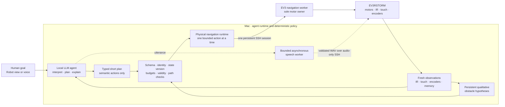

# Robot LLM Lab 🤖


[](https://github.com/Jawbreaker1/robot-llm/actions/workflows/ci.yml)


**A real LEGO robot controlled by a local agentic AI that can plan, observe,
speak, and adapt as it goes.**

> **Running on real hardware:** the project now communicates with an assembled
> physical EV3RSTORM over Wi-Fi/SSH. ev3dev boot, motors A/B/C, encoders, IR,
> touch and reflected-light sensors, bounded movement, and robot speech have
> all been exercised on the actual robot. The first complete autonomous
> obstacle-navigation episode remains the next live integration milestone.

Robot LLM Lab is an embodied-agent research project built around a LEGO
EV3RSTORM. A local LLM interprets a goal, produces a short structured plan,
chooses semantic robot actions, observes their results, and decides whether to
continue, investigate, replan, or stop. Deterministic software—not the
model—translates accepted actions into fixed motor behavior and remains the
only authority over the physical robot.

This is not a prompt-to-motor demo. The project is about a continuing,
closed-loop agent that can pursue an outcome while dialogue, perception,
mapping, validation, and speech are allowed to progress asynchronously.

> **Research question:** Can asynchronous LLM reasoning, dialogue, and
> perception produce useful closed-loop robot behavior while a deterministic
> control layer remains the sole authority over motion?

<p align="center">
  
</p>

<p align="center"><em>Mildly grumpy by design. Personality lives in the language layer; motor authority does not.</em></p>

## What the project is for

Give the robot an outcome such as:

```text
Explore the room. If something blocks you, investigate it, get around it,
and tell me what you think is happening.
```

The intended result is not a translated list of wheel commands. It is an
episode in which the system repeatedly:

1. interprets the goal and current evidence;
2. proposes a small typed plan;
3. executes one short, host-approved semantic action;
4. observes sensors and verified motor results;
5. updates its world memory; and
6. continues, replans, asks for more perception, or stops.

The same application provides the human conversation, technical trace,
settings, map, start/stop controls, and eventually additional bodies, cameras,
and microphones. Weather lookup and general conversation are supporting
agent capabilities; they are not the purpose of the project.

## Why this differs from common LLM-controlled robots

Many LLM–robot demonstrations are effectively one-shot remote controls:

```text
prompt → model chooses a command → robot executes it
```

Robot LLM Lab is built around a persistent feedback loop:

```text
goal → plan → bounded action → observe → verify → continue, replan, or stop
```

The distinction matters:

- a goal survives across many observations and actions;
- the model may revise its plan when physical evidence contradicts it;
- obstacle hypotheses remain relevant after the robot turns away from them;
- perception, mapping, dialogue, and speech can run without serializing every
  function behind one model call;
- every proposal carries typed identity and freshness information; and
- one deterministic execution path serializes all physical motor decisions.

Natural-language intent is handled semantically by the model and returned
through strict schemas. The host does not route robot instructions with
regular expressions, keyword menus, or Swedish/English-specific command
heuristics. The host validates what the model proposed; it does not secretly
reinterpret the user's sentence into motor power or duration.

> **Semantic invariant:** the LLM may choose intent, plan, and expression, but
> it never owns a motor.

> **Execution invariant:** reasoning and perception may run in parallel;
> physical execution is serialized, bounded, observable, and interruptible.

## From goal to physical action



The physical implementation uses a foreground, policy-free EV3 worker over a
persistent key-only Wi-Fi SSH connection. The worker exposes only fixed
semantic operations: observe, bounded advance/reverse/turn pulses, a bounded
relative scan turn, stop, describe, and shutdown. It owns the configured
drive motors for the worker session and accepts one request at a time.

The host runtime performs the agent loop: goal → structured model plan → short
semantic action → observation → verification → replan. It retains qualitative
IR obstacle hypotheses, rejects model actions that conflict with current
evidence or a swept path, renews a failed or exhausted worker session only at
a verified safe boundary, and never gives the model raw motor parameters.

## What works today

Status snapshot: **2026-07-31**.

“Verified” below means either observed on the assembled EV3RSTORM or exercised
by the hardware-free quality suite. “Awaiting live validation” means the
production path exists and its contracts pass simulated/fake-hardware tests,
but the complete path has not yet run as one physical autonomous episode.

| Area | Current state | Important boundary |
|---|---|---|
| Simulator agent | Fully exercised closed loops for waypoint navigation, idle exploration, obstacle avoidance, concurrent expression, and mapping | Simulator measurements are not physical calibration evidence |
| Physical EV3 baseline | Live-verified ev3dev boot, USB and Wi-Fi SSH, motors A/B/C, encoders, touch, relative IR, reflected light, manual bounded movement, and Swedish TTS | Historical measurements are listed below; they do not validate the new complete autonomous runtime |
| EV3 navigation worker | The production JSONL worker now runs on the assembled EV3 over persistent Wi-Fi SSH; live sessions have exercised observations, bounded pulses, turns, stop proofs, and active-scan slices | A complete autonomous obstacle-navigation episode still needs a clean acceptance run |
| Physical closed loop | A goal entered in the Robot UI has reached local Gemma, produced a typed plan, spoken its assessment, and dispatched real EV3 observations and movement; obstacle approach and reaction have both run | Reliable obstacle analysis and a complete route around or away from the obstacle remain the current acceptance target |
| Encoder-aware degraded motion | Failed or asymmetric drive attempts retain their actual left/right encoder movement; temporal differential-drive odometry updates the estimated pose, cancels stale plan tails, and can apply a bounded EV3-specific catch-up or retry | Live recovery sequences have looked correct, but repeatability still needs measurement; encoders cannot see wheel slip or revive broken hardware |
| Gemma 4 planner comparison | In one matched-load run, QAT Q4_0 produced `106.633 tok/s` single-flight median server decode versus Q8_0's `91.112 tok/s` (`+17.0%`), with `3.017` versus `3.312 s` median latency; both produced 45/45 schema-valid expected actions | This is one hardware-free planner run, not a moving-robot run or a general model-quality claim; four-way aggregate throughput was effectively tied |
| Active IR investigation | Bilateral coarse-to-fine front-arc scanning, encoder-derived headings, boundary observations, and restoration to the starting heading are implemented; physical turn/restoration slices and stationary IR batches have run | The current `682°` mean wheel-encoder estimate for an approximately `90°` body turn is provisional, and a complete bilateral live scan still needs an acceptance run |
| Obstacle memory | Physical navigation retains qualitative IR hazard hypotheses after turning and applies swept-path vetoes instead of assuming “not in front” means “gone” | IR-PROX is not metric distance or object identity; the physical map is deliberately qualitative |
| Robot speech | The host asynchronously asks loopback Piper for bounded Swedish `nst-deep` WAV audio, validates it, and streams it through one persistent audio-only SSH worker per episode; that voice has now been heard during a live physical agent episode | Repeated move-and-speak runs still need acceptance; English needs its own configured voice/model and is deliberately not sent through the Swedish NST voice |
| Robot control GUI | The separate Robot and Workbench views, explicit EV3 launch profile, episode controls, settings, stop, emergency stop, snapshots, physical map, and technical event streams are implemented; the Robot path has started real Wi-Fi episodes | Ordinary console startup still injects no physical adapter and reports `DISABLED`; the EV3 launch remains opt-in until a complete obstacle episode passes |
| Lab Console dialogue and STT | Local Gemma chat, local whisper.cpp STT, microphone selection and sensitivity controls, context, read-only weather, evidence, and English/Swedish UI and text responses | STT text reaches the agent; always-listening robot conversation remains future work |
| Spatial UI map | The read-only Map view supports both the simulator occupancy map and a live physical LOCAL_ODOMETRY layer fed by the same EV3 pose and hazard hypotheses used for navigation | The EV3 layer is deliberately qualitative: it draws provisional screen-space IR sectors, never invented centimetres, free cells, or object surfaces; its first live acceptance run is pending |
| Multi-controller architecture | Identity, proposal, and authority contracts are designed to grow to EV3, Robot Inventor 51515, BOOST, cameras, and microphones | Only the EV3 path has a production physical worker today |

### Latest physical run

The latest EV3 session reached the real integration path from the Robot UI:
local Gemma selected `SCAN_FRONT_ARC` for the box in front of the robot and
the host-generated Swedish assessment was dispatched to the separate EV3
speech worker while the physical runtime was active. The episode then stopped
on its first stationary scan sample, before issuing a scan-turn motor command.

This was separate from an earlier scan-turn failure in the same development
session. In that run, encoder evidence proved that the first `-30°` turn had
physically occurred; a later controlled turn restored the starting heading.
That path led to balanced scan slices and typed, safely stopped non-completion
receipts. The final run described here exposed the remaining sample-validator
mismatch before any wheel movement.

That failure was a strict-contract bug, not a sensor or Wi-Fi disconnect. The
EV3 obstacle gate filters the latest three readings from each five-sample
batch, while the host validator had recomputed the median over all five. A
perfectly valid jitter sequence could therefore be rejected, causing the host
to close the SSH channel and obscure the useful error behind a later shutdown
failure. The worker and host now publish and validate the same filter window,
the original fault is retained in dashboard telemetry, and the exact real
sample pattern is covered by regression tests.

All `1,236` hardware-free tests passed after the correction. Encoder evidence
also confirmed that the failed attempt had not moved either drive wheel. The
EV3 batteries expired before the corrected worker files could be copied back
to the brick, so the next session starts with that deployment followed by the
same autonomous box experiment—not with another redesign.

On the operator-confirmed `lmlink` path to the gaming computer, matched-load
QAT Q4_0 and Q8_0 runs both produced `45/45` schema-valid expected first-pass
decisions. In this run's latency-critical single-flight mode, QAT median server
decode was `106.633 tok/s` versus Q8's `91.112 tok/s` (`+17.0%`), and median
end-to-end latency was `3.017` versus `3.312 s` (`-8.9%`). This advantage did
not generalize to four concurrent requests: aggregate output was effectively
tied at `89.782` versus `90.468 tok/s`, and QAT median latency was worse. The
physical planner will therefore start single-flight. These are workload- and
run-specific observations between distinct model artifacts, not a general
claim that four-bit models are faster or equally capable. An earlier project update
mislabelled client end-to-end token rate as generation speed; the v2 evidence
now records server decode, TTFT, client wall time, makespan, and aggregate rate
separately.

## Fastest demonstrations

### 1. See the complete interface and a real autonomous map

This is the fastest visual demonstration and does not contact the EV3:

```sh
PYTHONPATH=src python3 -m robot_agent.dashboard_cli \
  --simulation-map-demo
```

Open the unique session URL printed by the server. The **Robot** view shows the
episode control plane and its disabled/live state; the **Map** view shows the
completed simulator episode. The map episode uses deterministic reference
behavior, so it validates orchestration, supervision, verification, and
mapping—not live model planning or physical calibration.

### 2. Let local Gemma select a bounded simulator objective

```sh
PYTHONPATH=src python3 -m robot_agent.autonomy_demo \
  --lm-studio --scenario range-change
```

The model sees opaque, host-created opportunities rather than coordinates or
motor values. This exercises model selection inside the agent loop while the
robot and world remain simulated.

### 3. Exercise the physical production contracts without moving a robot

```sh
sh ./scripts/quality_check.sh
```

The suite runs the host runtime, EV3 worker, SSH process transport, scan rig,
session renewal, stop/error paths, GUI control plane, speech scheduling, and
simulator scenarios against fakes and simulated sysfs. It cannot replace live
braking, calibration, room geometry, speaker, or network tests.

### 4. Start the explicit physical EV3 console

After deploying the exact committed worker files and completing the
motion-free preflight, start the real hardware profile with:

```sh
scripts/start_ev3rstorm_console.sh \
  --robot-target 'robot@<EV3-host-or-address>'
```

This is the opt-in production path used for the current live experiments. It
does not make the unfinished obstacle run a polished demo: the ordinary Lab
Console still injects no physical adapter, and the EV3 profile remains an
operator-controlled experiment until a complete goal-driven episode passes.

## The Lab Console

The Mac application has two deliberate identities:

- **Robot** is where a person gives the physical agent a goal, selects the
  exact model and episode budget, enables speech, starts one episode, stops it,
  or uses emergency stop. It also shows the current plan, action, obstacle or
  scan evidence, speech state, snapshots, and technical events.
- **Workbench** is for general dialogue, speech-to-text experiments,
  read-only research tools, evidence inspection, component configuration, and
  development traces.

The split prevents “talking to the development workbench” from being confused
with “talking directly to the embodied robot.” The Robot routes exist today,
but they fail closed as `DISABLED` unless the application was constructed
with the physical runtime adapter.


The screenshots currently document the verified workbench and experiment
surfaces. The live Robot control path is described by current status rather
than presented as completed physical evidence.

<details>
<summary><strong>Secondary proof: typed read-only tool use</strong></summary>


Weather is intentionally narrow and motion-free. In this run, Gemma selected
the single allowlisted `weather.current` tool, the host fetched Open-Meteo
data, bound it as fresh evidence, and required the answer to cite that
evidence. This validates semantic tool selection and provenance for future
robot perception; it does **not** make weather chat the purpose of the
project.

</details>

<details>
<summary><strong>Declarative component registry</strong></summary>


This is an inventory, not a control surface. The future camera, microphone,
Robot Inventor, and BOOST nodes are offline declarations with no exposed
physical control path.

</details>

## Parallel behavior without parallel motor ownership

The system is deliberately asynchronous above the execution boundary:

- the main agent can interpret goals and create a short plan;
- perception can publish new observations;
- mapping can retain and update world hypotheses;
- validation can judge the last action;
- speech can be generated and played while navigation continues; and
- future vision and sound workers can publish independent, time-stamped
  evidence.

None of those producers can write to a motor. Physical requests are
serialized through one host runtime and one EV3 worker session. Slow model or
speech work cannot stall deterministic motor cleanup. The speech queue is
bounded and latest-pending-wins; cancellation and playback failure are
observable but do not become motion authority.

The simulator already exercises richer concurrent navigation, expression,
speech, and propeller behavior. On the physical path, host-generated Swedish
speech has now overlapped an active navigation episode without becoming motor
authority. A complete repeated move-and-speak run remains an acceptance item,
and English still needs a separately configured and tested host voice.

## Physical perception and obstacle memory

EV3 `IR-PROX` is a relative reflection/proximity signal from 0 to 100. It is
not centimeters, object identification, or proof that an unseen direction is
clear. The physical runtime therefore stores qualitative hazard hypotheses
with evidence lineage instead of inventing metric geometry.

When an obstacle blocks progress, the model can request `SCAN_FRONT_ARC`. The
deterministic scan executor samples a fixed bilateral arc, optionally refines
blocked/clear transitions, records encoder-derived headings, and restores the
robot to its starting orientation before publishing a result. A later route
must respect the retained obstacle boundary and swept robot footprint; turning
until the IR sensor no longer sees the box does not erase the box.

The fixed scan profile currently derives an approximately 90-degree body turn
from a provisional target of 682 mean absolute wheel-encoder degrees. The
implementation and failure paths are tested, but the conversion, alignment
tolerance, and scan timing must be measured on the physical build before the
result is treated as calibrated.

The dashboard now keeps those two trust levels visibly separate. Simulator
ranges can populate the metric occupancy layer. Physical EV3 observations feed
a dedicated `LOCAL_ODOMETRY` layer with the encoder-derived robot pose and the
same opaque hazard IDs used by navigation. IR reflections appear as fixed
screen-space qualitative sectors anchored at the observing pose, never as
invented centimetre ranges, cleared cells, or object surfaces.

## Safety and authority boundaries

Enforced in code today:

- the model may select only strict semantic actions such as `ADVANCE`,
  `REVERSE`, `TURN_LEFT_90`, `TURN_RIGHT_90`, `SCAN_FRONT_ARC`, `OBSERVE`,
  and `FINISH`;
- fixed host/worker profiles own wheel speeds, pulse durations, allowed scan
  deltas, timeouts, and motor roles;
- the EV3 worker owns the drive motors exclusively and processes one request
  at a time;
- every action is bounded, sliced, observable, and followed by verified stop
  and encoder/sensor evidence;
- direction-consistent EV3 undertravel may trigger only a fixed, bounded
  single-wheel catch-up or paired retry budget; wrong-direction movement still
  latches a motion fault;
- touch, worker cancellation, signal, SSH EOF, request/session budgets, and
  emergency stop do not wait for an LLM response;
- strict schemas bind controller, request, state version, sequence, and result;
- stale plans, changed localization, unsafe swept paths, and unverifiable
  finishes fail closed;
- session renewal occurs only through bounded cleanup and re-observation;
- speech text is length-bounded and passed through stdin, never interpolated
  into a remote shell command;
- Swedish physical speech uses the explicit loopback Piper profile
  `piper-sv` / `nst-deep`, then streams bounded mono PCM16 WAV to the EV3
  without creating a remote temporary file;
- the local GUI has bounded request sizes, a unique loopback session URL,
  Host/Origin checks, strict route and asset allowlists, and no physical
  runtime unless one is explicitly injected; and
- natural-language routing belongs to schema-constrained model inference, not
  regular expressions or language-specific keyword heuristics.

Still required before calling physical autonomy live-validated:

- replace the exhausted batteries, deploy the committed scan-filter contract,
  and repeat the already proven motion-free worker preflight;
- measure straight and turn profiles, encoder alignment, stop behavior, and
  the provisional scan conversion on this physical build;
- run obstacle and bilateral-scan scenarios with recorded observations;
- verify stop, emergency stop, SSH loss, worker death, touch interruption,
  and session renewal while the robot is moving;
- repeat Swedish physical speech during completed motion and configure a
  separate tested English host voice;
- capture a clean run from the documented `start_ev3rstorm_console.sh`
  profile; and
- complete one end-to-end goal → model → action → observation → replan → stop
  episode and publish its evidence.

## Try it locally

The host code uses Python's standard library. Python 3.9+ is recommended on
macOS or Linux. The complete quality gate also uses Node.js for executable
tests of the dependency-free dashboard JavaScript; CI currently uses Node 22.

### Start the Lab Console

With LM Studio running on `127.0.0.1:1234` and the configured model already
loaded, run:

```sh
scripts/start_lab_console.sh
```

The canonical runtime default is the exact LM Studio model ID
`google/gemma-4-26b-a4b-qat`. The start command does not load or switch a
model; that exact ID must already be exposed by the intended LM Studio server.
An explicit alternative applies consistently to both Workbench and Robot
settings for that process:

```sh
scripts/start_lab_console.sh --model 'EXACT-MODEL-ID-FROM-LM-STUDIO'
```

Open the unique loopback session URL printed by the server:

```text
http://127.0.0.1:8765/session/<session-token>/
```

Restarting the server invalidates the token. The ordinary command launches
the complete UI but deliberately injects no EV3 runtime; the Robot view must
therefore report physical control as disabled. Model IDs are explicit
configuration values. Loading or benchmarking a model is a separate operator
decision on the intended LM Studio host.

The normal voice profile reuses a warm local `whisper.cpp` service at
`http://127.0.0.1:8178/v1`, posts to the separately validated
`/audio/transcriptions` path, and identifies the model as
`ggml-large-v3-turbo-q5_0`. For a new installation:

```sh
brew install whisper-cpp
sh scripts/download_whisper_model.sh large-v3-turbo-q5_0
whisper-server \
  --model models/ggml-large-v3-turbo-q5_0.bin \
  --host 127.0.0.1 \
  --port 8178 \
  --threads 8 \
  --language auto \
  --no-timestamps \
  --suppress-nst \
  --request-path /v1 \
  --inference-path /audio/transcriptions
```

Then run `scripts/start_lab_console.sh`. It probes the service before
declaring the dashboard ready, so a missing or incompatible provider fails
visibly instead of silently falling back. The provider-neutral settings
surface exposes microphone selection, input level and threshold, sensitivity,
silence auto-stop, maximum utterance length, browser audio processing,
language hint, warm-stream behavior, and automatic or editable transcript
submission.

The browser captures bounded 16 kHz mono PCM16 WAV through `getUserMedia` and
`AudioWorklet`; it does not use a browser-vendor transcription service. STT
has its own bounded worker and does not serialize Gemma dialogue, navigation,
speech playback, or motor supervision.

### Run hardware-free validation

```sh
sh ./scripts/quality_check.sh
```

The suite uses simulated sysfs, fake subprocesses, deterministic clocks, and
the accelerated simulator. It verifies contracts, budgets, process behavior,
agent loops, GUI routing, mapping, and failure cleanup. It never activates
physical hardware and cannot prove real stop latency or braking distance.

### Run autonomous simulator scenarios

Waypoint navigation:

```sh
PYTHONPATH=src python3 -m robot_agent.navigation_demo
```

Spatial mapping:

```sh
PYTHONPATH=src python3 -m robot_agent.spatial_mapping_demo
```

Self-directed idle exploration:

```sh
PYTHONPATH=src python3 -m robot_agent.autonomy_demo
```

Concurrent navigation, dialogue, virtual speech, and propeller behavior:

```sh
PYTHONPATH=src python3 -m robot_agent.concurrent_demo
```

The deterministic defaults run offline. `--lm-studio` is an explicit option
for the autonomy and concurrent demos; it should be used only after confirming
that the command points at the intended LM Studio host and model. All of these
demos remain simulated and make no claim about physical calibration.

### Use the read-only research seam

```sh
PYTHONPATH=src python3 -m robot_agent.research_cli --pretty \
  'Do I need an umbrella in Stockholm right now?'
```

The model chooses semantically from a strict schema; the host performs no
regex, substring, or keyword routing. The current registry contains only
`weather.current`, backed by Open-Meteo's
[geocoding](https://open-meteo.com/en/docs/geocoding-api) and
[forecast](https://open-meteo.com/en/docs) APIs. Responses include evidence
IDs, timestamps, TTL, source URLs, byte counts, and SHA-256 hashes.

## Physical EV3 deployment path

Keep mini-USB available as a recovery path during deployment. Verify the
assembled wiring against [`config/ev3rstorm.json`](config/ev3rstorm.json),
back up the destination, and follow the
[EV3 Wi-Fi onboarding runbook](docs/EV3_WIFI.md).

Deploy the exact code and configuration:

```sh
ssh 'robot@<EV3-host>' 'mkdir -p /home/robot/robot-llm'
scp -r ev3 config 'robot@<EV3-host>:/home/robot/robot-llm/'
```

Compare the fixed local and remote navigation-worker manifests before
starting any process:

```sh
PYTHONPATH=src python3 -m robot_agent.ev3_runtime_preflight_cli \
  --ssh-target 'robot@<EV3-host>' \
  --profile navigation-worker \
  --pretty
```

The preflight checks exact files, SHA-256 hashes, Python 3.5 grammar, fixed
remote paths, and remote compilation. It does not import the worker, generate
speech, or enable motion.

Then validate the live foreground worker protocol without requesting
movement:

```sh
PYTHONPATH=src python3 -m robot_agent.ev3_navigation_preflight_cli \
  --ssh-target 'robot@<EV3-host>' \
  --pretty
```

This runs only `start → describe → observe → stop → shutdown → close`, checks
that no movement budget was consumed, and emits sanitized JSON without the SSH
target, remote path, or raw transport errors. A failure aborts the channel and
attempts final cleanup before exiting non-zero. Cold worker startup gets a
separate 30-second `describe` deadline; later requests retain an 8-second
deadline.

Motion-free checks remain available on the EV3:

```sh
cd /home/robot/robot-llm
python3 ev3/robot_cli.py inventory
python3 ev3/robot_cli.py stop
python3 ev3/ir_gate_probe.py
```

Test the bounded voice seam independently of navigation:

```sh
printf '%s\n' 'Jag ser något framför mig.' |
  python3 ev3/robot_cli.py speak-stdin --voice sv
printf '%s\n' 'I can see something in front of me.' |
  python3 ev3/robot_cli.py speak-stdin --voice en
```

The host transport starts `ev3/navigation_worker_cli.py` as a foreground
JSONL process over one SSH channel. It should not be launched interactively as
an autonomous robot: the worker contains no goals, planner, personality, or
independent navigation policy. Those live in the Mac application.

Until the opt-in application composition and first live evidence run are
documented, use the existing manual pulse only for controlled calibration:

```sh
python3 ev3/robot_cli.py drive-test \
  --left-speed-dps 100 \
  --right-speed-dps 100 \
  --duration-ms 300 \
  --acknowledge-physical-motion
```

Read the full [runtime deployment preflight](docs/EV3_RUNTIME_DEPLOYMENT.md)
and [experiment plan](docs/EXPERIMENT_PLAN.md) before physical work.

## Verified results

The table below is historical evidence. It is preserved to distinguish prior
measurements from the new production physical path that still awaits its full
live run.

| Measurement | Result |
|---|---:|
| Hardware-free test suite | `scripts/quality_check.sh` passing |
| EV3 Wi-Fi onboarding | AR9271 + `ath9k_htc` firmware + ConnMan ready; key-only SSH; USB/Wi-Fi brick identity matched |
| Persistent full inventory | cold attempt exceeded the previous `20 s` client deadline, with remote completion unknown; immediate warm retry `15.721 s` |
| Persistent IR transport | cold request `13.307 s` / `14.138 s` total; 10 warm reads: min `70 ms`, median `82 ms`, p95/max `96 ms`; value `55 → 55` |
| Persistent touch transport | cold request `16.995 s` / `17.244 s` total; 3 warm reads: min `73 ms`, median `86 ms`, p95/max `88 ms`; value `0 → 0` |
| Controlled Wi-Fi disconnect | `PeripheralSSHTimeoutError` after `3.005 s`; ConnMan had auto-reconnected by the third `3 s` poll |
| Post-reboot cable-free Wi-Fi | ConnMan auto-connected; USB interface absent; Mac default route unchanged; strict key-only SSH passed; runtime manifest `6/6`; 3 warm IR reads min `70 ms`, median `88 ms`, p95/max `91 ms`; value `57 → 57` |
| Physical supervisor polling, before optimization | 12 motion-free polls: `196–216 ms`, median `201 ms`; physical remeasurement pending |
| Local `small` STT synthetic acceptance | exact Swedish + English transcripts; `495 ms` first inference / `120 ms` warm follow-up |
| Physical supervisor preflight | `completed`, `0` motor-start commands |
| Straight physical B/C pulse | `+175° / +175°` |
| Physical B/C turn pulse | `+172° / −170°` |
| Stored dynamic IR replicate | `277` samples |
| IR measurement sampling | mean `50 ms`, range `47–53 ms` |
| IR gate blocked | `100 ms` after first raw value `≤35` |
| IR gate released | `100 ms` after first filtered value `≥40` |
| Gemma proposal in one physical shadow run | `417 ms` |
| Gemma 4 QAT structured physical planner | Matched-load run: `45/45` valid schemas and expected actions; single-flight median/p95 `3.017 / 3.147 s`; median server decode `106.633 tok/s`; measured aggregate E2E output `98.206 tok/s` |
| Gemma 4 Q8 structured physical planner | `45/45` valid schemas and expected actions; single-flight median/p95 `3.312 / 3.922 s`; median server decode `91.112 tok/s`; measured aggregate E2E output `82.790 tok/s` |
| Live concurrent Gemma simulator run | `1` accepted expression; speech/navigation interleaving observed; `98` actions; verified stop |
| Live idle Gemma range-change run | `2 / 2` self-selected tasks; same box `207 → 357 mm`; `22` actions; `0` collisions; verified stop |
| Spatial-map simulator run | `100` fused snapshots; `193` retained cells; `9` opaque hypotheses; `98` actions; `0` collisions; verified stop |

The persistent Wi-Fi sensor run was entirely motion-free. Its unchanged IR
and touch values prove that requests and responses crossed the transport, not
that either sensor reacted to a physical stimulus. The disconnect result
measures host-side timeout and ConnMan recovery only; it is not evidence for
motor-stop latency, heartbeat enforcement, or safe motion over Wi-Fi.

The pre-optimization polling figure is retained as historical evidence; it is
not the architecture or a current requirement of the bounded navigation
worker. The new worker uses short fixed operations, local cancellation, and
verified stops and must be evaluated through its own live protocol.

The IR gate figures verify filtering and hysteresis in stationary tests. They
are not motor stop time, braking distance, a real-time guarantee, or a
benchmark. The STT figures use synthesized canonical WAV fixtures rather than
a physical microphone recording.

Protocols, limitations, and raw data are in the
[experiment plan](docs/EXPERIMENT_PLAN.md) and
[EXP-F1-IR-DYN-002.json](docs/data/EXP-F1-IR-DYN-002.json). The QAT planner
benchmark is recorded separately in
[EXP-GEMMA4-QAT-NAV-001.json](docs/data/EXP-GEMMA4-QAT-NAV-001.json), with the
matched-load records in
[EXP-GEMMA4-Q8-NAV-001.json](docs/data/EXP-GEMMA4-Q8-NAV-001.json) and
[EXP-GEMMA4-QAT-NAV-002.json](docs/data/EXP-GEMMA4-QAT-NAV-002.json), plus the
[comparison record](docs/data/EXP-GEMMA4-QAT-Q8-NAV-COMP-001.json).

## Roadmap

- [x] Physical EV3 baseline: ev3dev, USB/SSH, Wi-Fi, manual motors, sensors,
  encoders, and Swedish TTS
- [x] Local Gemma dialogue, English/Swedish UI, local whisper.cpp STT, and
  read-only cited research tools
- [x] Typed RobotAPI, waypoint navigation, verification, replanning, and
  self-directed exploration in simulation
- [x] Concurrent simulator navigation, expression, virtual speech, propeller
  reactions, and serialized wheel ownership
- [x] Simulator occupancy map and persistent opaque object hypotheses in the
  read-only GUI map
- [x] Live physical-map pipeline with local odometry and non-metric,
  provisional EV3 IR hypotheses in a separate read-only GUI layer
- [x] Bounded EV3 navigation worker with persistent SSH transport, exclusive
  motor ownership, verified stop, interruption, and safe session renewal
- [x] Host physical goal → structured plan → semantic action → observe →
  verify → replan runtime with qualitative obstacle memory and swept-path
  checks
- [x] Preserve degraded encoder evidence, integrate temporal differential
  odometry, cancel stale plan tails, and apply bounded EV3 undertravel recovery
  in hardware-free tests
- [x] Deterministic bilateral IR scan implementation with encoder-derived
  headings and start-heading restoration
- [x] Robot/Workbench GUI split with opt-in runtime, episode controls,
  settings, stop, emergency stop, snapshots, and technical events
- [x] Bounded asynchronous host-generated Swedish WAV speech transport,
  scheduler, duplicate suppression, and physical runtime composition
- [ ] Repeat Swedish TTS during completed motion and add a separately
  configured, live-tested English host voice
- [ ] Deploy the corrected scan-filter contract after the battery change and
  repeat the autonomous box experiment
- [ ] Calibrate advance, reverse, 90-degree turn, and active IR scan on the
  assembled EV3RSTORM
- [ ] Live-validate intermittent motor catch-up and record how often each EV3
  drive side misses or under-runs a command
- [ ] Run and publish the first complete autonomous physical obstacle episode
- [ ] Complete live acceptance of the explicit opt-in physical launch profile,
  including simultaneous motion and speech
- [ ] Add continuous hands-free STT with turn-taking and echo handling
- [ ] Add robot-mounted camera and microphone transport
- [ ] Add vision, object research, and sound-source localization
- [ ] Coordinate EV3, Robot Inventor 51515, and BOOST as one composite body

The dream demo:

`dog bark → locate sound → look for the source → confirm dog → turn toward it → “woof right back at you”`

## Repository layout

```text
config/                 robot topology, fixed action profiles, and simulator configuration
docs/                   architecture, deployment, experiment protocols, evidence, and UI captures
ev3/                    Python 3.5 HAL, bounded navigation worker, supervisor, and operator tools
src/robot_agent/        host agent loops, physical runtime, navigation, speech, research, and GUI
tests/                  hardware-free contracts, scenarios, transport, UI, and failure-path tests
```

Robot LLM Lab deliberately avoids a large robotics framework. Abstractions
must earn their place through measured experiments while the architecture
remains ready for parallel perception and reasoning across several physical
controllers.

LEGO, MINDSTORMS, EV3, Robot Inventor, and BOOST are trademarks of the LEGO
Group. This independent experimental project is not affiliated with or
endorsed by the LEGO Group.
