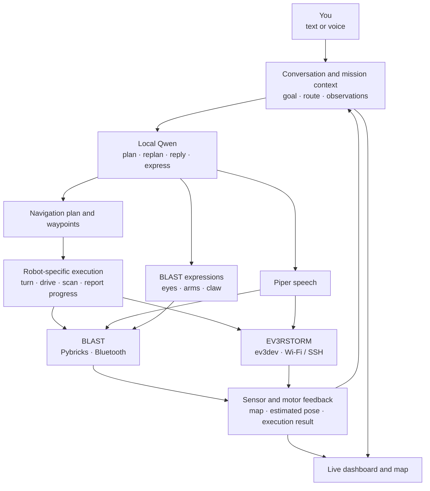

# Robot LLM Lab 🤖

[](https://github.com/Jawbreaker1/robot-llm/actions/workflows/ci.yml)


**Local intelligence. Real LEGO robots. Personality included.**

Robot LLM Lab turns LEGO robots into embodied AI agents: machines you can talk
to, give goals to, and watch as they plan a route, explore their surroundings,
and respond to what happens. Navigation, conversation, maps, and expressive
movement come together in one local application.

The ambition is a room full of robots that understand their surroundings,
share what they learn, and interact with people and each other. The foundation
is already physical: BLAST and EV3RSTORM connect to the same application, carry
out model-directed actions, and report what their sensors and motors actually
did. BLAST brings that interaction to life with a natural voice, animated eyes,
arm gestures, and a snapping claw.

<p align="center">
  
</p>

<p align="center"><em>A little attitude. A lot to explore.</em></p>

## Give a goal, not a motor command

The model owns the meaningful decisions: where to go, which waypoints to use,
when to gather more information, and when to change its plan. The robot runtime
handles carrying out those decisions with sensor and motor feedback.

```text
goal → plan → act → observe → verify → adapt
         ↑_______________________________|
```

A route is a working hypothesis, not a script. The goal stays in context as
the robot moves; waypoints describe how to reach it, and observations reveal
when that route needs revising. Following an agreed leg does not require the
model to approve every small motor pulse. A missing measurement is uncertainty
to handle, not automatically a new wall or a reason to abandon the goal.

This loop has taken physical robots around obstacles to their goals. BLAST's
navigation combines model-authored waypoints, distance scans, motor encoders,
and heading feedback, including recovery from incomplete observations. The
next challenge is making that behavior consistent across both robots and a
wider range of environments.

## More than navigation

**Talk to the robot.** Use text or push-to-talk in the web interface. The model
distinguishes conversation, questions about the robot, and requests to act.
Local Whisper handles speech recognition; Piper gives the reply a voice that
plays through the robot's own speaker.

**See the personality.** Qwen can choose BLAST's expression and gesture along
with her reply. Her 5×5 display becomes a pair of expressive eyes, with blinking,
glances, and different moods. Arm waves and claw flourishes make the response
physical. Gestures return the sensor-carrying arm to its navigation pose;
conversation gestures currently run while the robot is idle.

**Follow the decisions.** The dashboard brings together the goal, plan,
waypoints, estimated position, sensor observations, speech, and execution
events. You can see what the robot is trying to do as well as what it measured.

**Experiment before driving.** A shared-world simulator puts robot bodies,
sensors, obstacles, and goals in the same room. With Qwen in the loop, the model
must create its own route; the scenario does not supply the answer.

## How it fits together



The application keeps mission state and brings observations back to the model.
Each robot's controller owns its motors and translates supported actions into
hardware operations. Qwen chooses the route and expression; it does not need
to manage motor ports, Bluetooth packets, or audio encoding.

This is a shared application, not yet a single shared navigation implementation.
BLAST and EV3 have distinct execution paths and sensor representations. Bringing
their goal, route, and recovery handling together is the next integration step,
while keeping hardware-specific behavior in their adapters.

The core stack runs locally: **Qwen3.8 27B through LM Studio**, **whisper.cpp**
for voice input, and **Piper** for speech. BLAST uses the `en_GB-cori-high` voice.
The dashboard supports English and Swedish.

## Two bodies, different capabilities

| | BLAST · Robot Inventor 51515 | EV3RSTORM · MINDSTORMS EV3 |
|---|---|---|
| Connection | Persistent Bluetooth session with Pybricks | Wi-Fi / SSH with an ev3dev worker |
| Navigation feedback | Ultrasonic distance, motor encoders, IMU | IR, touch, motor encoders |
| Physical behavior | Drive, turn, scan, arm and claw gestures, animated eyes | Drive, turn, active IR scan, stop |
| Interaction | Model-directed conversation, onboard speech, expressions | Model-directed conversation and onboard speech |

Both platforms have completed physical obstacle detours. Their sensors do not
provide interchangeable maps: BLAST measures distance, while EV3's IR supports
qualitative obstacle evidence rather than a precise distance image. Neither is
currently a vision-based object-recognition or precision-SLAM system.

Multi-robot support has several distinct parts. Both robots can be configured
in one dashboard, and calibrated start positions allow their paths to be shown
in a common map. The shared simulator supports concurrent bodies. **Coordinated
physical navigation and shared obstacle knowledge are still in development**;
the combined dashboard currently permits one physical navigation task at a time.

## The live dashboard


- **Robot** is the place to talk, ask about observations, and submit goals.
- **Workbench** provides general dialogue and development tools.
- **Map** shows available position estimates, obstacle evidence, routes, and
  waypoint progress.
- **Bodies** exposes each controller's connection, battery, and telemetry.
- **Settings** holds model, language, and voice-input configuration, including
  microphone selection.


*Map interface preview using built-in demo data. Live runs populate the view
from the connected robot's observations and navigation state.*

See the [dashboard guide](docs/DASHBOARD.md) for voice input, settings, and
[shared fixed-start maps](docs/DASHBOARD.md#gemensam-fixed-start-karta-för-ev3-och-blast).

## Test decisions in a simulated world

The navigation simulator defines the environment, not the solution: room
bounds, obstacles, robot footprints, starting poses, sensor behavior, and goals.
Robot bodies occupy real space in the simulation and can obstruct each other.
Scenarios include boxes, side obstacles, narrow passages, corridors, bends,
staggered obstacles, and dead ends.

There are two different kinds of test:

- **Hardware-free checks** exercise the simulated world, robot adapters,
  movement, collision checks, and execution contracts.
- **Model-in-the-loop runs** exercise navigation decisions. Qwen receives the
  robot's observed context and must choose waypoints, scans, and replans itself.

The Qwen runner uses BLAST's production episode adapter, planner context, and
action schema. Model-driven EV3 parity is a next step. The simulator can also
replay recorded startup scans and inject missing range readings, helping
reproduce problems encountered on the physical robot.

With Qwen loaded in LM Studio, run a scenario:

```sh
PYTHONPATH=src .venv/bin/python -m robot_agent.blast_navigation_simulation \
  --model 'qwen/qwen3.8-27b' --scenario blast-box-front --compact
```

Omit `--scenario` to run the default scenario set. Traces retain model requests,
responses, reasoning when available, and execution results for inspection.

Simulation and physical testing serve different purposes. The simulated
hardware simplifies gyro and scan feedback; a successful simulated route does
not certify physical calibration or sensor timing. We validate on real robots
alongside simulation, and keep detailed evidence in the
[simulation notes](docs/MULTI_ROBOT_NAVIGATION_SIMULATION.md) and
[physical validation report](docs/NAVIGATION_VALIDATION_20260905.md).

## Get started

### Explore without hardware

```sh
git clone https://github.com/Jawbreaker1/robot-llm.git
cd robot-llm
PYTHONPATH=src python3 -m robot_agent.dashboard_cli --simulation-map-demo
```

Open the private live URL printed by the server and choose **Map**. No robot or
loaded model is needed. This is a deterministic interface demo, separate from
the Qwen navigation simulator.

To add local AI conversation, load `qwen/qwen3.8-27b` in LM Studio and start:

```sh
ROBOT_LLM_STT_URL='' scripts/start_lab_console.sh \
  --model 'qwen/qwen3.8-27b'
```

The empty STT setting starts without voice input. Omit it once the local speech
recognition service is configured using the [dashboard guide](docs/DASHBOARD.md).

### Connect your robots

Prepare the hardware before using its launcher:

| Robot | Setup |
|---|---|
| BLAST | Python 3.10+, dependencies in `requirements-pybricks.txt`, Pybricks on the hub, and Bluetooth. See [hub audio and firmware](docs/BLAST_HUB_AUDIO.md) for onboard Piper speech. |
| EV3RSTORM | ev3dev, a network connection, and the deployed worker. Follow [Wi-Fi setup](docs/EV3_WIFI.md) and [runtime deployment](docs/EV3_RUNTIME_DEPLOYMENT.md). |

For BLAST, install the host Bluetooth tooling:

```sh
python3 -m venv .venv
.venv/bin/python -m pip install -r requirements-pybricks.txt
```

Start the console with both robot profiles:

```sh
ROBOT_LLM_STT_URL='' scripts/start_robot_console.sh \
  --model 'qwen/qwen3.8-27b'
```

Use **Bodies → Check connection** for EV3 and **Bodies → Connect** for BLAST.
Defaults are `robot@ev3dev.local` and `BLAST-01`; override them with
`ROBOT_LLM_EV3_TARGET` and `ROBOT_LLM_BLAST_HUB_NAME`. Starting the console does
not start a navigation task.

For one robot, use `scripts/start_blast_console.sh` or
`scripts/start_ev3rstorm_console.sh` with the same options. The launchers use
the repository's `.venv` when available. Disconnect other Bluetooth clients,
such as Pybricks Code, before connecting BLAST.

## Where we are heading

The next milestone is **two autonomous robots using a common agentic flow**:
the same approach to goals, route memory, and replanning, with different
hardware underneath. Small, physically validated steps keep that integration
grounded in behavior rather than framework-building.

From there, the project grows in three directions:

- **Explore together.** Navigate larger spaces, recover from dead ends, share
  obstacle knowledge, and coordinate movement in the same room.
- **Interact with character.** Extend expressive behavior across both robots,
  improve conversational responsiveness, and explore useful manipulation as
  well as playful gestures.
- **Perceive more.** Add vision, continuous voice interaction, sound-source
  reasoning, and new LEGO bodies such as BOOST.

The long-term picture: a robot hears a dog bark, finds the source, turns toward
it, and answers, “woof right back at you.” Perception, planning, movement, and
personality working together.

## Development and documentation

Run the hardware-free quality suite:

```sh
sh ./scripts/quality_check.sh
```

| Guide | Contents |
|---|---|
| [Dashboard](docs/DASHBOARD.md) | UI, microphone input, settings, maps, and persistence |
| [BLAST speech](docs/BLAST_HUB_AUDIO.md) | Piper voice, onboard playback, and firmware setup |
| [BLAST expressions](docs/BLAST_SOCIAL_EXPRESSIONS.md) | Qwen-directed faces, arm and claw gestures, and physical checks |
| [Navigation simulation](docs/MULTI_ROBOT_NAVIGATION_SIMULATION.md) | Shared world, scenarios, model runs, and recorded-data regressions |
| [EV3 deployment](docs/EV3_RUNTIME_DEPLOYMENT.md) | Worker setup, transport, speech, and hardware checks |
| [Architecture notes](docs/ARCHITECTURE.md) | Design background, runtime boundaries, and multi-controller concepts |
| [Navigation integration plan](docs/NAVIGATION_SIMPLIFICATION_PLAN.md) | Bounded steps toward shared BLAST and EV3 navigation |
| [Experiments and evidence](docs/EXPERIMENT_PLAN.md) | Validation methods, observations, and linked results |

```text
config/                 robot topology and action profiles
docs/                   guides, design notes, validation reports, and images
ev3/                    EV3 hardware layer, workers, and diagnostics
hub_programs/           programs running on LEGO hubs
src/robot_agent/        agent, navigation, simulation, mapping, speech, and UI
tests/                  hardware-free scenarios and regression tests
```

No open-source license has been selected yet.

LEGO, MINDSTORMS, EV3, Robot Inventor, and BOOST are trademarks of the LEGO
Group. This independent project is not affiliated with or endorsed by the
LEGO Group.
