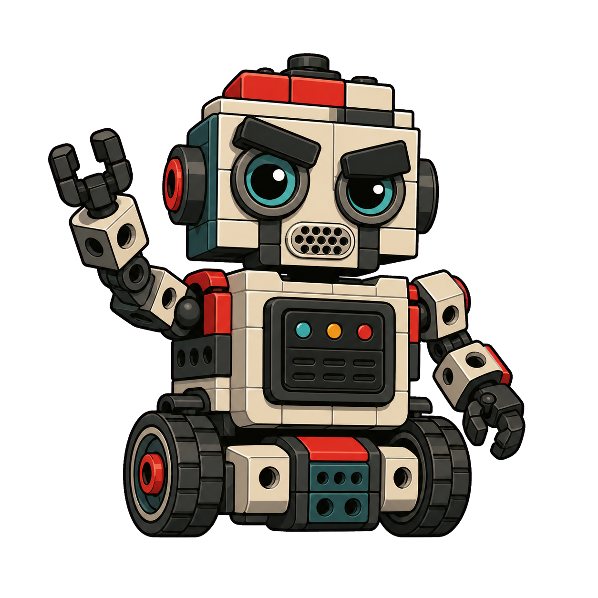
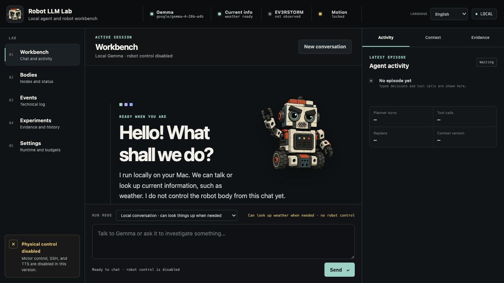
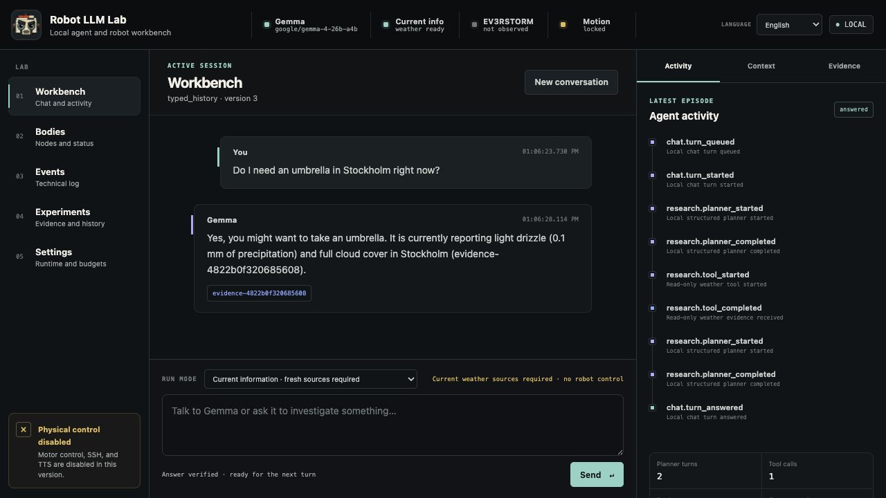
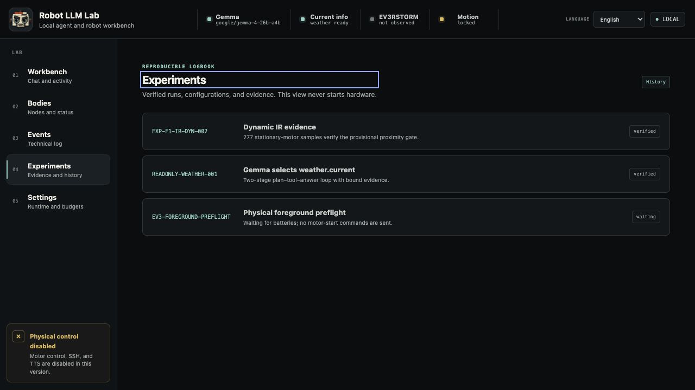
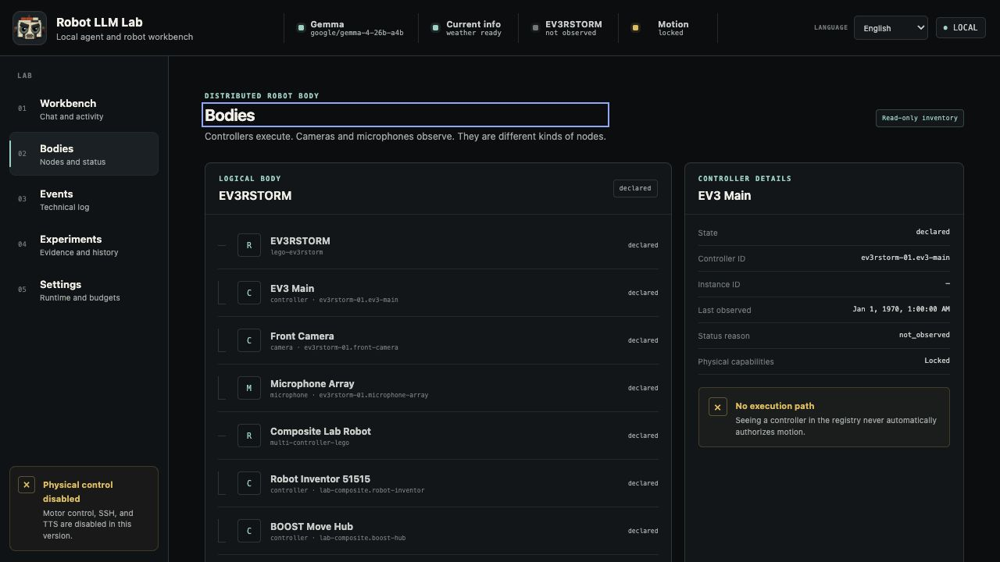
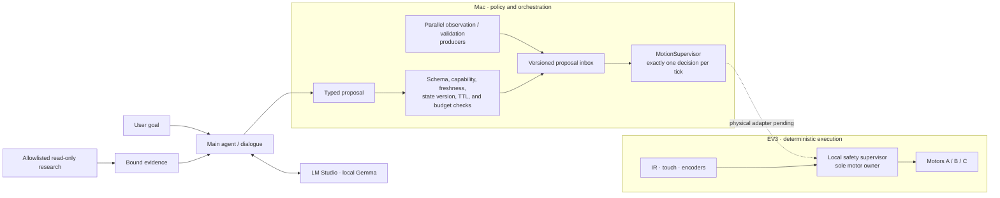

# Robot LLM Lab 🤖


<p align="center">
  
</p>

<p align="center"><em>Mildly grumpy by design. Personality lives in the language layer; safety does not.</em></p>

**A local LLM gets a real LEGO body—without getting direct access to the
motors.**

Robot LLM Lab is a controlled experiment built around a physical LEGO
MINDSTORMS EV3RSTORM, ev3dev, and a local Gemma model served by LM Studio. It
explores conversation, context, planning, perception, and closed agentic loops
while deterministic code remains solely responsible for authorization and
physical execution.

The project deliberately avoids phrase menus, regular-expression intent
matching, and language-specific keyword heuristics. The model classifies
natural language and proposes typed actions; strict host policy either accepts
that proposal as written, rejects it, or asks for clarification. It never
reinterprets the user's sentence into a motor command.

> **Semantic invariant:** the LLM may propose intent and express personality,
> but it never owns a motor.

> **Execution invariant:** parallel perception and reasoning are welcome;
> physical execution is serialized, bounded, interruptible, and deterministic.

## See it in action

### The English Lab Console



The Mac workbench provides local Gemma chat, session context, agent traces,
evidence, settings, experiment history, and technical events. The dashboard
cannot control the robot yet, and says so visibly.

### A live read-only agent episode



In this captured run, Gemma selected the single allowlisted
`weather.current` tool, the host fetched Open-Meteo data, bound it as fresh
evidence, and required the final answer to cite that evidence. The model and
agent run locally; only the explicit, allowlisted weather request leaves the
Mac.

### Honest experiment status



The experiment register keeps verified evidence separate from work that is
still waiting on a physical gate.

<details>
<summary><strong>Component registry</strong></summary>



This is a declarative inventory, not a control surface. The future camera,
microphone, Robot Inventor, and BOOST nodes are currently offline declarations
with no exposed control path. Seeing a controller in the registry never grants
permission to execute motion.

</details>

## What works today

Status snapshot: **2026-07-27**.

| Area | Verified now | Important boundary |
|---|---|---|
| Physical EV3 baseline | ev3dev boot, USB/SSH, motors A/B/C, bounded manual drive/turn pulses, encoders, touch, relative IR, reflected-light sensing, and Swedish eSpeak TTS | This verifies the assembled EV3RSTORM, not autonomous motion |
| Physical LLM path | One complete motion-free shadow cycle: IR readings → deterministic zone → Gemma comment as audit data → deterministic Swedish TTS | Gemma had no tools or motor access |
| EV3 supervisor | Motion-free `brake`/`stop`/inventory/touch preflight passed on the real robot with zero motor starts | The newer foreground daemon has only been verified against fake sysfs |
| Lab Console | Local Gemma chat, versioned context, read-only weather, evidence, event log, settings, experiment register, and English/Swedish UI + text responses | No motor, SSH, TTS, or stop routes exist in the dashboard |
| RobotAPI loop | Typed, snapshot-bound arm API and a closed `observe → plan → act → verify → replan` loop | Simulator-only and currently driven by a scripted fake planner |
| Navigation | Waypoint following, obstacle avoidance, proposal inbox, one MotionSupervisor, and an independent collision oracle | 2D simulator only; no physical navigation adapter |
| Concurrent interaction | Independent bounded workers plus one live local-Gemma simulator run where model speech overlapped a later navigation tick | Virtual callbacks only; no physical drive, speaker, or arm adapter |
| Physical autonomy | Not enabled | Waiting for reliable EV3 power, physical transport validation, calibration, stop-latency evidence, and fault injection |

The latest EV3 power check measured **5.889 V**. Physical deployment of the
foreground daemon was intentionally stopped before file transfer to avoid a
brownout and unnecessary SD-card risk. Physical testing remains paused until
reliable battery power is available.

English and Swedish are verified for the dashboard and model text responses.
English STT, English EV3 speech, multilingual robot personality, camera
vision, and physical language-to-action classification are not yet verified.
The locale contract is generic so more languages can be added without
language detection in the safety layer.

## How it works



The concurrent simulator runtime now uses independent bounded workers and
latest-snapshot mailboxes for its navigation behaviors. Obstruction-triggered
expression planning, speech playback, and the propeller reaction have separate
bounded queues. Each result is bound to controller, goal, plan, world model,
evidence, locale, and a host-owned lifetime. The MotionSupervisor never waits
for every producer; each tick uses the best fresh proposals already available
and emits at most one short-lived wheel decision.

Speech generation and playback may overlap later navigation ticks. A propeller
wave may not overlap wheel motion: it requests a pause, waits for a verified
stopped-boundary acknowledgement, revalidates the current obstruction, runs
fixed host-owned alternating segments, and releases navigation. Speech-only
reactions never pause the wheels. A slow or failed model/audio callback is
isolated from navigation. A per-object cooldown and total planner budget stop
repeated sensor reacquisition from turning into model or speech spam.

Touch stop, distance gates, heartbeat, timeout, speed limits, stall checks,
and emergency stop are deterministic. They do not wait for an LLM response.
Only the supervisor may own the motor bus; planning, validation, dialogue,
vision, and audio processes are proposal producers.

The same node and identity model is intended to grow from one EV3 into a
composite LEGO body with EV3, Robot Inventor 51515, BOOST, cameras, and
microphones. Multiple controllers still result in one coordinated,
authoritative physical decision.

See [ARCHITECTURE.md](docs/ARCHITECTURE.md) for the detailed state,
identity, freshness, and multi-controller design.

## Safety boundaries

Verified or enforced today:

- hard speed, duration, speech-length, queue, response-size, and episode
  budgets;
- explicit acknowledgement for every current manual physical motion command;
- motor and audio locks plus encoder postconditions;
- fixed SSH commands and speech text passed through stdin, never interpolated
  into shell code;
- loopback-only LM Studio with deadlines and bounded responses;
- a supervisor core with exclusive motor ownership, heartbeat, touch stop,
  stall/direction checks, latched faults, and verified stop;
- strict JSONL transport identity, sequence, TTL, replay, EOF, signal, and
  backpressure handling, verified against fake hardware;
- snapshot-bound RobotAPI actions with explicit capability allowlists and
  conservative at-most-once semantics;
- an exact read-only research allowlist with provenance, hashes, timestamps,
  TTL, evidence IDs, and citations;
- a loopback-only dashboard with a fresh 256-bit session URL, Host/Origin
  checks, strict route/asset allowlists, CSP, bounded jobs, and no physical
  endpoints;
- simulator-only closed loops for typed arm actions, waypoint navigation, and
  concurrent navigation/expression/speech/propeller coordination, all without
  a physical autonomy adapter.

Still required before autonomous physical motion:

- foreground daemon deployment and motion-free handshake on the real EV3;
- a motion-enabled physical adapter with lock-retaining fail-stop behavior;
- measured stop latency, braking distance, polling jitter, and stall
  thresholds;
- linear and turn calibration plus controlled reflected-light samples;
- fault injection for lost client, link, process, heartbeat, and motor writes;
- explicit time, distance, action, and replan budgets for each physical
  episode.

IR-PROX is a relative reflection/proximity signal from 0 to 100. It is not
centimeters, object identification, or proof that the path is clear. Object
IDs in the concurrent experiment are labels on synthetic simulator obstacles;
physical IR observations are never allowed to claim an identity.

## Try it locally

The host code and tests use Python's standard library. Python 3.9+ is
recommended on macOS or Linux.

### Start the Lab Console

With LM Studio running on `127.0.0.1:1234` and
`google/gemma-4-26b-a4b` loaded:

```sh
PYTHONPATH=src python3 -m robot_agent.dashboard_cli
```

Open the unique loopback session URL printed by the server:

```text
http://127.0.0.1:8765/session/<session-token>/
```

Restarting the server invalidates the token. The language selector switches
the complete UI and sends a typed `response_locale` with every model turn;
conversation state and form state survive the switch.

### Run the hardware-free tests

```sh
PYTHONDONTWRITEBYTECODE=1 \
  PYTHONPATH=src python3 -m unittest discover -s tests -q
```

The suite uses simulated sysfs and never activates physical hardware. It
verifies contracts, budgets, process behavior, agent loops, and the
accelerated synchronous simulator—not real stop latency or braking distance.

### Run autonomous navigation in the 2D simulator

```sh
PYTHONPATH=src python3 -m robot_agent.navigation_demo
```

Use `--scenario clear` for a direct waypoint and `--full` for the reproducible
tick trace. Every measurement in `config/navigation_simulation.json` is
labelled `simulation_only`. The command cannot import RobotAPI, SSH transport,
or the EV3 HAL.

### Run concurrent navigation and object interaction

```sh
PYTHONPATH=src python3 -m robot_agent.concurrent_demo
```

The default planner and simulated world are deterministic and offline; thread
timestamps and event interleaving are intentionally not byte-reproducible. The
run exercises independent navigation, expression, speech, and arm workers with
virtual callbacks and prints bounded JSON evidence, including whether speech
actually interleaved with navigation ticks and whether the propeller pause/ack
gate ran.

To use the loaded local model for the typed expression decision:

```sh
PYTHONPATH=src python3 -m robot_agent.concurrent_demo \
  --lm-studio --locale en-US --tick-ms 50
```

This remains a 2D simulation. Its speech and propeller callbacks record what
would happen; they do not play audio or contact EV3 hardware. A live LM Studio
run is therefore evidence for asynchronous model orchestration, not physical
TTS or motion.

### Run the read-only weather agent

```sh
PYTHONPATH=src python3 -m robot_agent.research_cli --pretty \
  'Do I need an umbrella in Stockholm right now?'
```

Gemma chooses semantically from a strict schema; the host performs no regex,
substring, or keyword routing. The current registry contains only
`weather.current`, backed by Open-Meteo's
[geocoding](https://open-meteo.com/en/docs/geocoding-api) and
[forecast](https://open-meteo.com/en/docs) APIs. Responses include evidence
IDs, timestamps, TTL, source URLs, byte counts, and SHA-256 hashes.

<details>
<summary><strong>Physical EV3 operator path</strong></summary>

Do not deploy or test on the EV3 until it has reliable power. Back up current
files, verify the destination and hashes, keep a physical abort method ready,
and compare the assembled wiring with
[`config/ev3rstorm.json`](config/ev3rstorm.json). The committed map is
specific to this EV3RSTORM.

Deploy and inventory:

```sh
ssh 'robot@<EV3-host>' 'mkdir -p /home/robot/robot-llm'
scp -r ev3 config 'robot@<EV3-host>:/home/robot/robot-llm/'
ssh 'robot@<EV3-host>' \
  'cd /home/robot/robot-llm && python3 ev3/robot_cli.py inventory'
```

Read the IR sensor or test the already verified **Swedish** TTS path without
motion:

```sh
python3 ev3/robot_cli.py read-sensor --role infrared
printf '%s\n' 'Jag ser något framför mig.' |
  python3 ev3/robot_cli.py speak-stdin
```

Run the motion-free local probes:

```sh
python3 ev3/robot_cli.py stop
python3 ev3/ir_gate_probe.py
python3 ev3/supervisor_cli.py preflight
```

Run one motion-free Gemma shadow cycle from the Mac:

```sh
PYTHONPATH=src python3 -m robot_agent.shadow_cli \
  --ssh-target 'robot@<EV3-host>'
```

The foreground daemon preflight is the next physical gate. Its public entry
point cannot enable motion, and the host sends only
`describe → status → claim → heartbeat → status → arm → status → release → status → shutdown`:

```sh
PYTHONPATH=src python3 -m robot_agent.supervisor_preflight_cli \
  --ssh-target 'robot@<EV3-host>'
```

Only after the experiment protocol's power, wiring, clearance, exclusivity,
and abort checks may an operator run a bounded manual pulse:

```sh
python3 ev3/robot_cli.py drive-test \
  --left-speed-dps 100 \
  --right-speed-dps 100 \
  --duration-ms 300 \
  --acknowledge-physical-motion
```

This is a manual hardware test, not autonomous navigation. Read the full
[experiment plan](docs/EXPERIMENT_PLAN.md) before physical work.

</details>

## Verified results

| Measurement | Result |
|---|---:|
| Hardware-free test suite | `521 / 521` passing |
| Physical supervisor preflight | `completed`, `0` motor-start commands |
| Straight physical B/C pulse | `+175° / +175°` |
| Physical B/C turn pulse | `+172° / −170°` |
| Stored dynamic IR replicate | `277` samples |
| IR measurement sampling | mean `50 ms`, range `47–53 ms` |
| IR gate blocked | `100 ms` after first raw value `≤35` |
| IR gate released | `100 ms` after first filtered value `≥40` |
| Gemma proposal in one physical shadow run | `417 ms` |
| Live concurrent Gemma simulator run | `1` accepted expression; speech/navigation interleaving observed; `98` actions; verified stop |

The IR figures verify filtering and hysteresis in stationary tests. They are
not motor stop time, braking distance, a real-time guarantee, or a benchmark.
Protocols, limitations, and raw data are in the
[experiment plan](docs/EXPERIMENT_PLAN.md) and
[EXP-F1-IR-DYN-002.json](docs/data/EXP-F1-IR-DYN-002.json).

## Roadmap

- [x] Physical EV3 baseline: ev3dev, USB/SSH, manual motors, sensors, encoders,
  and Swedish TTS
- [x] Motion-free physical Gemma shadow cycle and supervisor preflight
- [x] Foreground transport verified against fake sysfs and real subprocesses
- [x] English/Swedish Lab Console, typed response locale, local chat, and
  read-only cited weather
- [x] Typed RobotAPI and closed arm loop in simulation
- [x] Simulator-first waypoint navigation with parallelizable proposals and
  serialized supervision
- [x] Concurrent simulator runtime: asynchronous navigation/expression/speech,
  optional propeller reaction, and serialized wheel ownership
- [ ] Reliable EV3 power and physical motion-free foreground handshake
- [ ] Physical RobotAPI adapter, semantic tools, calibration, and safety
  evidence
- [ ] Gemma-driven physical `ACT`/`ABORT` loop behind a separate motion gate
- [ ] Push-to-talk STT through the Mac microphone
- [ ] Wi-Fi, camera, microphones, vision, and sound-source localization
- [ ] Multi-controller orchestration across EV3, Robot Inventor, and BOOST

The dream demo:

`dog bark → locate sound → look for the source → confirm dog → turn toward it → “woof right back at you”`

## Repository layout

```text
config/                 port map, safety limits, and simulator configuration
docs/                   architecture, experiment protocols, evidence, and UI captures
ev3/                    Python 3.5 HAL, supervisor, and manual EV3 tools
src/robot_agent/        host policy, agent loops, navigation, research, and dashboard
tests/                  hardware-free test suite
```

Robot LLM Lab deliberately stays small and avoids a large robotics framework.
Abstractions must earn their place through real experiments.

LEGO, MINDSTORMS, EV3, Robot Inventor, and BOOST are trademarks of the LEGO
Group. This independent experimental project is not affiliated with or
endorsed by the LEGO Group.
