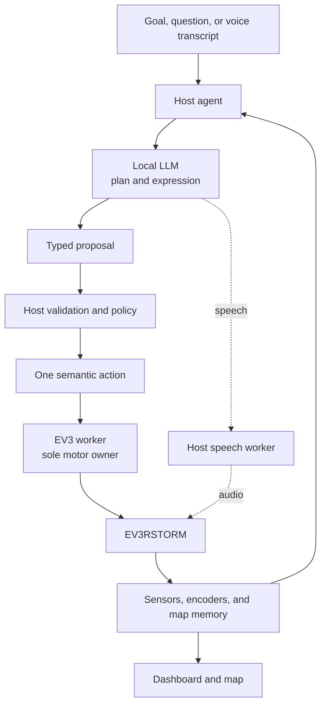
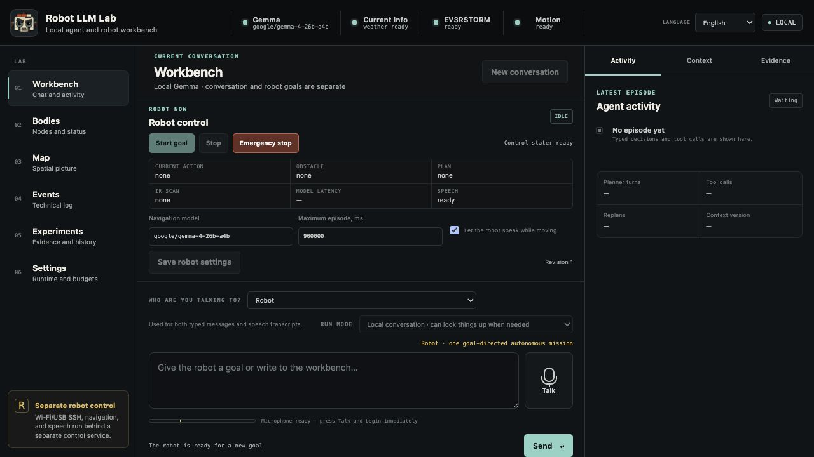
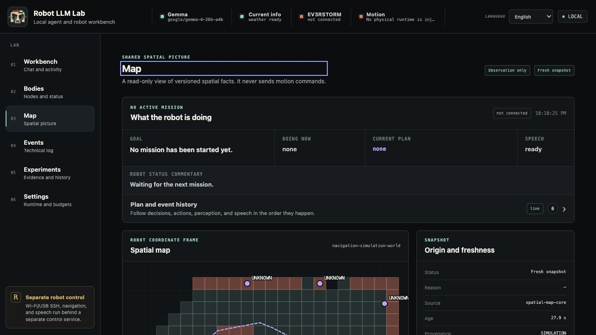

# Robot LLM Lab 🤖

[](https://github.com/Jawbreaker1/robot-llm/actions/workflows/ci.yml)


**A real LEGO robot controlled by a local agentic AI that can plan, observe,
speak, and adapt as it goes.**

Robot LLM Lab connects a local AI agent to a physical LEGO EV3RSTORM. Give it
a goal and the agent plans, acts, reads the sensors and motor feedback, and
adapts when reality disagrees. For obstacle avoidance it can authorize a side
around a remembered target; the host then builds a typed waypoint route and
follows its short, revalidated motion pulses without waiting for the model
after every pulse.

The language model chooses semantic intent and expression. The host application
validates and dispatches typed actions, while an EV3 worker remains the sole
owner of the motor ports.

<p align="center">
  
</p>

<p align="center"><em>Mildly grumpy by design. Personality shapes the language, not motor authority.</em></p>

## What makes it agentic

Many LLM–robot demos are effectively one-shot remote controls:

```text
prompt → command → execution
```

Robot LLM Lab keeps the goal alive and closes the loop:

```text
goal → plan → action → observe → verify → adapt
```

This means:

- a goal can survive across several actions and observations;
- verified sensor and encoder results inform the next decision;
- the agent can investigate, revise its plan, or stop when reality contradicts
  its assumptions; and
- speech, mapping, and UI updates can progress alongside navigation while
  physical actions remain serialized.

Natural-language intent is handled by the model through strict schemas. The
host does not translate instructions with regular expressions, keyword lists,
or language-specific command menus. The model never receives raw motor access.

## What works today

| Status | Capabilities |
|---|---|
| Working on physical EV3 | ev3dev, Wi-Fi/SSH control, bounded movement and turning, stop, IR, touch, motor encoders, host-generated robot speech, and the goal → plan → act → observe → replan loop |
| Working in the application | English/Swedish web dashboard, direct robot conversation and status questions, local push-to-talk STT, technical events, current plan, active route and waypoint, simulator mapping, and persistent physical navigation memory |
| Experimental | Operator-confirmed physical obstacle passage, active IR scanning, qualitative hazard mapping, model-authorized typed detour routes, body-aware path checks, and recovery from imperfect motor movement |
| Planned | Repeatable autonomous obstacle navigation, continuous hands-free voice interaction, color-sensor fusion, cameras, vision, sound localization, Robot Inventor 51515, BOOST, and multi-robot coordination |

The physical EV3 has completed its first operator-confirmed obstacle pass. It
investigated and routed around a real box, recovered its travel heading,
continued after imperfect motor startup, spoke while navigating, and finished
with the box still standing and the robot clear by a wide margin. This is one
successful live trial; repeatability and broader acceptance runs remain in
progress.

The current EV3 map is intentionally qualitative. IR reflection can support
obstacle hypotheses, but it is not vision, object recognition, or precise
metric SLAM. The forward-facing color/light sensor is installed but is not yet
used by the production navigation loop.

Only the EV3 has a production physical worker today. The other LEGO platforms
and external perception devices remain future integrations.

## Architecture



The host owns goals, state, navigation memory, model calls, and validation.
The EV3 worker exposes a small set of fixed robot operations and processes one
request at a time. It contains no planner, personality, or independent goal.
Once the model has authorized a target and detour side, a deterministic route
executive may serialize several freshly checked pulses before asking the model
again. New geometry, ambiguous progress, a veto, or a failed movement returns
control to the agent immediately.

Speech, map publication, and UI delivery already run alongside the physical
loop. Future vision, audio, validation, and planning workers will publish
time-stamped observations or proposals, but they will not control motors
directly. Physical execution remains serialized through the worker that owns
the relevant controller.

More detail is available in [the architecture document](docs/ARCHITECTURE.md).

## Dashboard



The local web application has two conversation targets:

- **Robot** can answer, report what its current sensors and plan say, or turn a
  text or speech instruction into a physical goal.
- **Workbench** provides ordinary dialogue, configuration, evidence, and
  development tools.

The dashboard shows the current live state rather than offering old physical
runs to resume. It exposes the current goal, plan, action, speech state,
active detour route and waypoint progress, technical events, and a read-only
map. Navigation memory is separate from the UI history and may persist between
runs.

The same Map view can display a completed simulator run or qualitative physical
odometry and obstacle hypotheses:



See [the dashboard guide](docs/DASHBOARD.md) for STT, settings, persistence,
and UI contracts.

## Quick start without a robot

```sh
git clone https://github.com/Jawbreaker1/robot-llm.git
cd robot-llm
PYTHONPATH=src python3 -m robot_agent.dashboard_cli \
  --simulation-map-demo
```

Open the private live URL printed by the server and choose **Map**. This uses a
deterministic simulator and requires no EV3 or loaded LLM. It demonstrates the
application and mapping pipeline, not physical calibration.

To run the Workbench with a model exposed by LM Studio:

```sh
ROBOT_LLM_STT_URL='' scripts/start_lab_console.sh \
  --model 'EXACT-MODEL-ID-FROM-LM-STUDIO'
```

The empty STT URL starts without speech recognition. Follow the
[dashboard guide](docs/DASHBOARD.md) to add the local whisper.cpp service.

## Running with a physical EV3

The physical path requires an EV3 running ev3dev, a network connection to the
brick, Python 3.9+ on the host, the deployed EV3 worker, and a model served by
LM Studio.

Before allowing movement, verify the robot configuration and complete the
motion-free deployment checks in:

- [EV3 Wi-Fi setup](docs/EV3_WIFI.md)
- [EV3 runtime deployment](docs/EV3_RUNTIME_DEPLOYMENT.md)

Then start the explicit EV3 profile:

```sh
ROBOT_LLM_STT_URL='' scripts/start_ev3rstorm_console.sh \
  --robot-target 'robot@<EV3-host>' \
  --model 'EXACT-MODEL-ID-FROM-LM-STUDIO'
```

Omit the STT override when the local speech-recognition service is configured.
Robot movement begins only after a goal is submitted and explicitly started in
the dashboard.

## Tests

```sh
sh ./scripts/quality_check.sh
```

The hardware-free suite covers contracts, agent loops, process transports,
mapping, dashboard behavior, simulated EV3 sysfs, and failure cleanup. It does
not replace physical calibration or live stop tests.

## Roadmap

- Make physical obstacle navigation repeatable and complete its live
  calibration and acceptance runs.
- Add color sensing, continuous voice interaction, wireless cameras,
  microphones, vision, and sound-source reasoning.
- Add production workers for Robot Inventor 51515 and BOOST, then coordinate
  several LEGO controllers in one system.
- Expand the asynchronous architecture with parallel perception, validation,
  and forward planning while preserving serialized motor ownership.

Long-term vision: hear a dog bark, locate the sound, look for the source,
recognize the dog, turn toward it, and answer, “woof right back at you.”

## Documentation

| Document | Contents |
|---|---|
| [Architecture](docs/ARCHITECTURE.md) | Agent runtime, authority, parallelism, memory, and multi-controller design |
| [Dashboard](docs/DASHBOARD.md) | Live UI, STT, map, settings, and persistence |
| [EV3 Wi-Fi](docs/EV3_WIFI.md) | Network onboarding and recovery |
| [EV3 runtime deployment](docs/EV3_RUNTIME_DEPLOYMENT.md) | Worker deployment, preflight, transport, speech, and physical checks |
| [Experiment plan](docs/EXPERIMENT_PLAN.md) | Test protocols, observations, limitations, and evidence |
| [Navigation benchmark](docs/LM_STUDIO_NAVIGATION_BENCHMARK.md) | Structured-planner benchmark method and results |
| [`docs/data`](docs/data) | Machine-readable experiment artifacts |

## Repository layout

```text
config/                 robot topology and fixed action profiles
docs/                   architecture, setup, experiments, evidence, and images
ev3/                    EV3 HAL, bounded workers, and diagnostic tools
src/robot_agent/        host agent, navigation, mapping, speech, and dashboard
tests/                  hardware-free scenarios, contracts, and failure tests
```

Robot LLM Lab deliberately avoids a large robotics framework. New abstractions
are introduced when experiments show that they are needed.

No open-source license has been selected yet.

LEGO, MINDSTORMS, EV3, Robot Inventor, and BOOST are trademarks of the LEGO
Group. This independent experimental project is not affiliated with or
endorsed by the LEGO Group.
