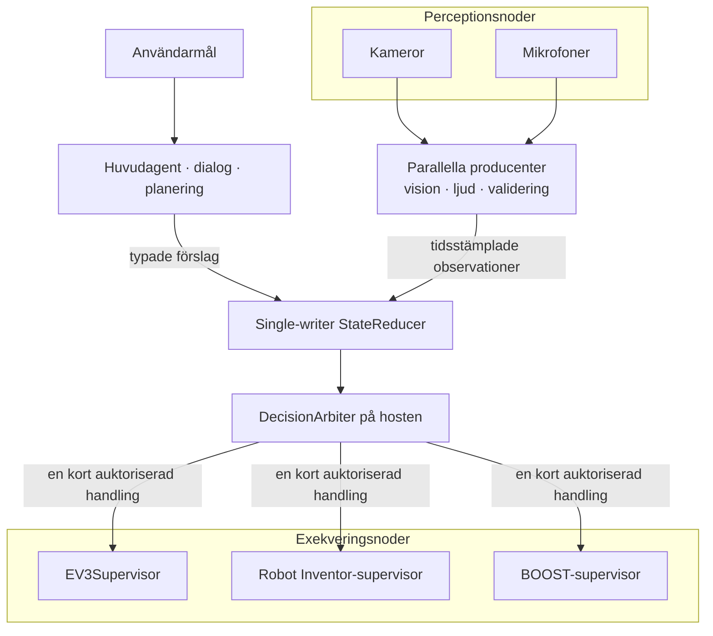
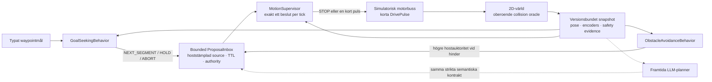
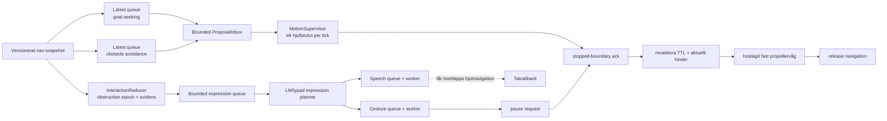
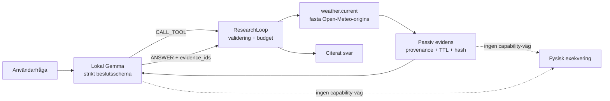
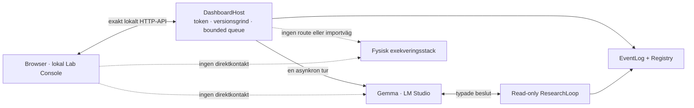

# Arkitekturprinciper

Projektet byggs som en distribuerad robotkropp, även när den första körbara
versionen endast använder en EV3. En fysisk robot kan senare bestå av flera
EV3-, Robot Inventor- och BOOST-kontrollers samt separata kameror,
mikrofoner och beräkningsprocesser.

## Konstitution

Många komponenter får observera, resonera och föreslå parallellt. En
single-writer-reducer skapar kausala och reproducerbara state-snapshots. En
deterministisk host-arbiter väljer högst en kort fysisk handling. Varje
motorkontroller har därefter en separat lokal supervisor som ensam äger sin
motorbuss och alltid får neka eller stoppa.

## Identiteter

Identiteter ska inte blandas ihop:

- `robot_id` identifierar den logiska, sammansatta robotkroppen.
- `controller_id` identifierar en fysisk exekveringsnod och dess motorbuss.
- `controller_instance_id` identifierar en viss supervisorprocess och byts
  vid omstart.
- `source_id` identifierar senare en producent, kamera, mikrofon eller
  analysprocess. Det är proveniens, inte behörighet.
- `action_id` ska senare korrelera ett semantiskt beslut genom host-policy,
  transport och en eller flera controllers.
- `command_id` identifierar den lokala, redan auktoriserade
  motorprimitiven.

En klientvald etikett som `owner_id` är auditinformation och får aldrig
behandlas som autentiserad identitet. I nuvarande transport är SSH-nyckeln
autentiseringsgränsen och supervisorsessionen en kortlivad capability.

## State utan delat muterbart minne

Producenter publicerar immutabla events eller förslag. De skriver inte
direkt i ett gemensamt objekt. En reducer äger skrivningen och skapar
snapshots som övriga komponenter får läsa. Detta gör beslut möjliga att
replaya och analysera i efterhand.

Den första simulator-slicens `ObservationEnvelope` fryser motor-, sensor- och
faultcontainrar, binder dem till controllerinstans, hostklocka,
`state_version` och mottagningstid. Ett enda globalt `state_version` räcker
däremot inte när vision, motorstatus och dialog har olika hastighet.
Målarkitekturen skiljer därför mellan exempelvis
`goal_epoch`, `plan_revision`, `robot_state_version` och
`world_model_version`, tillsammans med explicita beroenden och observationer.

## Tid och färskhet

Macens och LEGO-controllerns monotona klockor får aldrig jämföras direkt.
Transportfältet `queue_ttl_ms` börjar när en komplett frame tagits emot på
controllern och skyddar endast mot lokal köstaleness. Startdeadlinen
kontrolleras igen precis före varje motorstart.

Senare observationer bör bära minst:

- källans observationstid och klockdomän,
- mottagningstid på hosten,
- analyslatens,
- giltighet eller TTL,
- källa, evidensreferens och relevanta state-versioner.

Självrapporterad modellkonfidens är inte en säkerhetsregel.

## Körbar simulator-first-navigation

Den första autonoma navigationsvertikalen är nu implementerad som ett helt
separat plan från det befintliga arm-API:t:

En producent får endast föreslå `ADVANCE` eller `TURN`, aldrig hjulhastighet
eller motorport. Förslaget binds till `goal_id`, `goal_epoch`,
`plan_revision`, `robot_state_version` och `world_model_version`.
`source_id`, source-sekvens, mottagningstid, TTL, authority och priority
stämplas av en allowlistad host-wrapper; modellen får inte själv höja sin
auktoritet eller förlänga sin giltighet. Mailboxen är trådsäker och
begränsad. Varje tick dränerar hela batchen, så även icke-vinnande förslag
förbrukas och kan inte återuppstå senare.

Hostsekvensen fortsätter över episoder, medan proposal-ID:t innehåller goal
epoch och supervisorgrinden kräver exakt aktivt epoch. Inbox, arbiter,
motion-authority och simulatortrace har explicita replay-/historikfönster;
kontinuerlig drift samlar inte obegränsade ID-set eller pulsloggar.

`MotionSupervisor` väntar inte på en viss producent. Den använder bara de
förslag som redan finns, avslår gamla eller felbundna resultat och skapar
exakt ett `STOP` eller en kort `DrivePulse`. Touch, fault, aktiv motor,
gammalt snapshot och gammal safety-observation kontrolleras före
förslagen. Touch/fault latchas och kräver ett nytt goal epoch samt flera
färska säkra observationer för rearm. Likvärdiga topprankade förslag får
dedupliceras reproducerbart; semantiskt motstridiga topprankade förslag ger
`ambiguous_top_priority` och stopp.

Simulatorns motorbuss accepterar inte `arbiter_id` som ensam behörighet.
Supervisor och plant delar en privat hostlokal `MotionAuthority` som
registrerar och atomiskt förbrukar exakt varje auktoriserad puls en gång.
Själva capabilityn färdas aldrig i `DrivePulse`, audit-JSON eller plantens
pulslogg. Pulsen binds dessutom hela vägen till `plan_revision`. En annan
komponent kan därför inte få exekvering genom att bara konstruera rätt
strängfält, och en redan auktoriserad puls blir ogiltig om world model eller
planrevision ändras före dispatch.

Om episodbudgeten nekar en redan arbitrerad DRIVE återkallas dess one-shot
före terminalstoppet. En STOP-auktorisation ogiltigförklarar dessutom alla
väntande rörelsepulser innan den registreras och får därmed inte blockeras av
en full pending-kö.

Hela motion-bus-transaktionen
`consume → identity/version check → swept execution → state increment`
ligger under samma reentranta plantlås. Två samtidiga, i sig auktoriserade
pulser från samma snapshot kan därför inte båda passera: den första
serialiseras och den andra avslås som stale.

Den deterministiska referensplannern är en simulatorisk test-orakel/baslinje,
inte en alternativ naturlig-språkstolk. Den ser redan ett typat waypointmål
och innehåller inga regexp, keywords eller språkfraser. En framtida
LM Studio-planner ska lämna samma strikta `NEXT_SEGMENT | HOLD | ABORT`,
medan hostens supervisor förblir oförändrad.

Den ursprungliga, reproducerbara `NavigationEpisode`-demon får fortfarande
anropa de två exakta, inbyggda och ändliga referensbeteendena synkront.
`ConcurrentBehaviorRuntime` kör i stället samma allowlistade beteenden i var
sin bounded worker med en latest-snapshot-mailbox. Motionsticken tar bästa
tillgängliga batch och blockerar aldrig i väntan på att alla producenter ska
bli klara. Godtycklig LLM-, vision- eller I/O-latens får inte flyttas in i
motionstråden.

Simulatorn integrerar två hjul i korta tidssteg, producerar pose, encoders
och riktade avståndsstrålar samt kontrollerar den svepta robotkroppen mot
världsgränser och cirkulära hinder. Kollisionsfacit ligger separat från
sensorvärdet; ett grovt sensorsteg kan därför inte tunnla genom ett hinder
och ändå rapportera framgång. Episoden verifierar hjulens riktning,
parvis encoderprogress, poseprogress, målprogress, stateversioner, budgetar
och terminalt stopp.

All geometri i `config/navigation_simulation.json` är märkt
`simulation_only`. Den är syntetisk och får inte återanvändas som
EV3-kalibrering. Den fysiska uppskattningen på ungefär `7,58`
encodergrader per kroppsgrad är fortfarande preliminär, linjär
encodergrader-per-millimeter saknas och faktisk stopp-/bromssträcka är inte
verifierad.

EV3:s `IR-PROX` är dessutom reflektionsstyrka, inte centimeter. Stabilt höga
värden kan släppa en närhetslatch men bevisar aldrig fri väg. Därför kan
endast simulatorns `simulation_metric` ge positiv clearance i denna slice;
fysisk framåtkörning förblir explicit nekad.

Det finns ingen import från navigationen till `RobotAPI`,
`SupervisorSSHSession` eller EV3-HAL. Nuvarande EV3-protokoll budgeterar
dessutom exakt en fysisk `drive_timed` per motion-session och är inte en
backend för en pollande flerpulsloop. En fysisk adapter kräver därför en
senare protokollgrind med batterier, persistent heartbeat/preemption,
kalibrering, stopplatens och felinjektion – inte en SSH-session per tick.

### Parallell interaktion ovanpå serialiserad navigation

Den körbara concurrent-slicen lägger uttryck och objektreaktioner bredvid
navigationen utan att skapa en andra motorägare:

Varje kö är begränsad och har ett explicit overflowutfall i auditloggen.
Expression-plannern har dessutom en total episodbudget och en hostägd
cooldown per stabilt objekt-ID; hinder utan betrodd identitet delar en
konservativ unknown-obstruction-nyckel. Samma låda som återkommer i sensorns
stråle blir därför inte en modell- och talspamloop, medan ett annat
simulatorobjekt kan reageras på direkt. Hosten härleder ett unikt
expression-`proposal_id` från varje exakt snapshot, låser modellens schema
till detta värde och förbrukar ID:t exakt en gång per episod; modellen får
alltså varken välja eller återanvända det. Navigation, expression planning,
tal och propeller kör i separata workers. En blockerad eller felande modell- eller
talcallback hindrar därför inte senare motionstick. Tal är en kortlivad
reaktion på ett versionsbundet hinder-event och kan fortsätta medan roboten
navigerar vidare, så länge robot-, controller-, mål-, plan-, world-model- och
obstruction-epoch-bindningar samt hostens TTL fortfarande gäller. Att vägen
blir fri ändrar inte epoken, men ett nytt hinder gör ett väntande taljobb
stale. Callback-cancellation är kooperativ: callbacken får ett Event och ska
lämna snabbt.
Armgrindens host-watchdog avbryter hela episoden och framtvingar terminalt
hjulstopp om den exklusiva pausen inte släpps, men kan inte själv stoppa en
godtycklig callbacktråd eller fysisk motor. Den fysiska adaptern behöver därför
fortfarande en lokal, deterministisk motortimeout.

Propellern har en strängare fysisk grind. Ett semantiskt
`PROPELLER_WAVE`-förslag är valfritt; vanlig speech-only-dialog pausar aldrig
hjulen. Gesture-workern begär paus, väntar på kvittens vid en verifierat
stoppad pulsgräns, kontrollerar att samma hinder och färska evidens fortfarande
är aktuella, kör en fast hostägd växling av riktning med tids-, antal- och
cooldownbudget och släpper därefter navigationen. Modellen får inte ange
motorport, hastighet, segmenttid, TTL, priority, authority eller source.

`response_locale` ägs av hosten, binds både i interaction-snapshot och
modellens strikta schema och kontrolleras igen innan tal accepteras. Den lokala
Gemma-adaptern returnerar endast `EXPRESS | HOLD | ABORT`; för `EXPRESS` är
replik, affect och en valfri allowlistad propeller-gest semantiska data.

Objektidentitet i denna slice är endast simulator-evidens. Ett
`forward_object_id` får komma från `simulation_metric` och är då etiketten på
ett syntetiskt cirkelhinder. Fysisk IR-reflektion får aldrig bära eller
härleda objektidentitet, och modellen instrueras att inte namnge objektet när
identity-evidens saknas.

Ett liveprov med lokala Gemma accepterade en svensk speech-only-expression
efter ungefär `3,7 s`. Tal-workern startade, navigationen genomförde ytterligare
en tick innan talet avslutades och episoden nådde waypointen med verifierat
terminalstopp. Det är evidens för asynkron modell-/talorkestrering med virtuellt
ljud, inte för fysisk TTS.

Detta bevisar en bounded trådad schemaläggningsmodell, inte en fullt
paralleliserad fysisk robot. Tal- och armcallbacks är simulatoriska
testgränser. Nuvarande EV3-supervisor betraktar dessutom samtidig arm- och
hjulmotion som oväntad motoraktivitet; fysisk propellervåg måste därför börja
med samma paus-/stoppgrind tills en framtida ensam motorägare uttryckligen
stöder atomiska multi-actuator-beslut.

## Separat read-only research-plan

Extern kunskap är en perceptionskälla, inte en exekveringscapability. Den
första körbara slicen använder samma lokala Gemma-modell för semantiskt
verktygsval och svarssyntes, men ligger i en egen modulgräns utan import av
RobotAPI, SSH, TTS, supervisor eller motorprimitiver:

LM Studio-anropet går endast till loopback och använder OpenAI-kompatibel
structured output med ett dynamiskt JSON-schema. Modellen får välja exakt
`CALL_TOOL`, `ANSWER`, `CLARIFY` eller `ABORT`. Hostkoden tolkar inte
originalspråk med regexp eller keywords; den validerar bara schema,
kontextversion, unikt proposal-ID, tool-allowlist, argument, budget och
citationer. LM Studio returnerar alltså bara typad JSON; hostens
`ResearchLoop` exekverar verktyget. LM Studios structured-output-protokoll
dokumenteras under
[Structured Output](https://beta.lmstudio.ai/docs/developer/openai-compat/structured-output).

I första registryt finns endast `weather.current`. Verktyget gör två
proxyfria HTTPS-GET mot fasta Open-Meteo-origins, följer inga redirects och
accepterar endast begränsad JSON. Resultatet binds till exakt request-ID,
platsfråga, geocoding-URL, koordinater, providerns modellgiltighetstid och
monotona deadlines. Varje evidensdel bär provider, källtyp, URL,
hämtningstid, TTL, byteantal, SHA-256, attribution och licens. Extern text
märks `untrusted_external_data`; ett svar som kräver evidens måste citera
minst ett fortfarande färskt hostmyntat evidence-ID.

Toolresultat och modellbeslut är tidsbegränsade och replaygrindade.
Planner-timeouten skickas hela vägen till HTTP-transporten, så den är en
verklig avbrottsgräns och inte bara en mätning i efterhand. Oväntade
programmeringsfel döljs inte som ett vanligt providersvar, medan förväntade
transport-/providerfel kan ge en budgeterad omplanering.

Open-Meteos `current`-fält är 15-minuters modellbaserade väderdata, inte en
instrumentmätning; `precipitation` summerar föregående 15-minutersintervall.
Gratis-endpoints är avsedda för icke-kommersiell, rate-limited användning
utan upptidsgaranti enligt providerns
[pricing](https://open-meteo.com/en/pricing) och
[terms](https://open-meteo.com/en/terms).

Godtycklig `fetch_page(url)` är uttryckligen uppskjuten. En generell transport
måste först lösa och pinna publik destination-IP, neka loopback, privata,
link-local, multicast och övriga specialnät, bevara TLS/SNI-verifiering,
omvalidera varje redirect, ignorera ambient proxykonfiguration och ha absoluta
byte-, MIME- och tidsgränser. Webbinnehåll får därefter fortfarande bara bli
passiv evidens. Samma princip ska senare gälla kamera- och ljudanalys:
observationer kan påverka resonemang, men bara den separata auktorisations- och
supervisorvägen får skapa fysisk handling.

## Lokal dashboard som separat kontrollplan

Mac-dashboarden är ett dialog-, observations- och konfigurationsplan. Den är
inte en ny motorägare och inte ett tunt webbskal ovanpå EV3-kommandon.

Servern binder exakt till `127.0.0.1`, myntar en ny 256-bitars
sessionsnyckel per start och serverar index/assets endast under dess
tokeniserade bootstrap-sökväg. Samtliga API-anrop, även läsningar, kräver
nyckeln. Gränsen kontrollerar dessutom `Host`, `Origin`, JSON-MIME,
bodygräns och strikt JSON samt begränsar samtidiga HTTP-handlers. Browsern
får endast tala med samma host; den kontaktar inte LM Studio, Open-Meteo
eller en robotnod direkt. Statiska filer och API-routes ligger i explicita
allowlists.

Långsamma turer körs på en enda bounded worker. HTTP-tråden returnerar
`queued` direkt, medan status och tekniska events kan pollas parallellt.
Varje tur fångar en immutable settingsrevision innan köning. Eventloggen är
en begränsad ringbuffer med monoton hostsekvens och gapmarkör. Den loggar
korrelations-ID:n, typade transitions och budgetutfall men inte rå prompt,
rå modelltext, full evidence-URL eller traceback.

Konversationsminnet är ett eget versionerat kontrakt. Tidigare synliga
`user`-/`assistant`-meddelanden skickas som
`conversation-history/v1`; den aktuella frågan ligger kvar i det ordinarie
researchmålet och dupliceras inte. Det gör följdfrågor generiska och
språkoberoende utan regex, keyword-routing eller specialfraser.
Konversationsminnet ska inte förväxlas med fysisk actionkontext. En framtida
referens som “två gånger till” behöver dessutom bindas till explicit senast
föreslagen, auktoriserad och verifierad handling innan den kan påverka en
robot.

Presentationsspråk och svarsspråk är också explicita kontrakt, inte något
hosten försöker detektera ur naturligt språk. Browsern väljer en allowlistad
locale via `Intl.Locale` och en lokal katalog. Varje agenttur bär sedan
`response_locale` genom HTTP-kontrakt, köat turn-state och
plannerkontext. LM-plannern instrueras att använda detta fält för all
naturlig `ANSWER`-/`CLARIFY`-text och att lämna egennamn, protokoll-ID:n och
evidensidentiteter oförändrade. En hostskapad
`response_language_instruction` innehåller locale-kod och språkets namn,
ligger sist i den strukturerade modellkontexten och upprepas som description
på schemats user-facing textfält. Denna ordning är avsiktlig: liveprovet
visade att en avslutande användarfråga annars kunde vinna över en tidigare
locale-instruktion. Svenska och engelska är första kompletta katalogparet;
fler språk är en katalog-, språkmetadata- och allowlistutökning, inte nya
språkberoende beslutskodvägar.

En transportoberoende, bounded och kooperativt cancellable speech-worker finns nu i
concurrent-simulatorn, och tester visar att både blockerad och felande
uppspelning isoleras från navigationen. Den är ännu inte kopplad till EV3-TTS
och verifierar inte en fysisk röst. Framtida STT får publicera transkript med
ett separat, tidsstämplat `detected_locale` och confidence som observation;
det får inte tyst skriva över användarens valda `response_locale`. Den fysiska
TTS-adaptern får i sin tur ett explicit `voice_locale` och ett allowlistat
voice-ID. Om en passande röst saknas ska anropet neka eller kräva ett synligt
val, aldrig råka falla tillbaka till svenska. Engelskt STT/TTS är därför en
egen YouTube-demo-grind även om engelsk textdialog redan fungerar.

Det beskrivande registryt stöder redan flera `robot_id`, controllers,
kameror, mikrofoner, compute-noder och providers. Varje nod har
`control_exposed: false`. Dashboard-API:t har inga operationer för motor,
stopp, SSH, TTS, eventinjektion eller registryuppdatering. En framtida
motion-yta ska ligga bakom en separat, kortlivad armerings- och
auktorisationsprocess; den ska inte växa fram som en settings-toggle.

## Aktuell hårdvarufri RobotAPI-slice

Den första körbara host-gränsen är medvetet smal:

- `SimulatedRobotAPI` annonserar endast motorroller som finns i en explicit
  allowlist; i EV3RSTORM-konfigurationen är det bara propellerarmen,
- drivmotorerna exponeras inte som generiska enmotorsverktyg,
- varje motion binds till robot, controller, processinstans, hostklocka,
  färsk observation, state-version, hostmyntat action-/segment-ID och
  deadline,
- deadlinen kontrolleras både i adaptern och inne i simulatorns motorägare
  precis före stateändringen,
- kvittot måste matcha controllerinstans, state-version och observerade
  encoderpositioner,
- `stop_all` är instansbundet men aldrig replayblockerat; ett nödstopp får
  alltid utfärdas igen.

Capabilities annonserar ärligt
`motion_execution_model=accelerated_synchronous` och
`motion_retry_semantics=at_most_once`. Simulatorn applicerar hela
encodereffekten i samma anrop och modellerar inte `RUNNING`, heartbeat,
avbrott under rörelse eller förlorade kvitton. Den kan därför verifiera
kontrakt och beslutslogik men inte realtidssäkerhet.

`ClosedLoopAgent` tar ett typat encoderpositionsmål och anropar en planner
som endast får returnera exakt `ACT` eller `ABORT` enligt ett strikt
JSON-kontrakt. Hostkoden kontrollerar statebindning, motor, riktning,
capability, action-TTL, global episodtid, total rörelsetid och antal
omplaneringar. Efter varje steg jämförs kvitto, nytt snapshot och faktisk
encoderprogress. Terminalt resultat kräver ett färskt, säkert snapshot efter
ett verifierat, instansbundet stopp; oväntade backendfel återkastas först
efter best-effort-stop.

Denna loop använder ännu en scriptad testplanner. Den tolkar alltså inte
naturligt språk, anropar inte LM Studio och når inte fysisk EV3.

## Intern exekveringsyta och publikt agent-API

EV3-protokollets operationer `claim`, `heartbeat`, `arm`, `drive_timed`,
`release`, `stop` och `shutdown` är en intern backend-yta. De innehåller
fysiska primitiv och får aldrig visas direkt för en LLM.

Det fulla framtida publika agentkontraktet innehåller semantiska, typade verktyg
som `drive`, `turn`, `wave_arm`, `read_sensors` och `stop`. Dagens smalare
expression-kontrakt är separat: ett versionsbundet hinder-event kan ge
speech-only eller tal plus exakt den semantiska allowlistade gesten
`PROPELLER_WAVE`. Det är inte ett allmänt `wave_arm`-verktyg och kan inte
välja en fysisk primitive. LLM:n löser språk, referenser och planering till
ett beslutsförslag. Deterministisk host-kod validerar schema, capability,
färskhet, konflikt och budget och översätter först därefter till en fysisk
primitive.

Ingen del av exekveringslagren läser originalmeningen eller använder regexp,
substrings eller keywordlistor som en alternativ språkklassificerare.

SSH-transporten är sekventiell och konservativt `at_most_once`. Timeout,
partiell skrivning, fel korrelations-ID, dubbla/oväntade svar eller ett
asynkront läsfel poisonar kanalen och stänger dess stdin. När utfallet är
okänt får samma kanal aldrig användas för ett nytt motorförslag.

## Kamera och mikrofon

Kameror och mikrofoner är perceptionsnoder, inte motorcontrollers. Rå video
och rått ljud ska normalt ligga utanför det auktoritativa state som
strömmar eller korta evidensbuffertar. State innehåller tidsstämplade
observationer och referenser till evidensen.

En ensam mikrofon kan klassificera ett ljud men ger normalt inte tillförlitlig
riktning. Hunddemonstrationen kräver därför senare en mikrofonarray, flera
synkroniserade mikrofoner eller en långsammare aktiv sökning:

`hundskall → möjlig riktning → kontrollerad vridning → visuell sökning → verifiering → social respons`

## Samordnad fysisk handling

Det finns exakt en motorägare per fysisk exekveringsdomän och exakt en
robotövergripande koordinator för samordnade handlingar. Om flera controllers
deltar i samma fysiskt beroende handling ska alla först vara redo, dela ett
kortlivat `action_id` och stoppas som grupp om en deltagare försvinner.

Bluetooth, Wi-Fi och olika LEGO-hubbar ger inte atomisk eller perfekt
synkroniserad fysisk exekvering. Fysiskt kopplade mekanismer över flera
controllers behandlas därför som en separat, striktare experimentklass.
