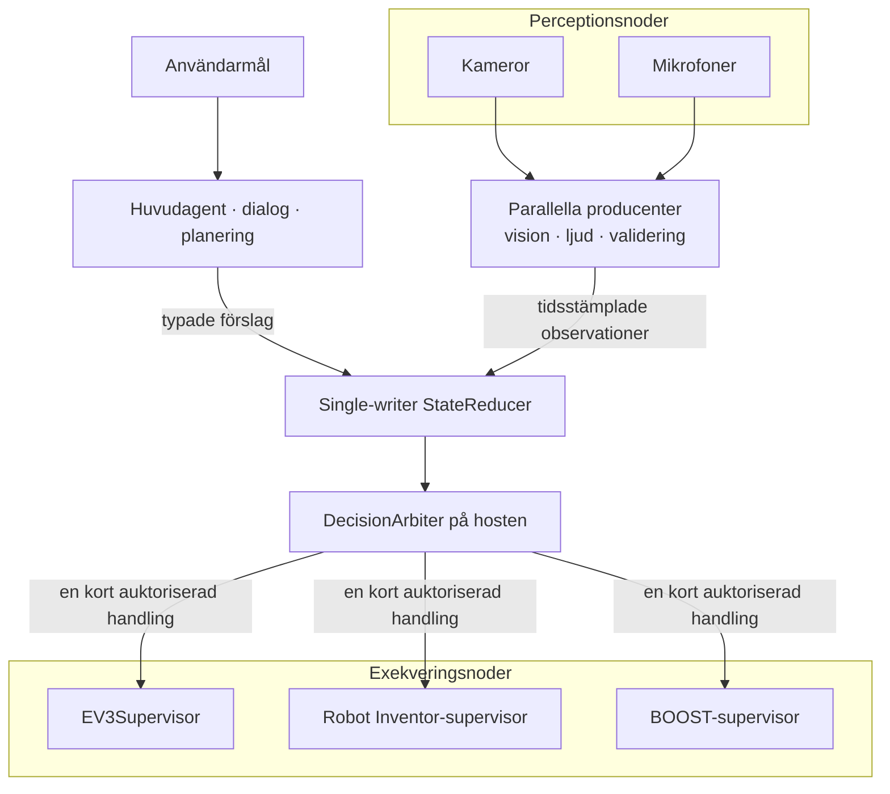

# Arkitekturprinciper

Projektet byggs som en distribuerad robotkropp, även när den första körbara
versionen endast använder en EV3. En fysisk robot kan senare bestå av flera
EV3-, Robot Inventor- och BOOST-kontrollers samt separata kameror,
mikrofoner och beräkningsprocesser.

## Konstitution

Många komponenter får observera, resonera och föreslå parallellt. En
single-writer-reducer skapar kausala och reproducerbara state-snapshots. En
deterministisk host-arbiter väljer högst en kort fysisk handling. Varje
motorkontroller har därefter en separat lokal supervisor som ensam äger sin
motorbuss och alltid får neka eller stoppa.

## Identiteter

Identiteter ska inte blandas ihop:

- `robot_id` identifierar den logiska, sammansatta robotkroppen.
- `controller_id` identifierar en fysisk exekveringsnod och dess motorbuss.
- `controller_instance_id` identifierar en viss supervisorprocess och byts
  vid omstart.
- `source_id` identifierar senare en producent, kamera, mikrofon eller
  analysprocess. Det är proveniens, inte behörighet.
- `action_id` ska senare korrelera ett semantiskt beslut genom host-policy,
  transport och en eller flera controllers.
- `command_id` identifierar den lokala, redan auktoriserade
  motorprimitiven.

En klientvald etikett som `owner_id` är auditinformation och får aldrig
behandlas som autentiserad identitet. I nuvarande transport är SSH-nyckeln
autentiseringsgränsen och supervisorsessionen en kortlivad capability.

## State utan delat muterbart minne

Producenter publicerar immutabla events eller förslag. De skriver inte
direkt i ett gemensamt objekt. En reducer äger skrivningen och skapar
snapshots som övriga komponenter får läsa. Detta gör beslut möjliga att
replaya och analysera i efterhand.

Den första simulator-slicens `ObservationEnvelope` fryser motor-, sensor- och
faultcontainrar, binder dem till controllerinstans, hostklocka,
`state_version` och mottagningstid. Ett enda globalt `state_version` räcker
däremot inte när vision, motorstatus och dialog har olika hastighet.
Målarkitekturen skiljer därför mellan exempelvis
`goal_epoch`, `plan_revision`, `robot_state_version` och
`world_model_version`, tillsammans med explicita beroenden och observationer.

## Tid och färskhet

Macens och LEGO-controllerns monotona klockor får aldrig jämföras direkt.
Transportfältet `queue_ttl_ms` börjar när en komplett frame tagits emot på
controllern och skyddar endast mot lokal köstaleness. Startdeadlinen
kontrolleras igen precis före varje motorstart.

Senare observationer bör bära minst:

- källans observationstid och klockdomän,
- mottagningstid på hosten,
- analyslatens,
- giltighet eller TTL,
- källa, evidensreferens och relevanta state-versioner.

Självrapporterad modellkonfidens är inte en säkerhetsregel.

## Aktuell hårdvarufri RobotAPI-slice

Den första körbara host-gränsen är medvetet smal:

- `SimulatedRobotAPI` annonserar endast motorroller som finns i en explicit
  allowlist; i EV3RSTORM-konfigurationen är det bara propellerarmen,
- drivmotorerna exponeras inte som generiska enmotorsverktyg,
- varje motion binds till robot, controller, processinstans, hostklocka,
  färsk observation, state-version, hostmyntat action-/segment-ID och
  deadline,
- deadlinen kontrolleras både i adaptern och inne i simulatorns motorägare
  precis före stateändringen,
- kvittot måste matcha controllerinstans, state-version och observerade
  encoderpositioner,
- `stop_all` är instansbundet men aldrig replayblockerat; ett nödstopp får
  alltid utfärdas igen.

Capabilities annonserar ärligt
`motion_execution_model=accelerated_synchronous` och
`motion_retry_semantics=at_most_once`. Simulatorn applicerar hela
encodereffekten i samma anrop och modellerar inte `RUNNING`, heartbeat,
avbrott under rörelse eller förlorade kvitton. Den kan därför verifiera
kontrakt och beslutslogik men inte realtidssäkerhet.

`ClosedLoopAgent` tar ett typat encoderpositionsmål och anropar en planner
som endast får returnera exakt `ACT` eller `ABORT` enligt ett strikt
JSON-kontrakt. Hostkoden kontrollerar statebindning, motor, riktning,
capability, action-TTL, global episodtid, total rörelsetid och antal
omplaneringar. Efter varje steg jämförs kvitto, nytt snapshot och faktisk
encoderprogress. Terminalt resultat kräver ett färskt, säkert snapshot efter
ett verifierat, instansbundet stopp; oväntade backendfel återkastas först
efter best-effort-stop.

Denna loop använder ännu en scriptad testplanner. Den tolkar alltså inte
naturligt språk, anropar inte LM Studio och når inte fysisk EV3.

## Intern exekveringsyta och publikt agent-API

EV3-protokollets operationer `claim`, `heartbeat`, `arm`, `drive_timed`,
`release`, `stop` och `shutdown` är en intern backend-yta. De innehåller
fysiska primitiv och får aldrig visas direkt för en LLM.

Det fulla framtida publika agentkontraktet innehåller semantiska, typade verktyg
som `drive`, `turn`, `wave_arm`, `read_sensors` och `stop`. LLM:n löser
språk, referenser och planering till ett beslutsförslag. Deterministisk
host-kod validerar schema, capability, färskhet, konflikt och budget och
översätter först därefter till en fysisk primitive.

Ingen del av exekveringslagren läser originalmeningen eller använder regexp,
substrings eller keywordlistor som en alternativ språkklassificerare.

SSH-transporten är sekventiell och konservativt `at_most_once`. Timeout,
partiell skrivning, fel korrelations-ID, dubbla/oväntade svar eller ett
asynkront läsfel poisonar kanalen och stänger dess stdin. När utfallet är
okänt får samma kanal aldrig användas för ett nytt motorförslag.

## Kamera och mikrofon

Kameror och mikrofoner är perceptionsnoder, inte motorcontrollers. Rå video
och rått ljud ska normalt ligga utanför det auktoritativa state som
strömmar eller korta evidensbuffertar. State innehåller tidsstämplade
observationer och referenser till evidensen.

En ensam mikrofon kan klassificera ett ljud men ger normalt inte tillförlitlig
riktning. Hunddemonstrationen kräver därför senare en mikrofonarray, flera
synkroniserade mikrofoner eller en långsammare aktiv sökning:

`hundskall → möjlig riktning → kontrollerad vridning → visuell sökning → verifiering → social respons`

## Samordnad fysisk handling

Det finns exakt en motorägare per fysisk exekveringsdomän och exakt en
robotövergripande koordinator för samordnade handlingar. Om flera controllers
deltar i samma fysiskt beroende handling ska alla först vara redo, dela ett
kortlivat `action_id` och stoppas som grupp om en deltagare försvinner.

Bluetooth, Wi-Fi och olika LEGO-hubbar ger inte atomisk eller perfekt
synkroniserad fysisk exekvering. Fysiskt kopplade mekanismer över flera
controllers behandlas därför som en separat, striktare experimentklass.
