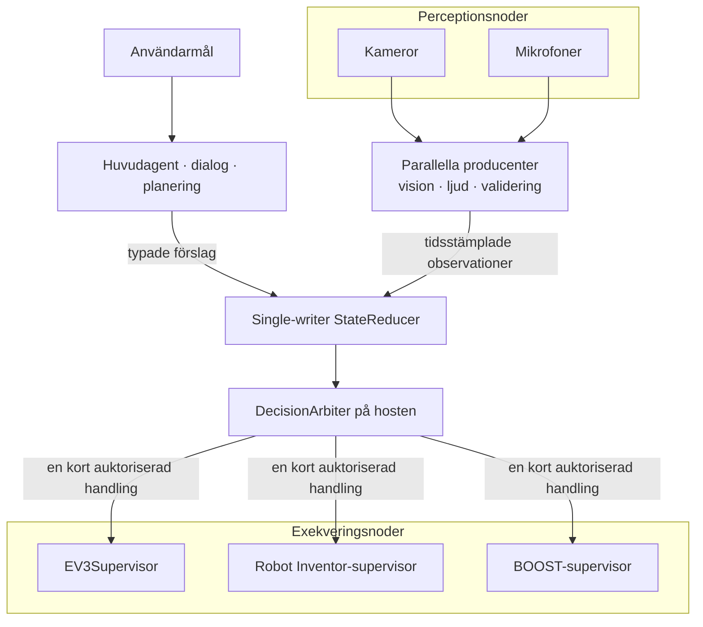
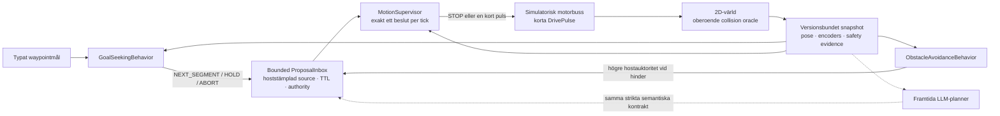
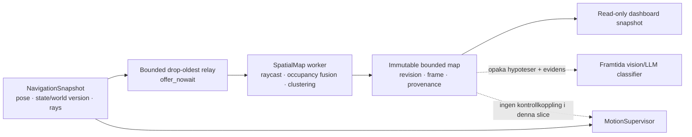
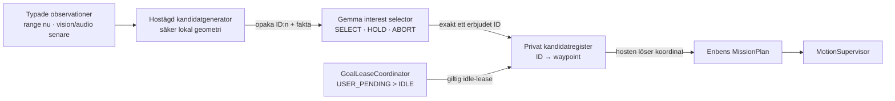
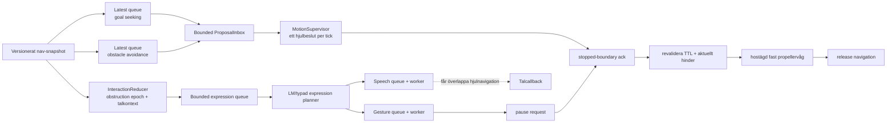
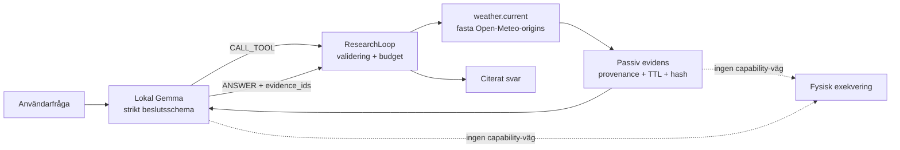
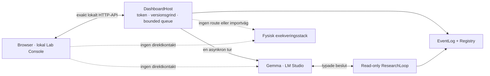

# Arkitekturprinciper

Projektet byggs som en distribuerad robotkropp, även när den första körbara
versionen endast använder en EV3. En fysisk robot kan senare bestå av flera
EV3-, Robot Inventor- och BOOST-kontrollers samt separata kameror,
mikrofoner och beräkningsprocesser.

## Konstitution

Många komponenter får observera, resonera och föreslå parallellt. En
single-writer-reducer skapar kausala och reproducerbara state-snapshots. En
deterministisk host-arbiter väljer högst en kort fysisk handling. Varje
motorkontroller har därefter en separat lokal supervisor som ensam äger sin
motorbuss och alltid får neka eller stoppa.

## Identiteter

Identiteter ska inte blandas ihop:

- `robot_id` identifierar den logiska, sammansatta robotkroppen.
- `controller_id` identifierar en fysisk exekveringsnod och dess motorbuss.
- `controller_instance_id` identifierar en viss supervisorprocess och byts
  vid omstart.
- `source_id` identifierar senare en producent, kamera, mikrofon eller
  analysprocess. Det är proveniens, inte behörighet.
- `action_id` ska senare korrelera ett semantiskt beslut genom host-policy,
  transport och en eller flera controllers.
- `command_id` identifierar den lokala, redan auktoriserade
  motorprimitiven.

En klientvald etikett som `owner_id` är auditinformation och får aldrig
behandlas som autentiserad identitet. I nuvarande transport är SSH-nyckeln
autentiseringsgränsen och supervisorsessionen en kortlivad capability.

## State utan delat muterbart minne

Producenter publicerar immutabla events eller förslag. De skriver inte
direkt i ett gemensamt objekt. En reducer äger skrivningen och skapar
snapshots som övriga komponenter får läsa. Detta gör beslut möjliga att
replaya och analysera i efterhand.

Den första simulator-slicens `ObservationEnvelope` fryser motor-, sensor- och
faultcontainrar, binder dem till controllerinstans, hostklocka,
`state_version` och mottagningstid. Ett enda globalt `state_version` räcker
däremot inte när vision, motorstatus och dialog har olika hastighet.
Målarkitekturen skiljer därför mellan exempelvis
`goal_epoch`, `plan_revision`, `robot_state_version` och
`world_model_version`, tillsammans med explicita beroenden och observationer.

## Tid och färskhet

Macens och LEGO-controllerns monotona klockor får aldrig jämföras direkt.
Transportfältet `queue_ttl_ms` börjar när en komplett frame tagits emot på
controllern och skyddar endast mot lokal köstaleness. Startdeadlinen
kontrolleras igen precis före varje motorstart.

Senare observationer bör bära minst:

- källans observationstid och klockdomän,
- mottagningstid på hosten,
- analyslatens,
- giltighet eller TTL,
- källa, evidensreferens och relevanta state-versioner.

Självrapporterad modellkonfidens är inte en säkerhetsregel.

## Körbar simulator-first-navigation

Den första autonoma navigationsvertikalen är nu implementerad som ett helt
separat plan från det befintliga arm-API:t:

En producent får endast föreslå `ADVANCE` eller `TURN`, aldrig hjulhastighet
eller motorport. Förslaget binds till `goal_id`, `goal_epoch`,
`plan_revision`, `robot_state_version` och `world_model_version`.
`source_id`, source-sekvens, mottagningstid, TTL, authority och priority
stämplas av en allowlistad host-wrapper; modellen får inte själv höja sin
auktoritet eller förlänga sin giltighet. Mailboxen är trådsäker och
begränsad. Varje tick dränerar hela batchen, så även icke-vinnande förslag
förbrukas och kan inte återuppstå senare.

Hostsekvensen fortsätter över episoder, medan proposal-ID:t innehåller goal
epoch och supervisorgrinden kräver exakt aktivt epoch. Inbox, arbiter,
motion-authority och simulatortrace har explicita replay-/historikfönster;
kontinuerlig drift samlar inte obegränsade ID-set eller pulsloggar.

`MotionSupervisor` väntar inte på en viss producent. Den använder bara de
förslag som redan finns, avslår gamla eller felbundna resultat och skapar
exakt ett `STOP` eller en kort `DrivePulse`. Touch, fault, aktiv motor,
gammalt snapshot och gammal safety-observation kontrolleras före
förslagen. Touch/fault latchas och kräver ett nytt goal epoch samt flera
färska säkra observationer för rearm. Likvärdiga topprankade förslag får
dedupliceras reproducerbart; semantiskt motstridiga topprankade förslag ger
`ambiguous_top_priority` och stopp.

Simulatorns motorbuss accepterar inte `arbiter_id` som ensam behörighet.
Supervisor och plant delar en privat hostlokal `MotionAuthority` som
registrerar och atomiskt förbrukar exakt varje auktoriserad puls en gång.
Själva capabilityn färdas aldrig i `DrivePulse`, audit-JSON eller plantens
pulslogg. Pulsen binds dessutom hela vägen till `plan_revision`. En annan
komponent kan därför inte få exekvering genom att bara konstruera rätt
strängfält, och en redan auktoriserad puls blir ogiltig om world model eller
planrevision ändras före dispatch.

Om episodbudgeten nekar en redan arbitrerad DRIVE återkallas dess one-shot
före terminalstoppet. En STOP-auktorisation ogiltigförklarar dessutom alla
väntande rörelsepulser innan den registreras och får därmed inte blockeras av
en full pending-kö.

Hela motion-bus-transaktionen
`consume → identity/version check → swept execution → state increment`
ligger under samma reentranta plantlås. Två samtidiga, i sig auktoriserade
pulser från samma snapshot kan därför inte båda passera: den första
serialiseras och den andra avslås som stale.

Den deterministiska referensplannern är en simulatorisk test-orakel/baslinje,
inte en alternativ naturlig-språkstolk. Den ser redan ett typat waypointmål
och innehåller inga regexp, keywords eller språkfraser. En framtida
LM Studio-planner ska lämna samma strikta `NEXT_SEGMENT | HOLD | ABORT`,
medan hostens supervisor förblir oförändrad.

Den ursprungliga, reproducerbara `NavigationEpisode`-demon får fortfarande
anropa de två exakta, inbyggda och ändliga referensbeteendena synkront.
`ConcurrentBehaviorRuntime` kör i stället samma allowlistade beteenden i var
sin bounded worker med en latest-snapshot-mailbox. Motionsticken tar bästa
tillgängliga batch och blockerar aldrig i väntan på att alla producenter ska
bli klara. Godtycklig LLM-, vision- eller I/O-latens får inte flyttas in i
motionstråden.

Simulatorn integrerar två hjul i korta tidssteg, producerar pose, encoders
och riktade avståndsstrålar samt kontrollerar den svepta robotkroppen mot
världsgränser och cirkulära hinder. Kollisionsfacit ligger separat från
sensorvärdet; ett grovt sensorsteg kan därför inte tunnla genom ett hinder
och ändå rapportera framgång. Episoden verifierar hjulens riktning,
parvis encoderprogress, poseprogress, målprogress, stateversioner, budgetar
och terminalt stopp.

All geometri i `config/navigation_simulation.json` är märkt
`simulation_only`. Den är syntetisk och får inte återanvändas som
EV3-kalibrering. Den fysiska uppskattningen på ungefär `7,58`
encodergrader per kroppsgrad är fortfarande preliminär, linjär
encodergrader-per-millimeter saknas och faktisk stopp-/bromssträcka är inte
verifierad.

EV3:s `IR-PROX` är dessutom reflektionsstyrka, inte centimeter. Stabilt höga
värden kan släppa en närhetslatch men bevisar aldrig fri väg. Därför kan
endast simulatorns `simulation_metric` ge positiv clearance i denna slice;
fysisk framåtkörning förblir explicit nekad.

Det finns ingen import från navigationen till `RobotAPI`,
`SupervisorSSHSession` eller EV3-HAL. Nuvarande EV3-protokoll budgeterar
dessutom exakt en fysisk `drive_timed` per motion-session och är inte en
backend för en pollande flerpulsloop. En fysisk adapter kräver därför en
senare protokollgrind med batterier, persistent heartbeat/preemption,
kalibrering, stopplatens och felinjektion – inte en SSH-session per tick.

Styckena ovan beskriver den äldre simulator-/RobotAPI-gränsen. Projektet har
nu också en separat, explicit opt-in fysisk EV3-navigationsväg över en
persistent foreground-SSH-session. Den ersätter inte kravet på lokal
motorägare eller verifierat stopp och den ska inte läsas som att de
provisoriska måtten nedan redan är fysiskt kalibrerade.

### Aktuell fysisk EV3-navigation och erfarenhetsminne

`PhysicalNavigationRuntime` ger den lokala modellen ett mål, en strukturerad
världsbild och endast semantiska handlingar. Före planneranropet beräknar
hosten faktabaserad genomförbarhet för varje rörelse och för en aktiv scan.
En geometriskt omöjlig handling tas bort ur modellens meny utan att hosten
väljer en ersättare. Omedelbart före dispatch görs samma kontroll igen mot
den aktuella kartan för att fånga TOCTOU-förändringar.

EV3RSTORM-profilen använder en asymmetrisk rektangel runt
differential-drive-origo med separata extents fram, bak, vänster och höger.
Den aktuella konfigurationen utan den löstagbara propellern är operatörsmätt
till 100 mm vänster och 130 mm höger från differential-drive-origo. Både
translation och rotation validerar hela den interpolerade svepta kroppen med
marginal, inte bara mittpunkten eller IR-strålen. Dashboardens kontur är
fortfarande konfigurerad geometri och inte en kontinuerligt uppmätt fysisk
kontaktyta.

EV3-profilens provisoriska hindercentrum ligger 210 mm framför drivorigo.
Värdet kommer från liveförsöket där lådans yta låg cirka 137 mm framför
IR-sensorn när hindret låstes, plus kartans 70 mm hinderzon. Det är fortfarande
ett kvalitativt ankare, inte ett påstående om att IR-värdet är metrisk distans.

Varje återställd aktiv scan kan sparas på hinderhypotesen med:

- exakt verifierad scanpose och kartversion som försöket byggde på,
- begärd och encoderhärledd faktisk kroppsvinkel per stråle,
- blocked/clear, unilateral/bilateral täckning och eventuell gräns,
- typad relation som stödjer eller motsäger den blockerade hypotesen.

Detaljhistoriken är begränsad till 16 försöksposter per hinder och 64 i hela
kartan. Retention prioriterar olika pose- och evidenssignaturer före
duplicerade retries. Blockerade strålar materialiseras dessutom i ett separat
beständigt index med högst 512 vinkelsupporter per hinder och 4 096 per karta.
Därmed ändrar beskärning av scan-detaljer inte den kollisionsgeometri som redan
har härletts. Supporterna använder samma provisoriska offset som den
ursprungliga IR-hypotesen och blir aldrig metriska objektytor. En full bilateral
all-clear contestar hypotesen och pausar dess kollisionsenvelope tills nyare
blocked-evidens åter stöder den, men historiken raderas inte.

När detaljposter ändå måste lämna 16/64-retentionen räknas bortfallet både på
berörd hinderhypotes och kumulativt på kartan med typad orsak. Kartans räknare
inkluderar även kvarvarande scanposter som försvinner tillsammans med en
utkastad hinderhypotes och persisteras i navigation memory. Planner och
dashboard kan därför skilja "inga äldre försök" från "äldre försök har
komprimerats bort" efter en save/load-rundtur inom samma kartgeneration.

Den auktoritativa kartan behåller högst 64 hinderhypoteser och hela
navigation-memory-filen högst 2 MiB. Om den 65:e distinkta hypotesen tillkommer
tas den äldsta bort deterministiskt; ett persisterat antal och en typad orsak
publiceras både till plannerkontexten och dashboardens read-only-karta. Förlust
vid kapacitetsgränsen är alltså synlig och får inte beskrivas som om kartan
fortfarande vore fullständig.

Persistensformatet är `robot-physical-navigation-memory/v2`. Läsaren migrerar
befintliga `v1`-filer genom att härleda materialiserade support- och
contest-fakta när källdatan räcker; nästa save skriver `v2`. Migrationen är
avsiktligt framåtriktad: en äldre checkout som bara förstår `v1` kan inte läsa
en fil som redan skrivits om som `v2`. Kodrollback kräver därför en bevarad
`v1`-kopia eller en explicit minnesreset, aldrig tyst feltolkning.

EV3-profilen återanvänder för närvarande inte en generation mellan fysiska
episoder. Varje ny episod skapar och sparar en tom generation innan
robotanslutningen startar. Persistensformatet ger atomisk lagring under
episoden, men den gamla kartan matas inte till nästa körning eftersom manuell
förflyttning saknar en absolut lokaliseringsreferens.

Ruttvalets färskhet är strängare än kollisionsminnet. Positiv och negativ
gränsevidens får komplettera varandra endast vid exakt samma verifierade pose
som roboten har när manövern startas. En scan från ett äldre perspektiv kan
fortsätta påverka den konservativa kollisionshypotesen men kan inte tyst
återanvändas som aktuell vänster/höger-geometri.

Ett separat `NavigationExperienceLedger` publicerar vad som faktiskt
försöktes och vad verktyget returnerade. Detaljerna är episodlokala,
begränsade till 64 poster och `64 KiB`, och kompletteras av ett begränsat index
över 43 200 tidigare `(typat försök, evidensbasis)`-par. Gränsen motsvarar tre
möjliga handlingar per tillåten runtime-turn under en hel episod. Därmed kan
modellen skilja
`FIRST_ATTEMPT`, `UNCHANGED_BASIS_REPEAT` och
`RETRY_AFTER_BASIS_CHANGE` även efter att den detaljerade ringhistoriken
roterat. Basis byggs av verifierad pose, drivmotorpositioner,
beslutsrelevanta sensorfakta, hindergeometri och substantiell scan-evidens.
State-version, tidsstämpel, liten rå IR-jitter, nya scan-ID:n och rörelse i en
icke-drivande arm räknas inte ensamma som navigationsframsteg. Ledgern har
`host_ranked_or_selected_action: false` och får aldrig välja rutt.

Gemma får inte hela den auktoritativa kartan eller hela ledgerprojektionen
oreflekterat. Plannerlagret behåller högst `24 KiB` ledgerdetalj med exakta
totalsummor, senaste typade utfall, bortfallsräknare och digest. Hela
användarkontexten har `56 KiB` mål och `64 KiB` hårt tak. En separat
32k-admission räknar konservativt även systemprompt, dynamiskt JSON-schema,
wrapperreserv, 2 048 tokens headroom och 520 outputtokens. Goal-/feasibility-
referenser publicerar kompakta scan-sammanfattningar; aktivt mål, senaste
verktygsmål och aktuell rutt behåller exakt nödvändig scan-ID, pose, gränser,
relation och aggregerade strålfakta. Det är en deterministisk projektion av ett
rikare hostminne, inte heuristisk handlingsrankning.

Denna slice är implementerad och hårdvarufritt testad. Den senaste fysiska
lådkörningen motiverade kroppskonturen men genomfördes före hela kedjan ovan;
en ny end-to-end-körning runt eller bort från hindret återstår. Fysiskt
propelleruttryck är inte integrerat i denna navigationsväg.

### Asynkront spatialt världsminne

Navigationens immutabla snapshots kan nu förgrenas till en separat
mapping-pipeline utan att göra perception till en del av motorbeslutet:

`offer_nowait` gör endast typkontroll, hoststämpling och en O(1)-köoperation.
Rayprojektion, griduppdatering, connected-components, immutable snapshot och
dashboardserialisering körs på mapping-workern eller lästråden, aldrig i
motionsticken. När kön är full kastas den äldsta ännu obehandlade
observationen. Ett sådant gap, eller ett mapperfel, gör kartan explicit
`degraded`; det får varken blockera, stoppa eller auktorisera hjulen.
Slutlig verifierad STOP-snapshot publiceras även från mission-, idle- och
concurrent-sömmarna. Kartans läs- och skrivcapabilities är separata:
dashboarden får endast en snapshot-provider och mappingkärnan har ingen
referens till `ProposalInbox`, `MotionAuthority`, motorbuss eller fysisk
adapter.

Kartan är en identitets- och rambunden, trådsäker LRU-grid med fast celltak.
Varje accepterad snapshot måste vara nyare i state-version, world-model-
version och tidsordning. Simulatorstrålar vid `0°`, `+45°` och `−45°`
markerar passerade celler som fri evidens och en träff före maxrange som
upptagen evidens. Motstridig evidens går genom `UNKNOWN`; en enda ny mätning
byter därför inte tvärt mellan `FREE` och `OCCUPIED`. Kartan behåller
provenance, evidensräknare, ålder, senaste pose och en egen monoton
`map_version`.

De tre strålarna i samma snapshot betraktas som korrelerade och reduceras
först till högst en uppdatering per cell. En explicit occupied endpoint
dominerar att en annan samtidig stråle passerar samma grova cell. Ett nyare
robot-state med exakt samma sensor-timestamp uppdaterar pose och
`map_version`, men fuserar eller reprojicerar inte samma sensorprov igen.
Vid en högre auktoritativ `world_model_version` invalidieras däremot all
gammal geometrisk och kvalitativ evidens innan den nya generationens prov
tas in, även om simulatorklockan inte hunnit ticka. Den första säkra slicen
väljer alltså ett ärligt generationsreset framför att presentera ett borttaget
objekt som aktuellt; partiell dynamisk kartassociation kommer senare.

Simulatorns avstånd och endpoints beskriver robotradie-inflated
configuration space från dess kollisionsmodell, inte ett exakt fysiskt
objekts yta. Ett betrott simulator-ID får följa träffevidensen men rensas när
senare positiv fri-evidens motbevisar cellen. Fysisk `IR-PROX` korsar aldrig
den metriska gränsen: den lagras endast som lågkonfidens,
`PROVISIONAL_QUALITATIVE` evidens i robotens lokala basram, utan uppfunnet
millimeteravstånd, endpoint eller objektidentitet.

Sammanhängande upptagna celler ger persistenta, opaka objekthypoteser med
centroid, bounds, första/senaste observation, confidence och evidenslinje.
Den enda semantiska etiketten är än så länge `UNKNOWN`. Det är avsiktligt:
en framtida kamera-, ljud- eller LLM-klassificerare ska föreslå en separat,
tidsstämplad semantisk hypotes mot detta ID och denna kartrevision, inte
skriva om geometrin eller direkt skapa motorhandling. Hypotesen kan ligga
kvar när objektet lämnar senaste sensorstrålen så länge dess occupied-celler
fortfarande stöds.
Ett unikt betrott simulatorobjekt ger ett geometriskt stabilt hashat
hypotes-ID. En okänd komponent ankras i sin äldsta fortfarande stödda
occupied-evidens, så tillväxt åt valfri riktning inte byter ID. Rensas eller
evikteras ankaret, eller splittras/mergeas komponenter, måste en framtida
klassificerare ändå revalidera mot aktuell `map_version`; full multi-object
tracking ingår inte ännu.

Detta är ett osäkert lokalt världsminne, inte SLAM, loop closure, global
lokalisering, frontier planner, A* eller bevis för att osedd yta är fri.
Navigationen konsumerar ännu inte kartan. När kameror, mikrofoner och flera
LEGO-controllers ansluts måste varje observation bära explicit frame och
kalibrerad transform; kartor från olika controllers får inte fusioneras utan
en verifierad gemensam ram.

#### Framtida relativa observationer mellan robotar

En EV3 IR-beacon monterad högt och fritt på Robot Inventor kan ge EV3 en
identifierad men grov observation av den andra roboten: beaconkanal,
riktning, signalbaserat avstånd, timestamp och confidence. Observationen ska
publiceras som en riktad relation från observerande `robot_id` till observerat
`robot_id`; den är inte i sig en gemensam global pose och får inte blandas med
vanlig `IR-PROX`-hinderdata.

Robot Inventors ultraljud kan senare bekräfta att ett objekt finns i den
förväntade riktningen, men inte dess identitet. En verifierad transform mellan
robotarnas lokala ramar kan etableras genom en kort känd förflyttning och nya
beaconobservationer före/efter. Först därefter får relationen användas för
beteenden som att vända robotarna mot varandra, följa efter eller mötas. Detta
är en framtida experimenthypotes, inte en nuvarande controllerkapabilitet.

### Versionsbundet missionslager

`MissionRunner` ligger ovanför den oförändrade waypointloopen och exekverar
ett strikt `robot-navigation-mission-plan/v1` med högst åtta semantiska
waypointben. Planen binds vid aktivering till robot, controllerinstans,
state-version och world-model-version. Den innehåller inga motorportar,
hjulhastigheter, motion authority eller TTL.

Varje ben får ett monotont nytt `goal_epoch`, nya instanser av de
deterministiska referensbeteendena och en del av missionens kvarvarande
globala budget för ticks, tid, förslag, omplaneringar, handlingar och
motionstid. Nästa ben startar endast om föregående waypoint nåddes och dess
terminala STOP verifierades. Fel, cancellation eller budgetstopp avbryter
alla senare ben. Ett ändrat world model gör återstående plan stale vid den
närmsta verifierade stoppgränsen.

Detta är en exekverings- och verifieringssöm för framtida agentisk planering,
inte en modellstyrd pulsgenerator. En långsam modell ska föreslå högre delmål
vid stoppgränser, inte försöka mikroplanera varje 120 ms-puls.
MotionSupervisor och den lokala hinderundvikningen förblir deterministiska.

### Självvalda idle-mål och exklusiv målauktoritet

Den första körbara idle-slicen låter nu Gemma välja vad roboten ska undersöka
när inget användarmål finns. Den ligger ovanför både missionslagret och
`ProposalInbox`:

Målauktoritet och pulsmakt är två olika saker. `MotionSupervisor` fortsätter
äga varje kort motorbeslut. En separat `GoalLeaseCoordinator` avgör atomiskt
om det över huvud taget är en användare eller idle-autonomin som får skapa
det aktiva högre målet. Idle är opt-in och avstängt som standard.
`try_acquire_idle()` lyckas bara när det varken finns en aktiv ägare eller en
väntande användare.

En användarinstruktion reserverar först `USER_PENDING`. Reservationen blockerar
omedelbart ny idle-planering och sätter cancellation på en eventuell aktiv
idle-lease. Den får inte aktiveras som användarmål förrän idle-resultatet har
bekräftat terminalt STOP, inaktiva motorer och frånvaro av touch/fault. Först
då tilldelas användaren ett strikt nyare `goal_epoch` och en ny planrevision.
Ett sent modellresultat kan alltså inte vinna ett race mot användaren. Ett
`SingleFlightSelector` väntar avbrytbart på högst ett modelljobb. En
användarreservation kan därför släppa idle-leasen och aktiveras efter
verifierat STOP även om själva modelltråden aldrig återkommer; sena resultat
kasseras och ingen ny selectortråd startas medan den gamla lever.

Cancellation som observeras före dispatch återkallar pulsen. Om reservationen
inträffar inne i den sista simulatoriska `plant.apply`-skarven kan däremot
högst den enda redan dispatchade, kalibreringsbegränsade pulsen hinna
exekveras. Ingen efterföljande DRIVE tillåts, terminalt STOP verifieras och
först därefter får användarens strikt nyare epoch aktiveras. Preemption är
alltså ordnad och hårt begränsad, inte fysiskt momentan.

Modellen ser aldrig kandidatens koordinater. Hosten skapar högst tre lokala
simulatoriska kandidater från positiv metric clearance i riktningarna fram,
vänsterstråle och högerstråle. Modellvyn innehåller endast ett opakt
`candidate_id`, typad uppgift, relativ riktning, uppskattad färdsträcka,
antal försök, antal verifierat slutförda besök och länkar till typade
observationer.
Strikt strukturerad output låser `selected_candidate_id` till en enum av
exakt dessa ID:n. Modellen kan inte returnera waypoint, heading, path,
goal epoch, motor, hastighet, duration, verktyg, TTL, priority eller authority.

Varje modellresultat binds till:

- robot och controllerinstans,
- autonomisession och lease-generation,
- kandidatset och hosttilldelat proposal-ID,
- state- och world-model-version,
- observationens producer, robot, controller och koordinatram,
- separat källdomän för sensortid samt hostens receive/deadline.

Efter modellsvaret läser hosten ett nytt stoppat snapshot och jämför allt igen.
En state- eller världsförändring kasserar svaret och förbrukar en explicit
replanbudget. TTL-gränsen är exklusiv och kontrolleras både när modellsvaret
tas emot och omedelbart före plan/dispatch; samma deadline avbryter även en
påbörjad mission. Ett världsbyte under första DRIVE gör missionen stale,
verifierar STOP och kan starta ett nytt idle-försök med ny lease och nytt
epoch.

`RangeObservationTracker` jämför endast exakta simulatoriska mätvärden från
samma pose och heading. Den kan publicera tidigare/aktuellt millimetervärde
och tidigare/aktuellt betrott simulatorobjekt-ID, men ger aldrig förändringen
ett språkligt intressevärde. Kandidater kan märkas som kopplade till denna
faktiska övergång; Gemma avgör om den är värd att undersöka. Rörelse mellan
två olika robotposer förväxlas inte med att världen rört sig. Fysisk
`IR-PROX` producerar varken metric observation eller positiv idle-kandidat.

Ett hostägt rutminne kvantiserar waypointceller och räknar slutförda besök.
Ett besök commit:as först efter nått mål och verifierat STOP; stale,
avbrutna och misslyckade försök räknas endast som attempts. Efter ett
deterministiskt retrytak döljs cellen tills en exakt ny observation gör den
relevant igen. En omgivande idle-session begränsar kumulativt antal uppgifter,
planneranrop, stale-replans, hosttid, handlingar och total motionstid. Ovanpå
sessionen finns en beständig duty-cycle som överlever nya `run_once`- och
`run_session`-anrop. Den kan bara återställas explicit när idle är avstängt,
ingen ägare eller användarreservation finns, roboten står säkert och ingen
selectortråd lever. En atomisk maintenance-guard i `GoalLeaseCoordinator`
blockerar samtidigt idle-enable, idle-acquisition och nya user-claims tills
snapshotkontroll och räknarnollning är färdiga. Varken nya missioner, nya
scheduleranrop eller ett rearm-race kan därför nollställa vandringsbudgeten.

Den körbara `autonomy_demo` har både ett deterministiskt test-orakel och den
strikta `LMStudioInterestSelector`. Ett liveprov med
`google/gemma-4-26b-a4b` slutförde först utforskning, flyttade därefter samma
syntetiska låda från den stoppade robotens perspektiv (`207 → 357 mm`) och
lät Gemma välja en `INVESTIGATE_OBSERVATION`-kandidat. Två delmål gav totalt
22 korta DRIVE-pulser, noll kollisioner och verifierat slutstopp.

Detta är ännu simulatorisk, wake-driven idle-autonomi. Den är inte inkopplad
till fysisk EV3-motion, dashboardens användarmål eller concurrent-tal/gest.
När dessa kopplas ihop ska tal vara en separat eventdriven producent som kan
överlappa hjulnavigation, medan samma goal lease och enda motorägare behålls.

### Parallell interaktion ovanpå serialiserad navigation

Den körbara concurrent-slicen lägger uttryck och objektreaktioner bredvid
navigationen utan att skapa en andra motorägare:

Varje kö är begränsad och har ett explicit overflowutfall i auditloggen.
Expression-plannern har dessutom en total episodbudget och en hostägd
cooldown per stabilt objekt-ID; hinder utan betrodd identitet delar en
konservativ unknown-obstruction-nyckel. Samma låda som återkommer i sensorns
stråle blir därför inte en modell- och talspamloop, medan ett annat
simulatorobjekt kan reageras på direkt. Hosten härleder ett unikt
expression-`proposal_id` från varje exakt snapshot, låser modellens schema
till detta värde och förbrukar ID:t exakt en gång per episod; modellen får
alltså varken välja eller återanvända det. Navigation, expression planning,
tal och propeller kör i separata workers. En blockerad eller felande modell- eller
talcallback hindrar därför inte senare motionstick. Tal är en kortlivad
reaktion på ett versionsbundet hinder-event och kan fortsätta medan roboten
navigerar vidare. Förslaget måste alltid exakt matcha sitt ursprungliga
snapshot. Vid senare talacceptans krävs dessutom samma robot, controller, mål,
plan, world model och locale samt hostens TTL. En separat hostägd
talkontext-generation gör att samma betrodda `object_id` kan överleva kort
sensor-occlusion och ett nytt fysiskt obstruction epoch när roboten svänger.
Ett annat objekt eller evidenssource byter talkontext. För oidentifierade
hinder skapar varje nytt obstruction epoch konservativt en ny talkontext.
Callback-cancellation är kooperativ: callbacken får ett Event och ska lämna
snabbt.
Armgrindens host-watchdog avbryter hela episoden och framtvingar terminalt
hjulstopp om den exklusiva pausen inte släpps, men kan inte själv stoppa en
godtycklig callbacktråd eller fysisk motor. Den fysiska adaptern behöver därför
fortfarande en lokal, deterministisk motortimeout.

Propellern har en strängare fysisk grind. Ett semantiskt
`PROPELLER_WAVE`-förslag är valfritt; vanlig speech-only-dialog pausar aldrig
hjulen. Gesture-workern begär paus, väntar på kvittens vid en verifierat
stoppad pulsgräns, kontrollerar att samma hinder och färska evidens fortfarande
är aktuella, kör en fast hostägd växling av riktning med tids-, antal- och
cooldownbudget och släpper därefter navigationen. Modellen får inte ange
motorport, hastighet, segmenttid, TTL, priority, authority eller source.

`response_locale` ägs av hosten, binds både i interaction-snapshot och
modellens strikta schema och kontrolleras igen innan tal accepteras. Den lokala
Gemma-adaptern returnerar endast `EXPRESS | HOLD | ABORT`; för `EXPRESS` är
replik, affect och en valfri allowlistad propeller-gest semantiska data.

Objektidentitet i denna slice är endast simulator-evidens. Ett
`forward_object_id` får komma från `simulation_metric` och är då etiketten på
ett syntetiskt cirkelhinder. Fysisk IR-reflektion får aldrig bära eller
härleda objektidentitet, och modellen instrueras att inte namnge objektet när
identity-evidens saknas.

Ett liveprov med lokala Gemma och `50 ms` navigationstick accepterade en
svensk speech-only-expression efter att samma syntetiska låda kort hade
försvunnit ur och återkommit i sensorns stråle. Tal-workern startade,
navigationen genomförde en senare tick innan talet avslutades och episoden
nådde waypointen med verifierat terminalstopp. Det är evidens för asynkron
modell-/talorkestrering med virtuellt ljud, inte för fysisk TTS.

Detta bevisar en bounded trådad schemaläggningsmodell, inte en fullt
paralleliserad fysisk robot. Tal- och armcallbacks är simulatoriska
testgränser. Nuvarande EV3-supervisor betraktar dessutom samtidig arm- och
hjulmotion som oväntad motoraktivitet; fysisk propellervåg måste därför börja
med samma paus-/stoppgrind tills en framtida ensam motorägare uttryckligen
stöder atomiska multi-actuator-beslut.

## Separat read-only research-plan

Extern kunskap är en perceptionskälla, inte en exekveringscapability. Den
första körbara slicen använder samma lokala Gemma-modell för semantiskt
verktygsval och svarssyntes, men ligger i en egen modulgräns utan import av
RobotAPI, SSH, TTS, supervisor eller motorprimitiver:

LM Studio-anropet går endast till loopback och använder OpenAI-kompatibel
structured output med ett dynamiskt JSON-schema. Modellen får välja exakt
`CALL_TOOL`, `ANSWER`, `CLARIFY` eller `ABORT`. Hostkoden tolkar inte
originalspråk med regexp eller keywords; den validerar bara schema,
kontextversion, unikt proposal-ID, tool-allowlist, argument, budget och
citationer. LM Studio returnerar alltså bara typad JSON; hostens
`ResearchLoop` exekverar verktyget. LM Studios structured-output-protokoll
dokumenteras under
[Structured Output](https://beta.lmstudio.ai/docs/developer/openai-compat/structured-output).

I första registryt finns endast `weather.current`. Verktyget gör två
proxyfria HTTPS-GET mot fasta Open-Meteo-origins, följer inga redirects och
accepterar endast begränsad JSON. Resultatet binds till exakt request-ID,
platsfråga, geocoding-URL, koordinater, providerns modellgiltighetstid och
monotona deadlines. Varje evidensdel bär provider, källtyp, URL,
hämtningstid, TTL, byteantal, SHA-256, attribution och licens. Extern text
märks `untrusted_external_data`; ett svar som kräver evidens måste citera
minst ett fortfarande färskt hostmyntat evidence-ID.

Toolresultat och modellbeslut är tidsbegränsade och replaygrindade.
Planner-timeouten skickas hela vägen till HTTP-transporten, så den är en
verklig avbrottsgräns och inte bara en mätning i efterhand. Oväntade
programmeringsfel döljs inte som ett vanligt providersvar, medan förväntade
transport-/providerfel kan ge en budgeterad omplanering.

Open-Meteos `current`-fält är 15-minuters modellbaserade väderdata, inte en
instrumentmätning; `precipitation` summerar föregående 15-minutersintervall.
Gratis-endpoints är avsedda för icke-kommersiell, rate-limited användning
utan upptidsgaranti enligt providerns
[pricing](https://open-meteo.com/en/pricing) och
[terms](https://open-meteo.com/en/terms).

Godtycklig `fetch_page(url)` är uttryckligen uppskjuten. En generell transport
måste först lösa och pinna publik destination-IP, neka loopback, privata,
link-local, multicast och övriga specialnät, bevara TLS/SNI-verifiering,
omvalidera varje redirect, ignorera ambient proxykonfiguration och ha absoluta
byte-, MIME- och tidsgränser. Webbinnehåll får därefter fortfarande bara bli
passiv evidens. Samma princip ska senare gälla kamera- och ljudanalys:
observationer kan påverka resonemang, men bara den separata auktorisations- och
supervisorvägen får skapa fysisk handling.

## Lokal dashboard som separat kontrollplan

Mac-dashboarden är ett dialog-, observations- och konfigurationsplan. Den är
inte en ny motorägare och inte ett tunt webbskal ovanpå EV3-kommandon.

Servern binder exakt till `127.0.0.1`. Den normala startprofilen laddar eller
skapar en slumpad 256-bitars livekonsolnyckel i en owner-only-fil och serverar
index/assets under `/live/<access-key>/`. Nyckeln är en stabil lokal
access-capability, inte identitet för ett återupptagbart körläge. Gamla
`/session/<key>/`-bootstrap- och assetlänkar valideras med samma nyckel och
omdirigeras till den kanoniska liveadressen. Den exakta lokala roten `/`
omdirigeras också dit som en medveten loopback-only bekvämlighet; redirecten
är inte cachebar. Interna `session_token`-namn finns kvar endast för
kompatibilitet. Samtliga API-anrop, även läsningar, kräver
samma nyckel. Gränsen kontrollerar dessutom `Host`, `Origin`, JSON-MIME,
bodygräns och strikt JSON samt begränsar samtidiga HTTP-handlers. Browsern
får endast tala med samma host; den kontaktar inte LM Studio, Open-Meteo
eller en robotnod direkt. Statiska filer och API-routes ligger i explicita
allowlists.

Långsamma turer körs på en enda bounded worker. HTTP-tråden returnerar
`queued` direkt, medan status och tekniska events kan pollas parallellt.
Varje tur fångar en immutable settingsrevision innan köning. Eventloggen är
en begränsad ringbuffer med monoton hostsekvens och gapmarkör. Den loggar
korrelations-ID:n, typade transitions och budgetutfall men inte rå prompt,
rå modelltext, full evidence-URL eller traceback.

Kartvyn projicerar robotkontrollen som en separat read-only uppdragspanel.
Aktuell status kommer från samma snapshot som Workbenchens robotkontroll;
historiken hämtar
`robot-control-event-page/v1` och `robot-control-snapshot-page/v1` med varsin
cursor eftersom deras sekvenser är oberoende. Frontend skapar tidslinjeposter
genom strukturell jämförelse av typade fält, inte regex eller tolkning av
naturligt språk. Den rumsliga snapshoten bär samtidigt en begränsad
`pose_history` med encoderbaserad odometri. Båda projektionerna är
observationsytor och har ingen motorauktoritet.

Den fysiska spatiala snapshoten bär dessutom samma `collision_geometry` som
hostens sveptest och en bounded `scan_evidence_history`. Browsern ritar den
asymmetriska konturen med kalibreringsprovenance och återger blocked/clear vid
varje stråles faktiska encoderhärledda kroppsvinkel från dess historiska
scanpose. SVG-längden är presentationsgeometri, aldrig uppmätt IR-avstånd.
Action/result-ledgern är tills vidare plannerkontext och runtime-telemetri,
inte ett separat dashboardkontrakt eller en alternativ motorauktoritet.

Konversationsminnet är ett eget versionerat kontrakt. Tidigare synliga
`user`-/`assistant`-meddelanden skickas som
`conversation-history/v1`; den aktuella frågan ligger kvar i det ordinarie
researchmålet och dupliceras inte. Det gör följdfrågor generiska och
språkoberoende utan regex, keyword-routing eller specialfraser.
Konversationsminnet ska inte förväxlas med fysisk actionkontext. En framtida
referens som “två gånger till” behöver dessutom bindas till explicit senast
föreslagen, auktoriserad och verifierad handling innan den kan påverka en
robot.

Presentationsspråk och svarsspråk är också explicita kontrakt, inte något
hosten försöker detektera ur naturligt språk. Browsern väljer en allowlistad
locale via `Intl.Locale` och en lokal katalog. Varje agenttur bär sedan
`response_locale` genom HTTP-kontrakt, köat turn-state och
plannerkontext. LM-plannern instrueras att använda detta fält för all
naturlig `ANSWER`-/`CLARIFY`-text och att lämna egennamn, protokoll-ID:n och
evidensidentiteter oförändrade. En hostskapad
`response_language_instruction` innehåller locale-kod och språkets namn,
ligger sist i den strukturerade modellkontexten och upprepas som description
på schemats user-facing textfält. Denna ordning är avsiktlig: liveprovet
visade att en avslutande användarfråga annars kunde vinna över en tidigare
locale-instruktion. Svenska och engelska är första kompletta katalogparet;
fler språk är en katalog-, språkmetadata- och allowlistutökning, inte nya
språkberoende beslutskodvägar.

Två separata bounded speech-flöden finns nu. Concurrent-simulatorns
uppspelningsworker isolerar blockerad eller felande TTS från navigationen.
Dashboardens STT-worker tar korta 16 kHz mono PCM16-yttranden från Macens
browserstandardiserade mikrofonflöde och publicerar ett tidsbegränsat
transkript till exakt samma agent-submit som text. Ingen av dem har motor-,
SSH- eller supervisorcapability.

STT-providergränsen är transportoberoende; första adaptern använder en varm,
lokal `whisper.cpp`. Jobbkö, ljudstorlek, taltid, providerdeadline,
resultatlagring och leverans-TTL är hårt begränsade. Cancel och shutdown
raderar köat ljud och gör sena providerresultat ogiltiga. Råljud, ljudhash och
transkript får aldrig kopieras till eventloggen. Ett `detected_language` är
metadata och får inte tyst skriva över användarens valda `response_locale`.

Flödet är ännu inte kopplat till EV3-TTS eller den fysiska
språk-till-handling-grinden. Den fysiska TTS-adaptern får i sin tur ett
explicit `voice_locale` och ett allowlistat voice-ID. Om en passande röst
saknas ska anropet neka eller kräva ett synligt val, aldrig råka falla
tillbaka till svenska. Engelskt och svenskt mikrofon-STT samt engelskt
EV3-TTS är därför separata YouTube-demo-grindar även om textdialogen redan
fungerar.

Det beskrivande registryt stöder redan flera `robot_id`, controllers,
kameror, mikrofoner, compute-noder och providers. Varje nod har
`control_exposed: false`. Dashboard-API:t har inga operationer för motor,
stopp, SSH, TTS, eventinjektion eller registryuppdatering. En framtida
motion-yta ska ligga bakom en separat, kortlivad armerings- och
auktorisationsprocess; den ska inte växa fram som en settings-toggle.

## Aktuell hårdvarufri RobotAPI-slice

Den första körbara host-gränsen är medvetet smal:

- `SimulatedRobotAPI` annonserar endast motorroller som finns i en explicit
  allowlist; i EV3RSTORM-konfigurationen är det bara propellerarmen,
- drivmotorerna exponeras inte som generiska enmotorsverktyg,
- varje motion binds till robot, controller, processinstans, hostklocka,
  färsk observation, state-version, hostmyntat action-/segment-ID och
  deadline,
- deadlinen kontrolleras både i adaptern och inne i simulatorns motorägare
  precis före stateändringen,
- kvittot måste matcha controllerinstans, state-version och observerade
  encoderpositioner,
- `stop_all` är instansbundet men aldrig replayblockerat; ett nödstopp får
  alltid utfärdas igen.

Capabilities annonserar ärligt
`motion_execution_model=accelerated_synchronous` och
`motion_retry_semantics=at_most_once`. Simulatorn applicerar hela
encodereffekten i samma anrop och modellerar inte `RUNNING`, heartbeat,
avbrott under rörelse eller förlorade kvitton. Den kan därför verifiera
kontrakt och beslutslogik men inte realtidssäkerhet.

`ClosedLoopAgent` tar ett typat encoderpositionsmål och anropar en planner
som endast får returnera exakt `ACT` eller `ABORT` enligt ett strikt
JSON-kontrakt. Hostkoden kontrollerar statebindning, motor, riktning,
capability, action-TTL, global episodtid, total rörelsetid och antal
omplaneringar. Efter varje steg jämförs kvitto, nytt snapshot och faktisk
encoderprogress. Terminalt resultat kräver ett färskt, säkert snapshot efter
ett verifierat, instansbundet stopp; oväntade backendfel återkastas först
efter best-effort-stop.

Denna loop använder ännu en scriptad testplanner. Den tolkar alltså inte
naturligt språk, anropar inte LM Studio och når inte fysisk EV3.

## Intern exekveringsyta och publikt agent-API

EV3-protokollets operationer `claim`, `heartbeat`, `arm`, `drive_timed`,
`release`, `stop` och `shutdown` är en intern backend-yta. De innehåller
fysiska primitiv och får aldrig visas direkt för en LLM.

Det fulla framtida publika agentkontraktet innehåller semantiska, typade verktyg
som `drive`, `turn`, `wave_arm`, `read_sensors` och `stop`. Dagens smalare
expression-kontrakt är separat: ett versionsbundet hinder-event kan ge
speech-only eller tal plus exakt den semantiska allowlistade gesten
`PROPELLER_WAVE`. Det är inte ett allmänt `wave_arm`-verktyg och kan inte
välja en fysisk primitive. LLM:n löser språk, referenser och planering till
ett beslutsförslag. Deterministisk host-kod validerar schema, capability,
färskhet, konflikt och budget och översätter först därefter till en fysisk
primitive.

Ingen del av exekveringslagren läser originalmeningen eller använder regexp,
substrings eller keywordlistor som en alternativ språkklassificerare.

SSH-transporten är sekventiell och konservativt `at_most_once`. Timeout,
partiell skrivning, fel korrelations-ID, dubbla/oväntade svar eller ett
asynkront läsfel poisonar kanalen och stänger dess stdin. När utfallet är
okänt får samma kanal aldrig användas för ett nytt motorförslag.

Korta rörelsefria engångskommandon kan återanvända en strikt verifierad
OpenSSH-anslutning för att slippa ny nyckelväxling. Det är bara en
latensoptimering och ersätter inte exekveringsprotokollet. Motor-supervisorn
behåller sin egen explicita foreground-kanal så att heartbeat, länkbortfall
och okänt utfall har entydig livscykel.

Sensorperiferin har dessutom en separat persistent stdio-kanal med endast
`describe`, `read_sensor` och `shutdown`. EV3-processen binder konfigurerade
sensorvägar en gång men revaliderar adress, driver och mode vid varje färsk
läsning. Protokollet kan inte uttrycka motor, TTS, shell eller nätverk.
Sessionen och varje frame, svar, kö, TTL och requestbudget är begränsade.
Det gör snabb perception möjlig utan att blanda blockerande tal eller
motorägarskap i samma kanal.

## Kamera och mikrofon

Kameror och mikrofoner är perceptionsnoder, inte motorcontrollers. Rå video
och rått ljud ska normalt ligga utanför det auktoritativa state som
strömmar eller korta evidensbuffertar. State innehåller tidsstämplade
observationer och referenser till evidensen.

En ensam mikrofon kan klassificera ett ljud men ger normalt inte tillförlitlig
riktning. Hunddemonstrationen kräver därför senare en mikrofonarray, flera
synkroniserade mikrofoner eller en långsammare aktiv sökning:

`hundskall → möjlig riktning → kontrollerad vridning → visuell sökning → verifiering → social respons`

## Samordnad fysisk handling

Det finns exakt en motorägare per fysisk exekveringsdomän och exakt en
robotövergripande koordinator för samordnade handlingar. Om flera controllers
deltar i samma fysiskt beroende handling ska alla först vara redo, dela ett
kortlivat `action_id` och stoppas som grupp om en deltagare försvinner.

Bluetooth, Wi-Fi och olika LEGO-hubbar ger inte atomisk eller perfekt
synkroniserad fysisk exekvering. Fysiskt kopplade mekanismer över flera
controllers behandlas därför som en separat, striktare experimentklass.
